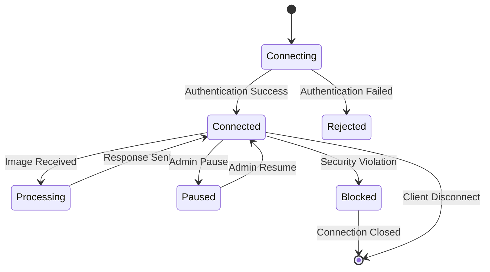
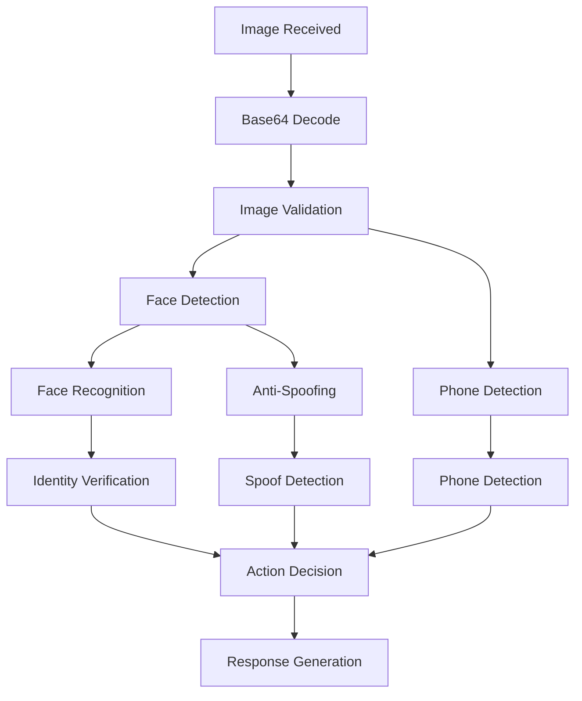
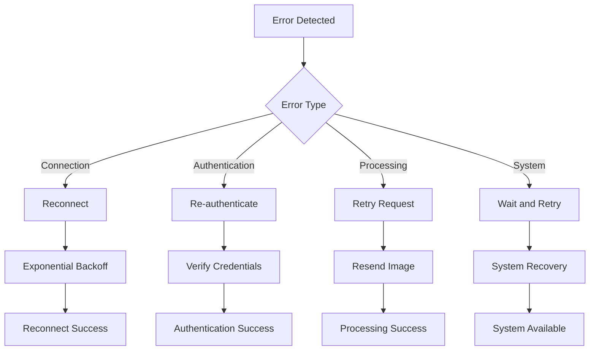

# API Documentation

## Overview

This document provides comprehensive API documentation for the Face Recognition & Object Detection Server. The server communicates with clients through WebSocket connections, providing real-time face recognition, phone detection, and security enforcement capabilities.

## WebSocket API

### Connection Endpoint

```
ws://server:8000/ws
```

### Connection Parameters

- **Host**: Server IP address (default: 0.0.0.0)
- **Port**: Server port (default: 8000)
- **Protocol**: WebSocket (ws://) or Secure WebSocket (wss://)
- **Path**: `/ws` (default endpoint)

## Message Format

### Request Message Structure

```json
{
    "user_name": "string",
    "image": "base64_encoded_string",
    "timestamp": "optional_timestamp"
}
```

### Response Message Structure

```json
{
    "action": "string",
    "reason": "string",
    "actual_username": "string",
    "send_time": "HH-MM-SS",
    "finish_time": "HH-MM-SS"
}
```

## API Endpoints

### 1. Client Authentication

#### Connect to Server

**Description**: Establish WebSocket connection and authenticate client

**Request**:

```json
{
    "user_name": "client_001",
    "image": "iVBORw0KGgoAAAANSUhEUgAAAAEAAAABCAYAAAAfFcSJAAAADUlEQVR42mNkYPhfDwAChAI9jU77wgAAAABJRU5ErkJggg=="
}
```

**Response (Success)**:

```json
{
    "action": "NO_ACTION",
    "reason": "EMPTY_REASON",
    "actual_username": "client_001",
    "send_time": "12:00:00",
    "finish_time": "12:00:01"
}
```

**Response (Authentication Failed)**:

```json
{
    "action": "ACTION_ERROR",
    "reason": "REASON_CLIENT_NOT_AVAILABLE"
}
```

#### Connection States



### 2. Image Processing

#### Send Image for Processing

**Description**: Send image data for face recognition and phone detection

**Request**:

```json
{
    "user_name": "client_001",
    "image": "base64_encoded_image_data"
}
```

**Processing Flow**:



#### Possible Responses

##### 1. No Action (Normal Operation)

```json
{
    "action": "NO_ACTION",
    "reason": "EMPTY_REASON",
    "actual_username": "client_001",
    "send_time": "12:00:00",
    "finish_time": "12:00:01"
}
```

##### 2. Lock Screen (Security Warning)

```json
{
    "action": "ACTION_LOCK_SCREEN",
    "reason": "REASON_NO_FACE",
    "actual_username": "client_001",
    "send_time": "12:00:00",
    "finish_time": "12:00:01"
}
```

##### 3. Sign Out (Security Violation)

```json
{
    "action": "ACTION_SIGN_OUT",
    "reason": "REASON_PHONE_DETECTION",
    "actual_username": "client_001",
    "send_time": "12:00:00",
    "finish_time": "12:00:01"
}
```

##### 4. Warning (Client Status)

```json
{
    "action": "ACTION_WARNING",
    "reason": "REASON_PAUSED_CLIENT",
    "actual_username": "client_001",
    "send_time": "12:00:00",
    "finish_time": "12:00:01"
}
```

##### 5. Error (Critical Issue)

```json
{
    "action": "ACTION_ERROR",
    "reason": "REASON_BLOCKED_CLIENT",
    "actual_username": "client_001",
    "send_time": "12:00:00",
    "finish_time": "12:00:01"
}
```

## Action Types

### Action Enumeration

```python
class Action(Enum):
    NO_ACTION = 0
    ACTION_LOCK_SCREEN = 1
    ACTION_SIGN_OUT = 2
    ACTION_WARNING = 3
    ACTION_ERROR = 4
```

#### Action Descriptions

| Action             | Code | Description                | Client Response              |
| ------------------ | ---- | -------------------------- | ---------------------------- |
| NO_ACTION          | 0    | Normal operation, continue | Continue normal operation    |
| ACTION_LOCK_SCREEN | 1    | Lock user's screen         | Lock workstation immediately |
| ACTION_SIGN_OUT    | 2    | Sign out user              | Log out user session         |
| ACTION_WARNING     | 3    | Warning message            | Display warning to user      |
| ACTION_ERROR       | 4    | Error condition            | Handle error condition       |

## Reason Codes

### Reason Enumeration

```python
class Reason(Enum):
    EMPTY_REASON = 0
    REASON_NO_FACE = 1
    REASON_SPOOF_IMAGE = 2
    REASON_WRONG_USER = 3
    REASON_PHONE_DETECTION = 4
    REASON_PAUSED_CLIENT = 5
    REASON_BLOCKED_CLIENT = 6
    REASON_CLIENT_NOT_AVAILABLE = 7
```

#### Reason Descriptions

| Reason                      | Code | Description            | Cause                                    |
| --------------------------- | ---- | ---------------------- | ---------------------------------------- |
| EMPTY_REASON                | 0    | No specific reason     | Normal operation                         |
| REASON_NO_FACE              | 1    | No face detected       | Face not visible in image                |
| REASON_SPOOF_IMAGE          | 2    | Spoofed image detected | Fake/photo used instead of live face     |
| REASON_WRONG_USER           | 3    | Wrong user detected    | Different person than expected           |
| REASON_PHONE_DETECTION      | 4    | Phone detected         | Mobile device detected in image          |
| REASON_PAUSED_CLIENT        | 5    | Client is paused       | Administrator paused client              |
| REASON_BLOCKED_CLIENT       | 6    | Client is blocked      | Client blocked due to security violation |
| REASON_CLIENT_NOT_AVAILABLE | 7    | Client not in database | Client not registered in system          |

## Error Handling

### Connection Errors

#### Connection Refused

```json
{
    "error": "CONNECTION_REFUSED",
    "message": "Server is at full capacity",
    "code": 4002
}
```

#### Authentication Failed

```json
{
    "error": "AUTHENTICATION_FAILED",
    "message": "Client not found in database",
    "code": 4001
}
```

#### Network Error

```json
{
    "error": "NETWORK_ERROR",
    "message": "Connection lost",
    "code": 4000
}
```

### Processing Errors

#### Invalid Image Format

```json
{
    "action": "ACTION_ERROR",
    "reason": "INVALID_IMAGE_FORMAT",
    "message": "Image decode failed"
}
```

#### Processing Timeout

```json
{
    "action": "ACTION_ERROR",
    "reason": "PROCESSING_TIMEOUT",
    "message": "Processing took too long"
}
```

### Error Recovery



## Client Implementation

### JavaScript WebSocket Client

```javascript
class FaceRecognitionClient {
    constructor(serverUrl, username) {
        this.serverUrl = serverUrl;
        this.username = username;
        this.socket = null;
        this.isConnected = false;
    }
  
    connect() {
        this.socket = new WebSocket(this.serverUrl);
    
        this.socket.onopen = () => {
            console.log('Connected to server');
            this.isConnected = true;
        };
    
        this.socket.onmessage = (event) => {
            const response = JSON.parse(event.data);
            this.handleResponse(response);
        };
    
        this.socket.onclose = (event) => {
            console.log('Connection closed:', event.code);
            this.isConnected = false;
            this.handleDisconnect(event.code);
        };
    
        this.socket.onerror = (error) => {
            console.error('WebSocket error:', error);
        };
    }
  
    sendImage(imageData) {
        if (!this.isConnected) {
            console.error('Not connected to server');
            return;
        }
    
        const message = {
            user_name: this.username,
            image: imageData
        };
    
        this.socket.send(JSON.stringify(message));
    }
  
    handleResponse(response) {
        switch(response.action) {
            case 'NO_ACTION':
                // Continue normal operation
                break;
            case 'ACTION_LOCK_SCREEN':
                this.lockScreen();
                break;
            case 'ACTION_SIGN_OUT':
                this.signOut();
                break;
            case 'ACTION_WARNING':
                this.showWarning(response.reason);
                break;
            case 'ACTION_ERROR':
                this.handleError(response.reason);
                break;
        }
    }
  
    lockScreen() {
        // Implementation to lock workstation
        console.log('Locking screen...');
    }
  
    signOut() {
        // Implementation to sign out user
        console.log('Signing out user...');
    }
  
    showWarning(reason) {
        // Implementation to show warning
        console.log('Warning:', reason);
    }
  
    handleError(reason) {
        // Implementation to handle error
        console.error('Error:', reason);
    }
  
    handleDisconnect(code) {
        switch(code) {
            case 4000:
                console.log('Network error - attempting reconnect');
                this.reconnect();
                break;
            case 4001:
                console.log('Authentication failed');
                break;
            case 4002:
                console.log('Server full - waiting before retry');
                setTimeout(() => this.reconnect(), 30000);
                break;
        }
    }
  
    reconnect() {
        setTimeout(() => {
            if (!this.isConnected) {
                this.connect();
            }
        }, 5000);
    }
}
```

### Python WebSocket Client

```python
import asyncio
import websockets
import json
import base64
import cv2

class FaceRecognitionClient:
    def __init__(self, server_url, username):
        self.server_url = server_url
        self.username = username
        self.websocket = None
        self.is_connected = False
    
    async def connect(self):
        try:
            self.websocket = await websockets.connect(self.server_url)
            self.is_connected = True
            print("Connected to server")
        
            # Start listening for messages
            await self.listen_for_messages()
        
        except Exception as e:
            print(f"Connection failed: {e}")
            self.is_connected = False
        
    async def send_image(self, image_path):
        if not self.is_connected:
            print("Not connected to server")
            return
        
        # Read and encode image
        image = cv2.imread(image_path)
        _, buffer = cv2.imencode('.jpg', image)
        image_base64 = base64.b64encode(buffer).decode('utf-8')
    
        # Create message
        message = {
            "user_name": self.username,
            "image": image_base64
        }
    
        # Send message
        await self.websocket.send(json.dumps(message))
    
    async def listen_for_messages(self):
        try:
            async for message in self.websocket:
                response = json.loads(message)
                await self.handle_response(response)
            
        except websockets.exceptions.ConnectionClosed:
            print("Connection closed")
            self.is_connected = False
        
    async def handle_response(self, response):
        action = response.get("action")
        reason = response.get("reason")
    
        if action == "NO_ACTION":
            print("Access granted - continue normal operation")
        elif action == "ACTION_LOCK_SCREEN":
            print(f"Lock screen requested - Reason: {reason}")
            await self.lock_screen()
        elif action == "ACTION_SIGN_OUT":
            print(f"Sign out requested - Reason: {reason}")
            await self.sign_out()
        elif action == "ACTION_WARNING":
            print(f"Warning received - Reason: {reason}")
        elif action == "ACTION_ERROR":
            print(f"Error occurred - Reason: {reason}")
        
    async def lock_screen(self):
        # Implementation to lock workstation
        print("Locking screen...")
    
    async def sign_out(self):
        # Implementation to sign out user
        print("Signing out user...")

# Usage example
async def main():
    client = FaceRecognitionClient("ws://localhost:8000/ws", "user1")
    await client.connect()
  
    # Send image periodically
    while client.is_connected:
        await client.send_image("user_image.jpg")
        await asyncio.sleep(1)

if __name__ == "__main__":
    asyncio.run(main())
```

## Rate Limiting

### Connection Limits

- **Maximum Concurrent Connections**: Configurable (default: 150)
- **Connection Timeout**: 1000 seconds
- **Ping Interval**: Disabled (set to None)
- **Max Message Size**: Unlimited (set to None)

### Processing Limits

- **Image Processing Rate**: Real-time (no artificial delays)
- **Queue Size**: Limited by system capacity
- **Timeout**: 1000 seconds for message processing

## Security Considerations

### Authentication

- **Client Validation**: Database-based client verification
- **Reference Image**: Required for face recognition
- **Session Management**: WebSocket session tracking

### Data Protection

- **Image Encryption**: Consider encrypting image data in transit
- **Secure WebSocket**: Use WSS for production deployments
- **Access Control**: IP-based access restrictions

### Privacy

- **Data Retention**: Configurable evidence retention policy
- **Image Processing**: Images processed in memory only
- **Logging**: Minimal personal data in logs
