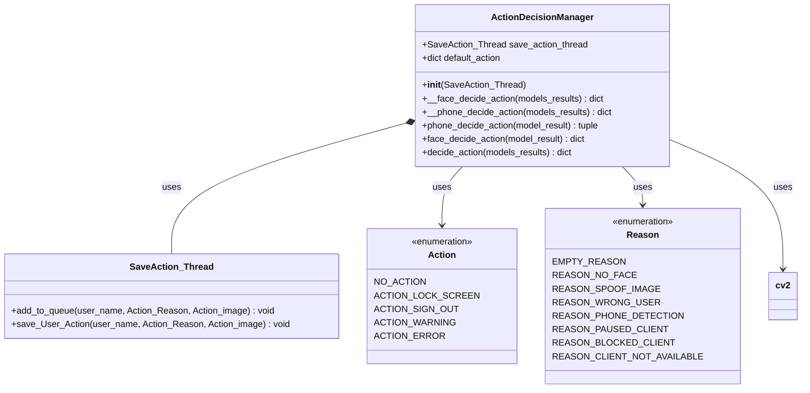
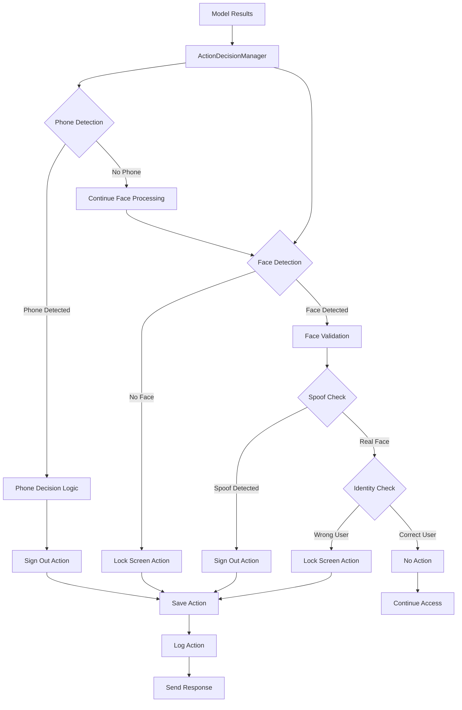
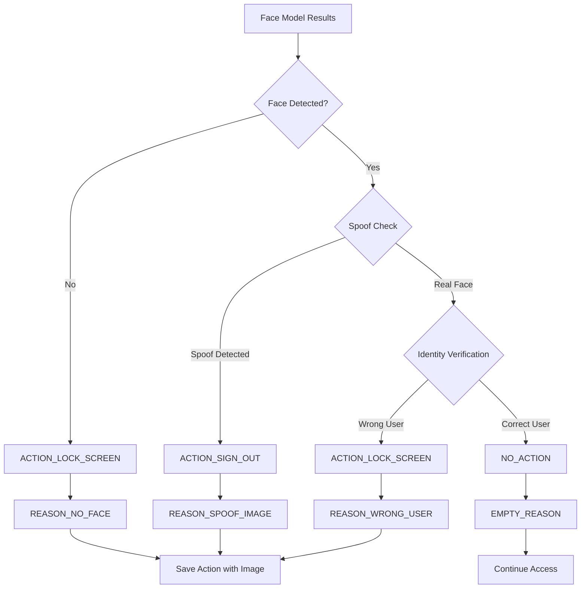
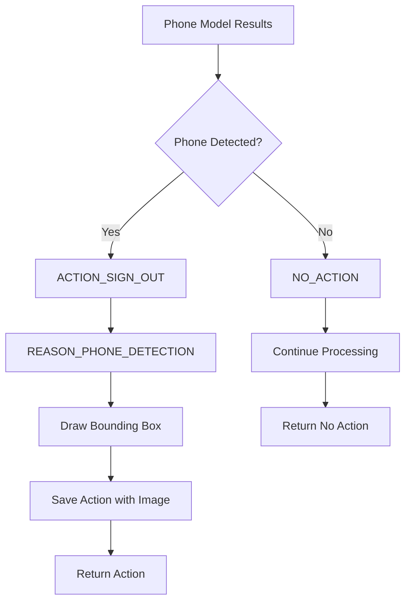
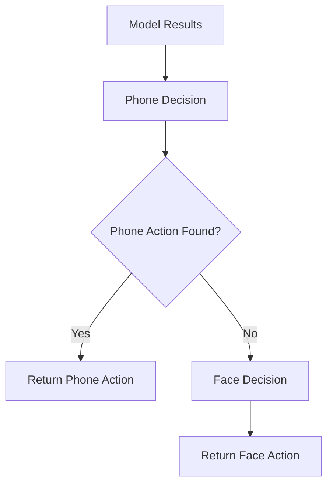
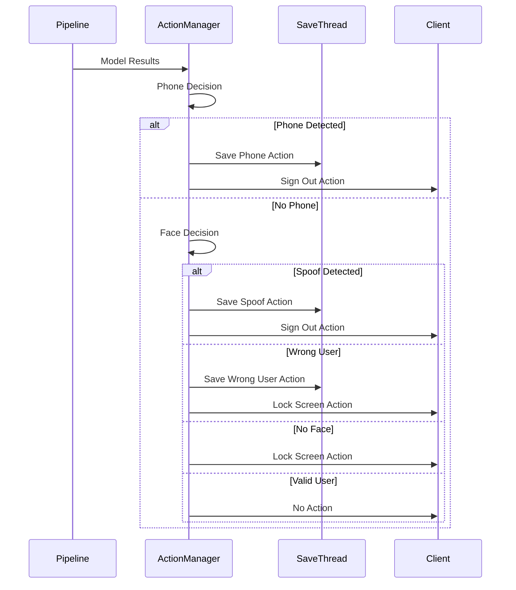
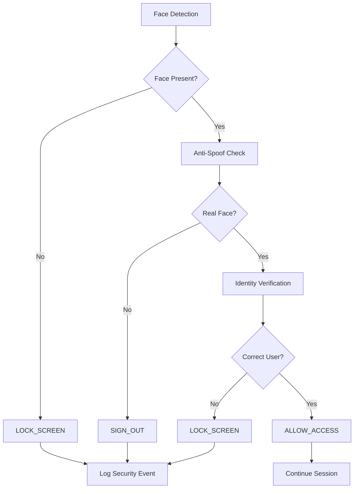
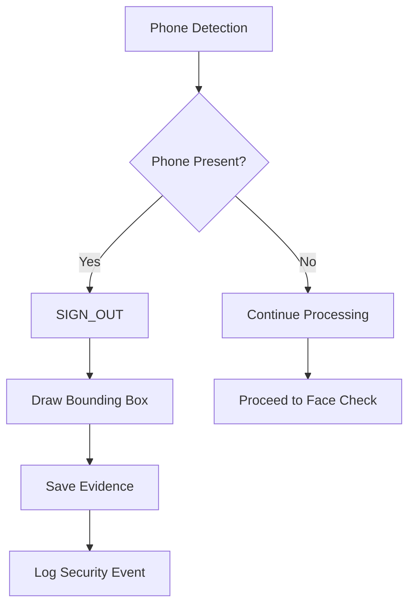
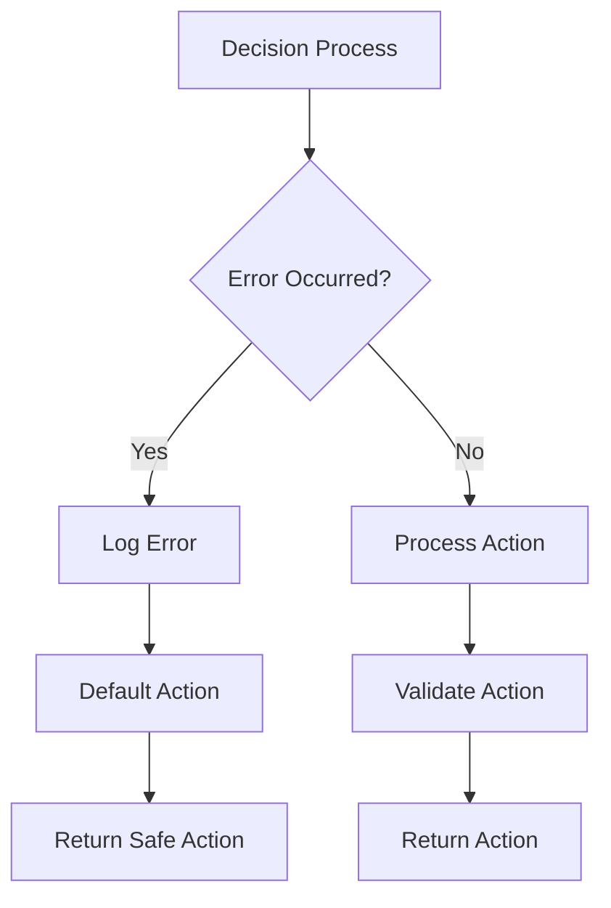

# ActionDecisionManager Module Documentation

## Overview

The `ActionDecisionManager.py` module implements the decision-making logic for the face recognition system. It processes model results from phone detection and face recognition pipelines to determine appropriate security actions such as locking screens, signing out users, or allowing access.

## Class Diagram



## Architecture Overview

The ActionDecisionManager implements a rule-based decision system that evaluates model results against security policies to determine appropriate actions.

## Related Component Documentation

The ActionDecisionManager integrates with various system components:

- **[Save_Action_thread](Save_Action_thread.md)** - Action logging and persistence
- **[Utilities](Utilities.md)** - Action and Reason enumerations, data structures
- **[PipeLine](PipeLine.md)** - Pipeline processing coordination
- **[ModelsManager](ModelsManager.md)** - Model result processing
- **[Server](Server.md)** - WebSocket communication for actions

## Decision Flow Architecture



## Core Functionality

### 1. Decision Making Logic

#### Face Decision Process


#### Phone Decision Process


### 2. Action Types and Reasons

#### Action Types
- **NO_ACTION**: Continue normal operation
- **ACTION_LOCK_SCREEN**: Lock the user's screen
- **ACTION_SIGN_OUT**: Sign out the user
- **ACTION_WARNING**: Send warning message
- **ACTION_ERROR**: Send error message

#### Reason Codes
- **EMPTY_REASON**: No specific reason
- **REASON_NO_FACE**: No face detected in image
- **REASON_SPOOF_IMAGE**: Spoofed/fake image detected
- **REASON_WRONG_USER**: Wrong user identity
- **REASON_PHONE_DETECTION**: Phone detected in image
- **REASON_PAUSED_CLIENT**: Client is paused
- **REASON_BLOCKED_CLIENT**: Client is blocked
- **REASON_CLIENT_NOT_AVAILABLE**: Client not in database

## Key Methods

### Private Decision Methods

#### `__face_decide_action(models_results) -> dict`
**Purpose**: Determines action based on face recognition results

**Input Parameters**:
```python
models_results = {
    "face_bbox": [x1, y1, x2, y2] or None,
    "check_spoof": bool,
    "check_client": bool,
    "user_image": cv2_image,
    "actual_username": str
}
```

**Decision Logic**:
```python
def __face_decide_action(self, models_results: Dict[str, str]) -> Dict[str, str]:
    __action = {"action": Action.NO_ACTION.value, "reason": Reason.EMPTY_REASON.value}
    
    # Check if no face is detected
    if models_results["face_bbox"] is None:
        __action.update({
            "action": Action.ACTION_LOCK_SCREEN.value, 
            "reason": Reason.REASON_NO_FACE.value
        })
        return __action
    
    image = models_results["user_image"]
    x1, y1, x2, y2 = models_results["face_bbox"]
    
    # Check if the detected face is marked as a spoof
    if models_results["check_spoof"]:
        cv2.rectangle(image, (x1, y1), (x2, y2), (255, 0, 0), 2)
        __action = {
            "action": Action.ACTION_SIGN_OUT.value, 
            "reason": Reason.REASON_SPOOF_IMAGE.value
        }
        self.save_action_thread.add_to_queue(
            models_results["actual_username"], __action, image
        )
        return __action
    
    # Check if the predicted username does not match the actual username
    if not models_results["check_client"]:
        __action = {
            "action": Action.ACTION_LOCK_SCREEN.value, 
            "reason": Reason.REASON_WRONG_USER.value
        }
        self.save_action_thread.add_to_queue(
            models_results["actual_username"], __action, image
        )
        return __action
    
    return __action
```

#### `__phone_decide_action(models_results) -> dict`
**Purpose**: Determines action based on phone detection results

**Input Parameters**:
```python
models_results = {
    "phone_bbox": [x1, y1, x2, y2] or None,
    "user_image": cv2_image,
    "actual_username": str
}
```

**Decision Logic**:
```python
def __phone_decide_action(self, models_results: Dict[str, str]) -> Dict[str, str]:
    __action = {"action": Action.NO_ACTION.value, "reason": Reason.EMPTY_REASON.value}
    image = models_results.get("user_image")
    
    # Check if a phone is detected
    if models_results["phone_bbox"] is not None:
        x1, y1, x2, y2 = models_results["phone_bbox"]
        cv2.rectangle(image, (x1, y1), (x2, y2), (0, 0, 255), 2)  # Red box for phone
        
        # Update action to sign out due to phone detection
        __action = {
            "action": Action.ACTION_SIGN_OUT.value, 
            "reason": Reason.REASON_PHONE_DETECTION.value
        }
        self.save_action_thread.add_to_queue(
            models_results["actual_username"], __action, image
        )
    
    return __action
```

### Public Interface Methods

#### `phone_decide_action(model_result) -> tuple`
**Purpose**: Public interface for phone decision making

**Return**: `(bool, dict)` - (action_found, action_data)

**Implementation**:
```python
def phone_decide_action(self, model_result):
    p__decide_action = self.__phone_decide_action(model_result)
    if p__decide_action["action"] != Action.NO_ACTION.value:
        p__decide_action['actual_username'] = model_result['actual_username']
        p__decide_action['send_time'] = model_result['send_time']
        p__decide_action['finish_time'] = time.strftime("%H-%M-%S", time.localtime())
        return (True, p__decide_action)
    else:
        return (False, None)
```

#### `face_decide_action(model_result) -> dict`
**Purpose**: Public interface for face decision making

**Implementation**:
```python
def face_decide_action(self, model_result):
    f__decide_action = self.__face_decide_action(model_result)
    f__decide_action['actual_username'] = model_result['actual_username']
    f__decide_action['send_time'] = model_result['send_time']
    f__decide_action['finish_time'] = time.strftime("%H-%M-%S", time.localtime())
    return f__decide_action
```

#### `decide_action(models_results) -> dict`
**Purpose**: Combined decision making for all models

**Logic Flow**:


## Action Processing Flow

### Complete Decision Flow


### Action Response Format
```python
action_response = {
    "action": Action.ACTION_LOCK_SCREEN.value,
    "reason": Reason.REASON_NO_FACE.value,
    "actual_username": "client_name",
    "send_time": "12:00:00",
    "finish_time": "12:00:01"
}
```

## Security Policies

### Face Recognition Security


### Phone Detection Security


## Image Processing and Evidence

### Bounding Box Visualization
```python
# Phone detection bounding box (red)
cv2.rectangle(image, (x1, y1), (x2, y2), (0, 0, 255), 2)

# Face detection bounding box (blue for spoof)
cv2.rectangle(image, (x1, y1), (x2, y2), (255, 0, 0), 2)
```

### Evidence Collection
- **Image Capture**: Original image with bounding boxes
- **Timestamp**: Action time recording
- **User Identity**: Client identification
- **Action Type**: Security action taken
- **Evidence Storage**: Organized by action type and user

## Performance Considerations

### Decision Speed
- **Rule-based Logic**: Fast decision making
- **Minimal Processing**: Efficient condition checking
- **Immediate Response**: Real-time action determination

### Memory Usage
- **Image Processing**: Minimal memory footprint
- **Action Logging**: Efficient queue management
- **Thread Safety**: Safe concurrent access

## Error Handling

### Decision Errors


### Fallback Strategies
- **Default Action**: Safe fallback for errors
- **Error Logging**: Comprehensive error tracking
- **Graceful Degradation**: Maintain security even with errors

## Configuration

### Decision Thresholds
- **Recognition Threshold**: Face recognition confidence
- **Anti-Spoof Threshold**: Spoof detection sensitivity
- **Phone Detection Threshold**: Phone detection confidence

### Action Policies
```python
SECURITY_POLICIES = {
    "no_face_action": Action.ACTION_LOCK_SCREEN,
    "spoof_action": Action.ACTION_SIGN_OUT,
    "wrong_user_action": Action.ACTION_LOCK_SCREEN,
    "phone_action": Action.ACTION_SIGN_OUT,
    "default_action": Action.NO_ACTION
}
```

## Usage Example

```python
# Initialize action decision manager
save_thread = SaveAction_Thread("SaveAction_Thread")
action_manager = ActionDecisionManager(save_thread)

# Process model results
model_results = {
    "face_bbox": [100, 100, 200, 200],
    "check_spoof": False,
    "check_client": True,
    "phone_bbox": None,
    "user_image": image,
    "actual_username": "user1",
    "send_time": "12:00:00"
}

# Make decision
action = action_manager.decide_action(model_results)

# Process individual decisions
phone_action = action_manager.phone_decide_action(model_results)
face_action = action_manager.face_decide_action(model_results)
```

## Dependencies

- **cv2**: Image processing and bounding box drawing
- **time**: Timestamp generation
- **typing**: Type hints for better code documentation
- **common_utilities**: Logging utilities
- **utilities.project_utilities**: Action and Reason enumerations
- **SaveAction_Thread**: Action logging functionality

## Monitoring and Logging

### Action Metrics
- **Action Frequency**: Count of each action type
- **Response Time**: Decision making speed
- **Error Rate**: Decision error frequency
- **Security Events**: Critical security actions

### Audit Trail
- **Action History**: Complete action log
- **User Behavior**: User-specific action patterns
- **Security Analysis**: Security event analysis
- **Performance Metrics**: Decision performance tracking

## Future Enhancements

1. **Machine Learning Decisions**: AI-based decision making
2. **Dynamic Thresholds**: Adaptive threshold adjustment
3. **User Behavior Analysis**: Behavioral pattern recognition
4. **Advanced Policies**: Complex security rule engine
5. **Risk Assessment**: Risk-based action determination
6. **Integration APIs**: External system integration
7. **Real-time Monitoring**: Live security monitoring dashboard
