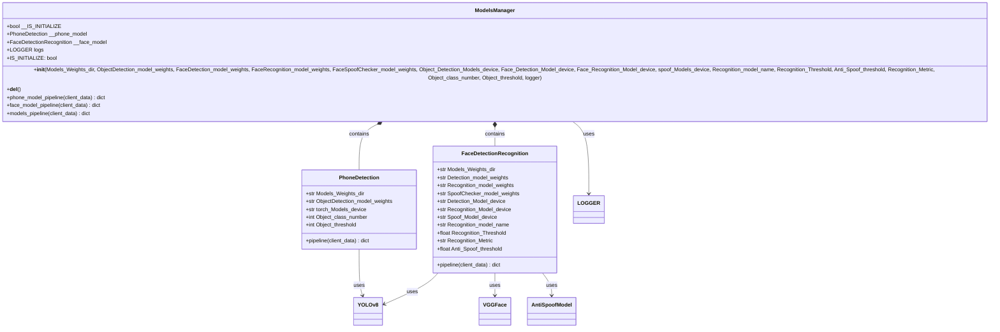
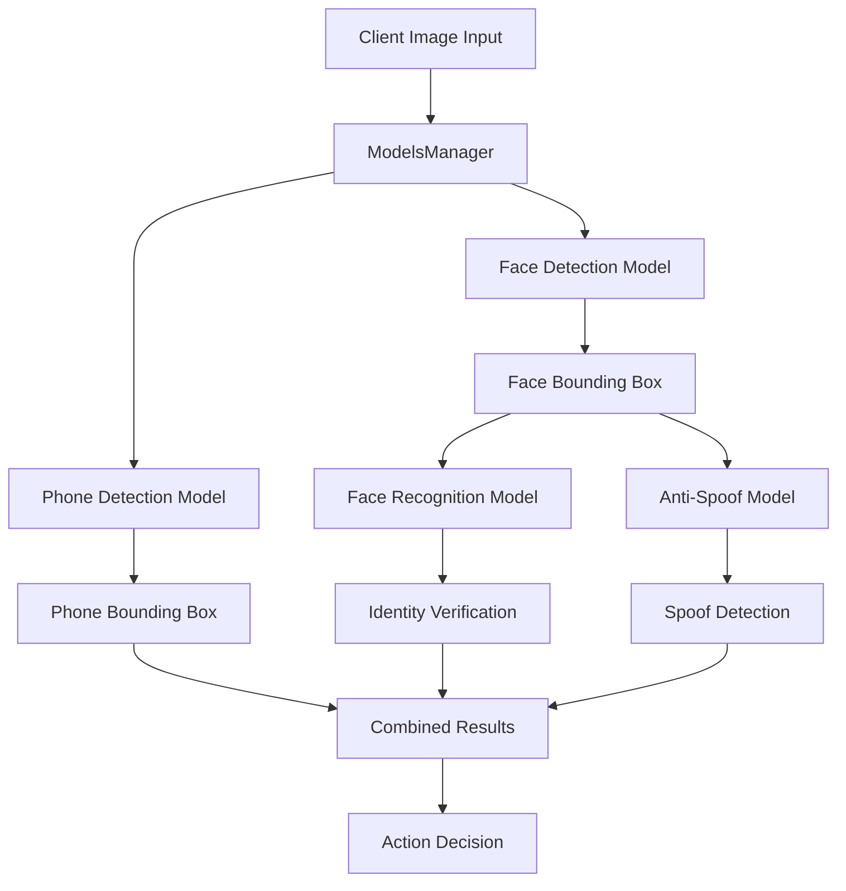
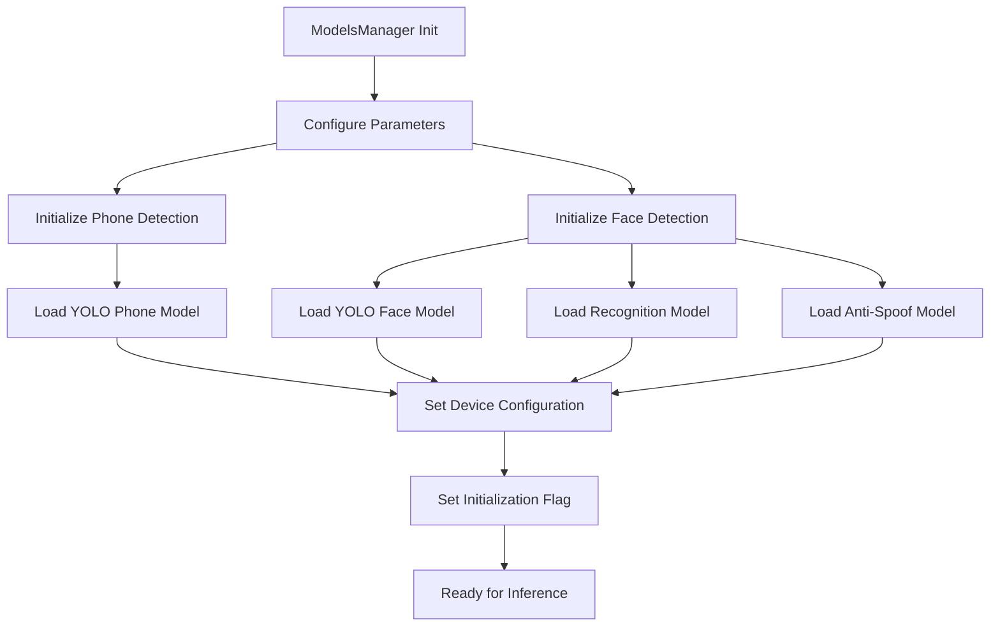
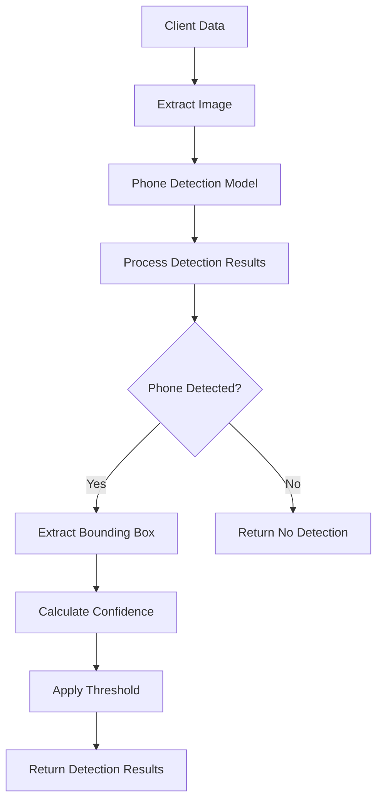
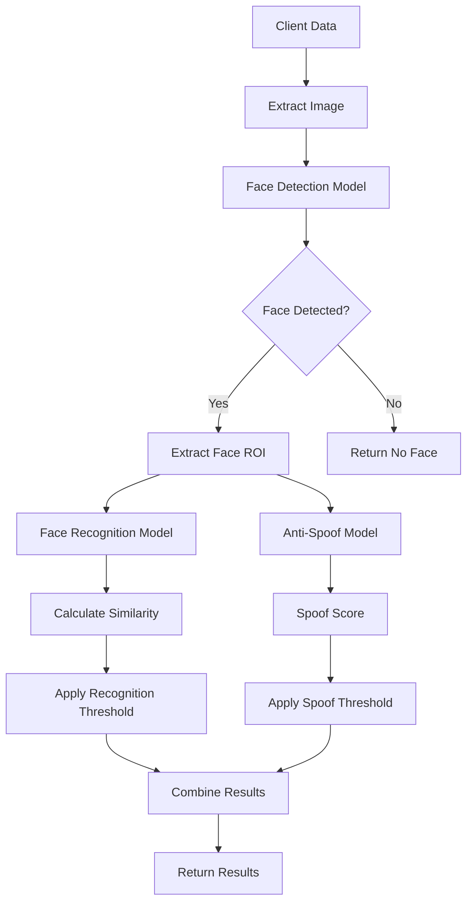
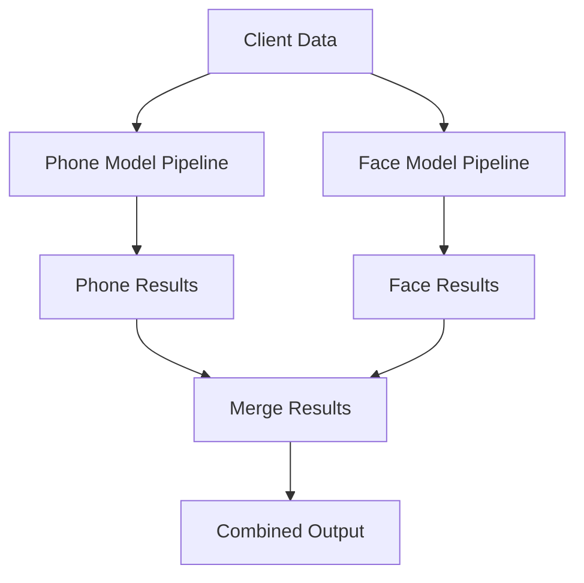
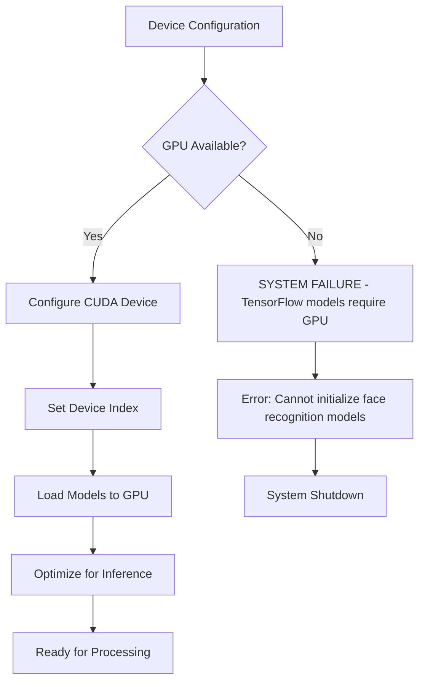
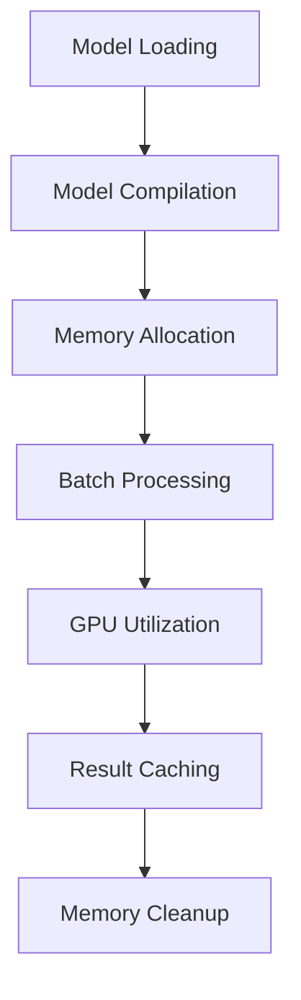
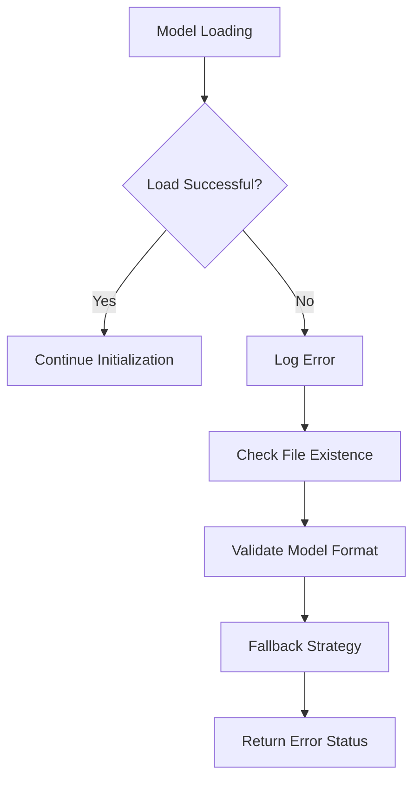

# ModelsManager Module Documentation

## Overview

The `ModelsManager.py` module serves as the central hub for managing AI models used in face recognition, phone detection, and anti-spoofing tasks. It provides a unified interface for model initialization, configuration, and inference operations while handling GPU resource management and memory optimization.

**⚠️ CRITICAL REQUIREMENT**: TensorFlow-based models (used for face recognition) in this system require GPU hardware and cannot run on CPU. This is a fundamental constraint that must be considered for deployment.

## Class Diagram



## Hardware Requirements

### GPU Requirements

**⚠️ MANDATORY**: This system requires GPU hardware for proper operation. The face recognition models are built using TensorFlow and are configured to run exclusively on GPU devices.

#### Minimum Requirements:

- **GPU**: NVIDIA GPU with CUDA support
- **CUDA Version**: 11.0 or higher
- **GPU Memory**: Minimum 4GB VRAM
- **Driver**: NVIDIA drivers supporting CUDA

#### Recommended Requirements:

- **GPU**: NVIDIA RTX 3060 or higher
- **GPU Memory**: 8GB+ VRAM
- **CUDA Version**: 11.8 or higher
- **Multi-GPU**: Supported for distributed processing

#### CPU-Only Limitation:

- **Face Recognition Models**: Cannot run on CPU due to TensorFlow configuration
- **Phone Detection Models**: Can run on CPU but performance will be significantly degraded
- **Deployment Impact**: System will fail to initialize without GPU support

### Memory Requirements:

- **System RAM**: Minimum 16GB, recommended 48GB+
- **GPU Memory**: Varies by model complexity
- **Storage**: SSD recommended for model loading

## Architecture Overview

The ModelsManager implements a composite pattern where different model types are encapsulated within specialized classes, providing a unified interface for model operations.

## Detailed Component Documentation

For comprehensive documentation of the underlying components, refer to:

- **[Object Detection Task](Object_Detection_Task.md)** - Detailed documentation for phone detection components

  - `ObjectDetection.py` - Core YOLO-based object detection
  - `PhoneDetection.py` - Phone-specific detection wrapper
- **[Face Recognition Anti-Spoof Task](Face_Recognition_Anti_Spoof_Task.md)** - Detailed documentation for face recognition components

  - `FaceDetectionRecognition.py` - Main face authentication pipeline
  - `DetectFaces.py` - YOLO-based face detection
  - `RecognitionFace.py` - Face recognition and verification
  - `SpoofChecker.py` - Anti-spoofing detection
  - `FasNet.py` - FasNet anti-spoofing model
  - `VGGFace.py` - VGG-Face model implementation
  - `model.py` - IResNet model architectures

These documents provide detailed class diagrams, method descriptions, usage examples, and integration guidelines for each component.

## Model Architecture



## Core Functionality

### 1. Model Initialization

#### Initialization Flow



#### Model Configuration

```python
Models_Parameters = {
    # Model Weights
    "Models_Weights_dir": "Models_Weights",
    "ObjectDetection_model_weights": "phone_detection.pt",
    "FaceDetection_model_weights": "yolov8_model.pt",
    "FaceRecognition_model_weights": "arcface_r100.pth",
    "FaceSpoofChecker_model_weights": None,
  
    # Device Configuration
    "Object_Detection_Models_device": "cuda:0",
    "Face_Detection_Model_device": "GPU:0",
    "Face_Recognition_Model_device": "GPU:0",
    "spoof_Models_device": "cuda:0",
  
    # Model Parameters
    "Recognition_model_name": "r100",
    "Recognition_Threshold": 0.25,
    "Anti_Spoof_threshold": 65,
    "Recognition_Metric": "cosine_similarity",
    "Object_class_number": 67,
    "Object_threshold": 65
}
```

### 2. Pipeline Operations

#### Phone Detection Pipeline



#### Face Recognition Pipeline



## Key Methods

### Model Pipeline Methods

#### `phone_model_pipeline(client_data) -> dict`

**Purpose**: Processes phone detection for client data

**Input**:

```python
client_data = {
    "user_image": cv2_image,
    "actual_username": "client_name",
    "send_time": "timestamp"
}
```

**Output**:

```python
{
    "phone_bbox": [x1, y1, x2, y2] or None,
    "phone_confidence": float,
    "phone_detected": bool
}
```

#### `face_model_pipeline(client_data) -> dict`

**Purpose**: Processes face recognition and anti-spoofing

**Input**:

```python
client_data = {
    "user_image": cv2_image,
    "actual_username": "client_name",
    "ref_image": reference_image,
    "send_time": "timestamp"
}
```

**Output**:

```python
{
    "face_bbox": [x1, y1, x2, y2] or None,
    "face_confidence": float,
    "recognition_score": float,
    "spoof_score": float,
    "check_client": bool,
    "check_spoof": bool
}
```

#### `models_pipeline(client_data) -> dict`

**Purpose**: Combined processing for all models

**Processing Flow**:



## Model Configurations

### Phone Detection Model

- **Architecture**: YOLOv8
- **Input**: RGB image
- **Output**: Bounding boxes with confidence scores
- **Classes**: 67 object classes including phones
- **Threshold**: Configurable confidence threshold

### Face Detection Model

- **Architecture**: YOLOv8 (customized for faces)
- **Input**: RGB image
- **Output**: Face bounding boxes
- **Preprocessing**: Image normalization
- **Postprocessing**: NMS for duplicate removal

### Face Recognition Model

- **Architecture**: VGG-Face / ArcFace
- **Framework**: TensorFlow
- **Hardware Requirement**: GPU ONLY - Cannot run on CPU
- **Input**: Cropped face image
- **Output**: Face embedding vector
- **Similarity Metric**: Cosine similarity
- **Threshold**: Configurable recognition threshold
- **CUDA Support**: Required for model execution

### Anti-Spoofing Model

- **Architecture**: CNN-based classifier
- **Input**: Face ROI
- **Output**: Spoof probability score
- **Detection**: Live face vs. photo/video
- **Threshold**: Configurable spoof threshold

## Device Management

### GPU Configuration

**⚠️ IMPORTANT**: TensorFlow-based face recognition models require GPU and will fail on CPU-only systems.



### Device Assignment Strategy:

- **Face Recognition Models**: Must use GPU (TensorFlow requirement)
- **Phone Detection Models**: GPU preferred, CPU fallback available
- **Anti-Spoofing Models**: GPU required for optimal performance
- **Multi-GPU Support**: Models can be distributed across multiple GPUs

### Memory Management

```python
def __del__(self):
    if hasattr(self, "__phone_model"):
        del self.__phone_model
    if hasattr(self, "__face_model"):
        del self.__face_model
    torch.cuda.empty_cache()
    torch.cuda.ipc_collect()
    tf.keras.backend.clear_session()
    gc.collect()
```

## Performance Optimization

### Inference Optimization



### Optimization Strategies

1. **Model Quantization**: Reduced precision for faster inference
2. **Batch Processing**: Process multiple images simultaneously
3. **Memory Pooling**: Reuse memory allocations
4. **Pipeline Parallelism**: Concurrent model execution
5. **Result Caching**: Cache frequently accessed results

## Error Handling

### Model Loading Errors



### Runtime Errors

- **CUDA Out of Memory**: Automatic fallback to CPU for PyTorch models only
- **TensorFlow GPU Errors**: System failure - no CPU fallback available
- **Model Inference Errors**: Graceful error handling where possible
- **Device Switching**: Limited to PyTorch models only
- **Memory Leaks**: Automatic cleanup
- **GPU Unavailable**: Critical system failure for TensorFlow models

## Deployment Considerations

### Critical Hardware Requirements

1. **GPU Mandatory**: System will not function without GPU support
2. **TensorFlow Constraint**: Face recognition models cannot run on CPU
3. **Resource Planning**: Ensure adequate GPU memory for model loading
4. **Fallback Strategy**: No CPU fallback available for core functionality

### Deployment Checklist

- [ ] NVIDIA GPU with CUDA support installed
- [ ] CUDA drivers and runtime properly configured
- [ ] Sufficient GPU memory (minimum 16GB VRAM)
- [ ] TensorFlow-GPU installation verified
- [ ] Model weights accessible and valid
- [ ] GPU device permissions configured

### Common Deployment Issues

- **No GPU Detected**: System initialization failure
- **Insufficient GPU Memory**: Model loading errors
- **CUDA Version Mismatch**: TensorFlow compatibility issues
- **Driver Problems**: GPU not accessible to TensorFlow

## Configuration Examples

### Basic Configuration

```python
models_manager = ModelsManager(
    Models_Weights_dir="Models_Weights",
    ObjectDetection_model_weights="phone_detection.pt",
    FaceDetection_model_weights="yolov8_model.pt",
    Object_Detection_Models_device="cuda:0",
    Face_Detection_Model_device="cuda:0",
    Recognition_Threshold=0.3,
    Object_threshold=65,
    logger="models_logs"
)
```

### Advanced Configuration

```python
models_manager = ModelsManager(
    # Model paths
    Models_Weights_dir="Models_Weights",
    ObjectDetection_model_weights="phone_detection.pt",
    FaceDetection_model_weights="yolov8_model.pt",
    FaceRecognition_model_weights="arcface_r100.pth",
    FaceSpoofChecker_model_weights="spoof_model.pth",
  
    # Device configuration
    Object_Detection_Models_device="cuda:0",
    Face_Detection_Model_device="cuda:1",
    Face_Recognition_Model_device="cuda:0",
    spoof_Models_device="cuda:1",
  
    # Model parameters
    Recognition_model_name="ArcFace",
    Recognition_Threshold=0.4,
    Anti_Spoof_threshold=0.7,
    Recognition_Metric="cosine_similarity",
    Object_class_number=80,
    Object_threshold=70,
  
    logger="models_logs"
)
```

## Usage Example

```python
# Initialize models manager
models_manager = ModelsManager(
    Models_Weights_dir="Models_Weights",
    ObjectDetection_model_weights="phone_detection.pt",
    FaceDetection_model_weights="yolov8_model.pt",
    Object_Detection_Models_device="cuda:0",
    Face_Detection_Model_device="cuda:0",
    Recognition_Threshold=0.3,
    Object_threshold=65,
    logger="models_logs"
)

# Process client data
client_data = {
    "user_image": image,
    "actual_username": "client_1",
    "ref_image": reference_image,
    "send_time": "12:00:00"
}

# Run combined pipeline
results = models_manager.models_pipeline(client_data)

# Process individual pipelines
phone_results = models_manager.phone_model_pipeline(client_data)
face_results = models_manager.face_model_pipeline(client_data)
```

## Dependencies

- **tensorflow**: Deep learning framework (GPU version required)
- **tensorflow-gpu**: GPU acceleration for TensorFlow models
- **torch**: PyTorch framework (GPU support recommended)
- **opencv-python**: Image processing
- **numpy**: Numerical computations
- **ultralytics**: YOLO models
- **deepface**: Face recognition framework
- **cuda-toolkit**: NVIDIA CUDA development toolkit
- **gc**: Garbage collection
- **common_utilities**: Logging utilities

### GPU-Specific Dependencies

- **CUDA Runtime**: Required for GPU operations
- **cuDNN**: Deep learning GPU acceleration
- **NVIDIA Drivers**: GPU hardware interface
