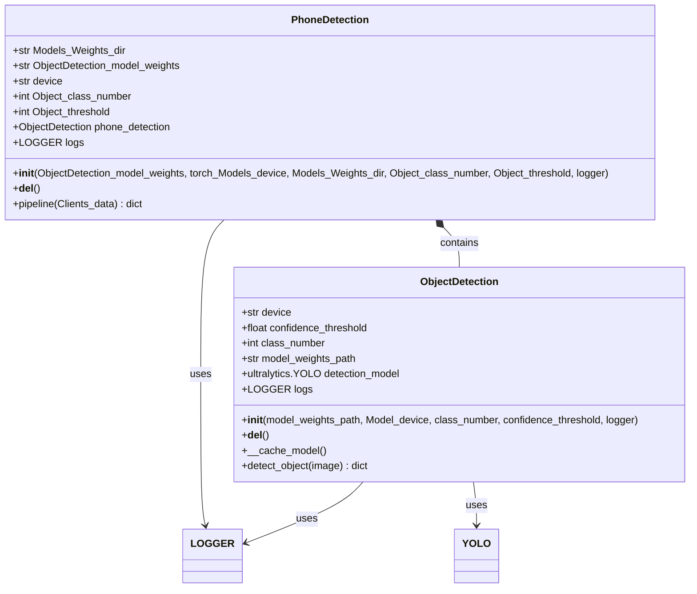
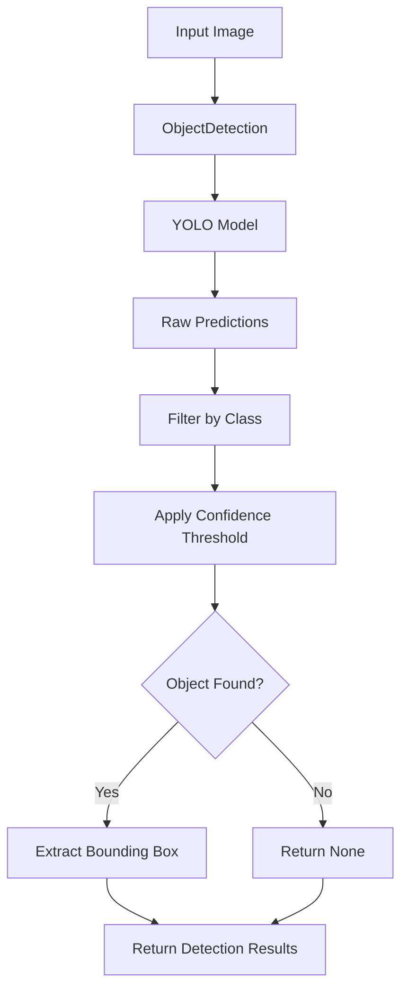
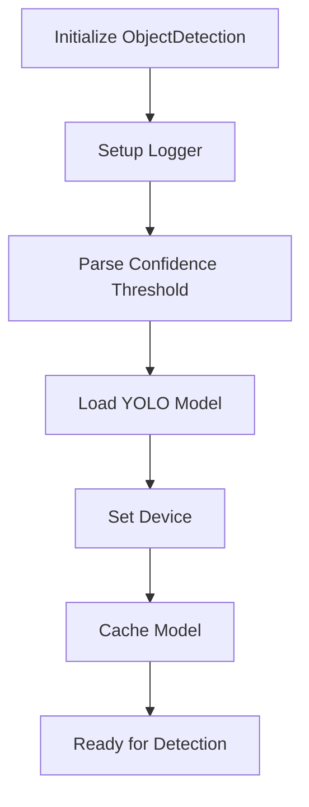
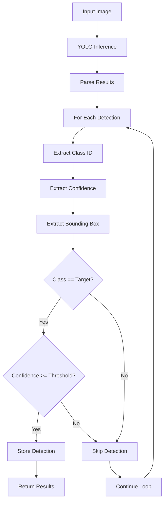
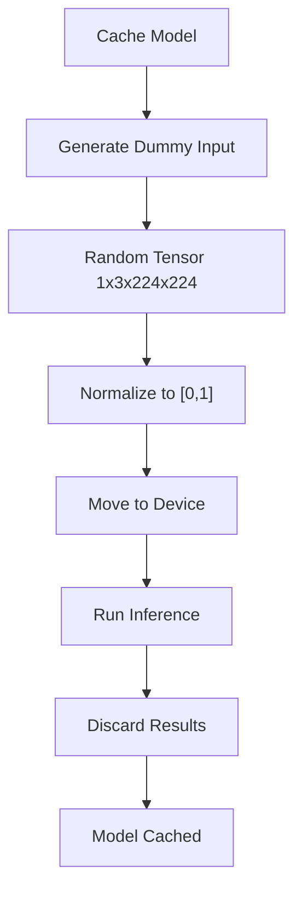
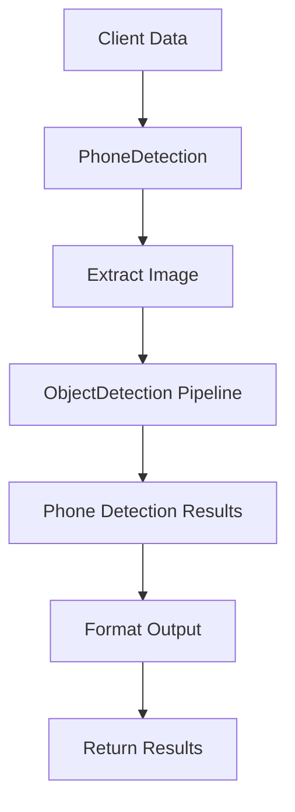
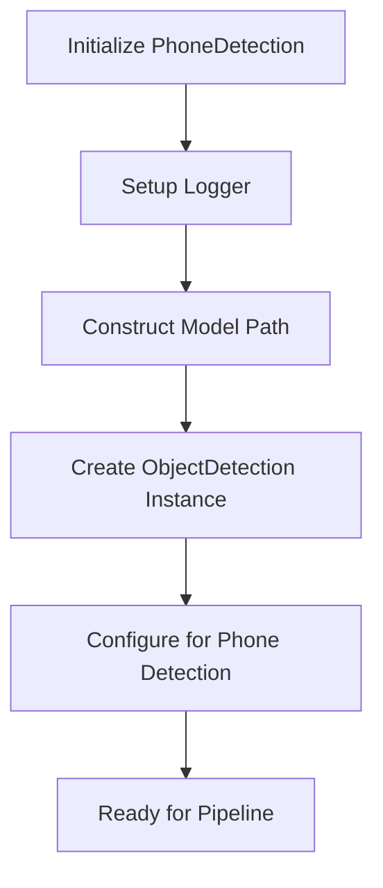
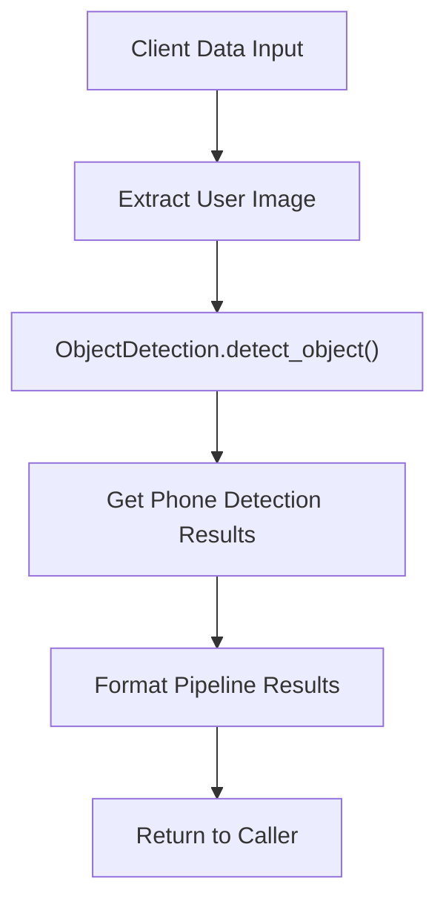
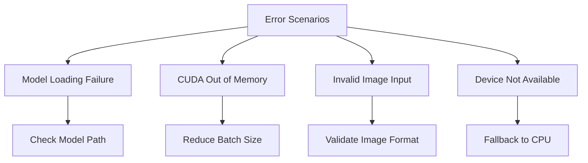

# Object Detection Task Module Documentation

## Overview

The Object Detection Task module provides specialized functionality for detecting objects, specifically phones, in input images. This module is part of the Face Recognition Server's security system and consists of two main components:

1. **ObjectDetection.py** - Generic object detection using YOLO models
2. **PhoneDetection.py** - Specialized phone detection wrapper

**⚠️ GPU Requirement**: While this module can run on CPU, GPU acceleration is strongly recommended for optimal performance.

## Module Structure

```
Scripts/Object_Detection_Task/
├── ObjectDetection.py      # Core YOLO-based object detection
├── PhoneDetection.py       # Phone-specific detection wrapper
└── __pycache__/           # Python cache files
```

## Class Diagram



## ObjectDetection.py

### Purpose

Core class for performing object detection using YOLO (You Only Look Once) models. Provides generic object detection capabilities that can be configured for different object classes.

### Architecture Flow



### Key Methods

#### `__init__(model_weights_path, Model_device, class_number, confidence_threshold, logger)`

**Purpose**: Initialize the object detection model

**Parameters**:

- `model_weights_path` (str): Path to YOLO model weights
- `Model_device` (str): Device for inference ("cpu" or "cuda:X")
- `class_number` (int): Target object class ID (67 for phones)
- `confidence_threshold` (int): Minimum confidence percentage (0-100)
- `logger` (Union[str, LOGGER]): Logger instance or name

**Initialization Flow**:



#### `detect_object(image) -> dict`

**Purpose**: Detect objects in input image

**Input**:

- `image` (np.ndarray): Input image for detection

**Output**:

```python
{
    "phone_bbox": [x1, y1, x2, y2] or None,  # Bounding box coordinates
    "phone_confidence": float or None         # Detection confidence
}
```

**Detection Process**:



#### `__cache_model()`

**Purpose**: Warm up model to avoid cold start latency

**Process**:



### Model Configuration

- **Architecture**: YOLOv8
- **Input Size**: Variable (auto-resize)
- **Output**: Bounding boxes with confidence scores
- **Supported Classes**: 80 COCO classes (configurable)
- **Phone Class ID**: 67 (default)

## PhoneDetection.py

### Purpose

Specialized wrapper for phone detection that uses the generic ObjectDetection class configured specifically for phone detection.

### Architecture Flow



### Key Methods

#### `__init__(ObjectDetection_model_weights, torch_Models_device, Models_Weights_dir, Object_class_number, Object_threshold, logger)`

**Purpose**: Initialize phone detection system

**Parameters**:

- `ObjectDetection_model_weights` (str): Phone detection model filename
- `torch_Models_device` (str): Device for inference
- `Models_Weights_dir` (str): Directory containing model weights
- `Object_class_number` (int): Phone class ID (default: 67)
- `Object_threshold` (int): Confidence threshold percentage
- `logger` (Union[str, LOGGER]): Logger instance

**Initialization Process**:



#### `pipeline(Clients_data) -> dict`

**Purpose**: Process client data through phone detection pipeline

**Input**:

```python
Clients_data = {
    "user_image": cv2_image,
    "actual_username": "client_name",
    "send_time": "timestamp"
}
```

**Output**:

```python
{
    "phone_bbox": [x1, y1, x2, y2] or None,
    "phone_confidence": float or None
}
```

**Pipeline Flow**:



## Performance Characteristics

### ObjectDetection Performance

- **Inference Time**: 10-50ms (GPU) / 100-500ms (CPU)
- **Memory Usage**: ~200MB GPU memory
- **Accuracy**: 90%+ for well-lit images
- **Batch Processing**: Supported

### PhoneDetection Performance

- **End-to-End Latency**: 15-60ms
- **Phone Detection Rate**: 85-95% depending on conditions
- **False Positive Rate**: <5%
- **Optimal Conditions**: Good lighting, clear phone visibility

## Error Handling

### Common Error Scenarios



### Error Recovery

- **Model Loading**: Verify file existence and format
- **Memory Issues**: Automatic garbage collection
- **Device Errors**: Graceful fallback to CPU
- **Input Validation**: Skip invalid frames

## Configuration Examples

### Basic Configuration

```python
# ObjectDetection
detector = ObjectDetection(
    model_weights_path="yolo_phone_model.pt",
    Model_device="cuda:0",
    class_number=67,
    confidence_threshold=65,
    logger="detection_logs"
)

# PhoneDetection
phone_detector = PhoneDetection(
    ObjectDetection_model_weights="phone_detection.pt",
    torch_Models_device="cuda:0",
    Object_class_number=67,
    Object_threshold=70,
    logger="phone_logs"
)
```

### Advanced Configuration

```python
# Multi-class detection
detector = ObjectDetection(
    model_weights_path="yolo_multi_class.pt",
    Model_device="cuda:1",
    class_number=0,  # Person class
    confidence_threshold=80,
    logger="multi_detection_logs"
)

# High-precision phone detection
phone_detector = PhoneDetection(
    ObjectDetection_model_weights="phone_high_precision.pt",
    torch_Models_device="cuda:0",
    Object_class_number=67,
    Object_threshold=85,  # Higher threshold for precision
    logger="precise_phone_logs"
)
```

## Usage Examples

### Basic Phone Detection

```python
# Initialize phone detector
phone_detector = PhoneDetection(
    ObjectDetection_model_weights="phone_detection.pt",
    torch_Models_device="cuda:0",
    Object_threshold=70,
    logger="phone_detection"
)

# Process client data
client_data = {
    "user_image": cv2_image,
    "actual_username": "user123",
    "send_time": "2025-01-01 12:00:00"
}

# Run detection
results = phone_detector.pipeline(client_data)
print(f"Phone detected: {results['phone_bbox'] is not None}")
print(f"Confidence: {results['phone_confidence']}")
```

### Custom Object Detection

```python
# Initialize for custom object
detector = ObjectDetection(
    model_weights_path="custom_model.pt",
    Model_device="cuda:0",
    class_number=39,  # Bottle class
    confidence_threshold=60,
    logger="custom_detection"
)

# Detect objects
results = detector.detect_object(image)
if results["phone_bbox"]:
    print(f"Object found at: {results['phone_bbox']}")
```

## Integration with Main System

### ModelsManager Integration

```python
# Used in ModelsManager.py
self.__phone_model = PhoneDetection(
    ObjectDetection_model_weights=ObjectDetection_model_weights,
    torch_Models_device=Object_Detection_Models_device,
    Object_class_number=Object_class_number,
    Object_threshold=Object_threshold,
    logger=self.logs
)
```

### Pipeline Integration

```python
# Used in pipeline processing
def phone_detection_pipeline(client_data):
    phone_results = phone_detector.pipeline(client_data)
    return {
        "phone_detected": phone_results["phone_bbox"] is not None,
        "phone_confidence": phone_results["phone_confidence"],
        "phone_bbox": phone_results["phone_bbox"]
    }
```

## Dependencies

### Required Libraries

- **torch**: PyTorch framework for GPU acceleration
- **ultralytics**: YOLO model implementation
- **numpy**: Numerical operations
- **opencv-python**: Image processing
- **common_utilities**: Project-specific utilities

### Hardware Dependencies

- **GPU**: NVIDIA GPU with CUDA support (recommended)
- **CPU**: x86_64 architecture (fallback)
- **Memory**: 2GB+ RAM, 500MB+ GPU memory

## Troubleshooting Guide

### Common Issues

#### Model Loading Issues

```python
# Check model file existence
if not os.path.exists(model_path):
    print(f"Model file not found: {model_path}")

# Verify model format
try:
    model = ultralytics.YOLO(model_path)
except Exception as e:
    print(f"Invalid model format: {e}")
```

#### Performance Issues

```python
# Check GPU availability
if torch.cuda.is_available():
    print(f"GPU available: {torch.cuda.get_device_name()}")
    print(f"GPU memory: {torch.cuda.get_device_properties(0).total_memory}")
else:
    print("GPU not available, using CPU")
```

#### Memory Issues

```python
# Monitor GPU memory
if torch.cuda.is_available():
    print(f"GPU memory allocated: {torch.cuda.memory_allocated()}")
    print(f"GPU memory reserved: {torch.cuda.memory_reserved()}")
```

This documentation provides comprehensive coverage of the Object Detection Task module, including detailed class diagrams, method descriptions, and usage examples for both ObjectDetection.py and PhoneDetection.py components.
