# PipeLine Module Documentation

## Overview

The `PipeLine.py` module implements individual processing pipelines that handle face recognition and phone detection tasks. Each pipeline manages a set of clients and processes their data through specialized model pipelines using multithreading for optimal performance.

## Class Diagram

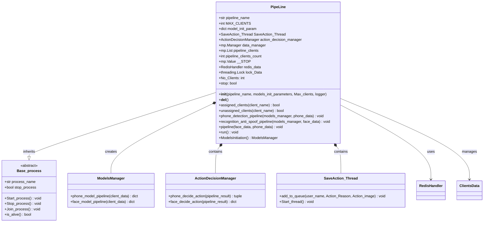

## Architecture Overview

The PipeLine class implements a multi-threaded processing architecture where each pipeline handles multiple clients through separate processing threads for phone detection and face recognition.

## Related Component Documentation

Each pipeline integrates with multiple system components:

- **[ModelsManager](ModelsManager.md)** - AI model management for pipeline processing
- **[Object Detection Task](Object_Detection_Task.md)** - Phone detection processing
  - `ObjectDetection.py` - Core object detection
  - `PhoneDetection.py` - Phone-specific detection
- **[Face Recognition Anti-Spoof Task](Face_Recognition_Anti_Spoof_Task.md)** - Face recognition processing
  - `FaceDetectionRecognition.py` - Main face authentication pipeline
  - `DetectFaces.py` - Face detection
  - `RecognitionFace.py` - Face recognition
  - `SpoofChecker.py` - Anti-spoofing
- **[ActionDecisionManager](ActionDecisionManager.md)** - Decision logic for each pipeline
- **[Save_Action_thread](Save_Action_thread.md)** - Action logging for pipeline events
- **[PipeLinesManager](PipeLinesManager.md)** - Pipeline coordination and management
- **[Utilities](Utilities.md)** - Project utilities and support functions

## Pipeline Architecture

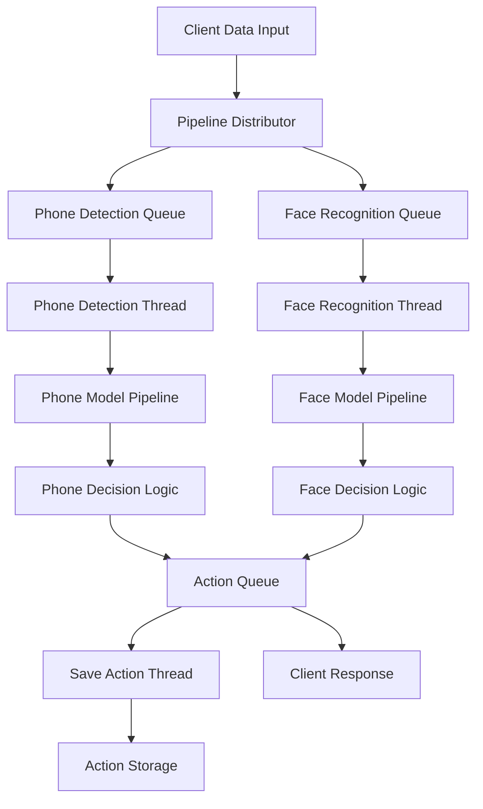

## Core Functionality

### 1. Client Management

#### Client Assignment Flow

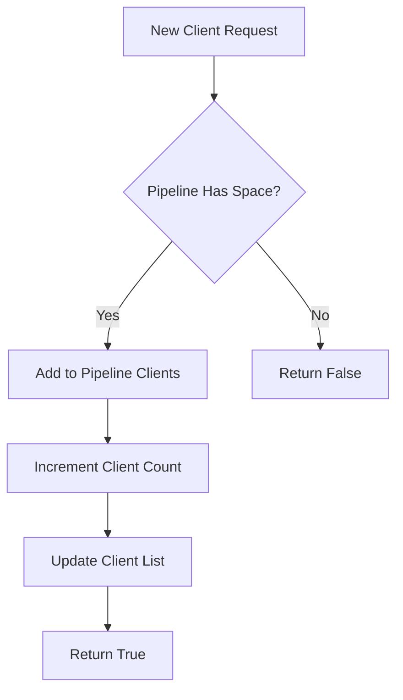

#### Client Unassignment Flow

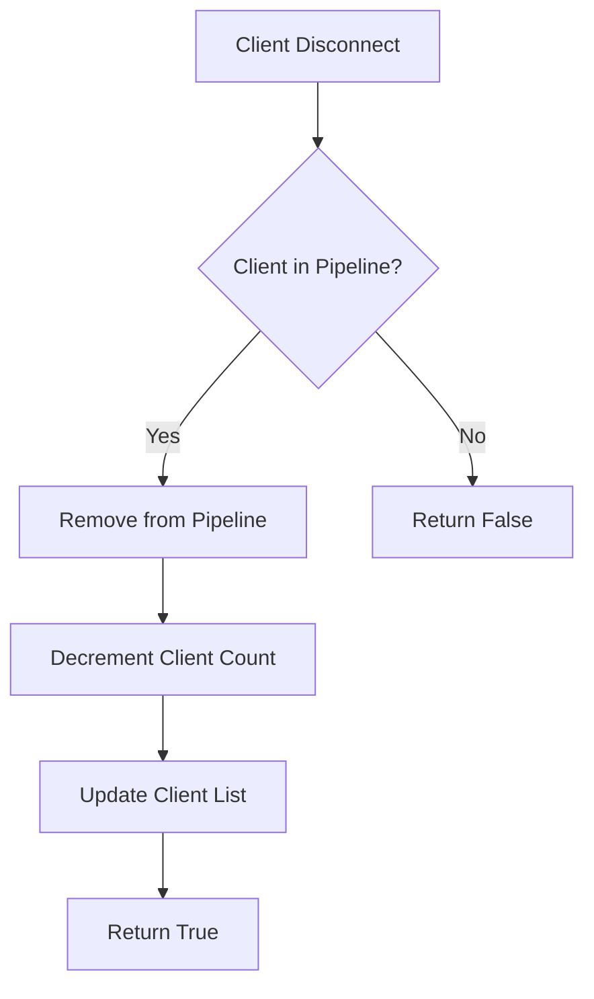

### 2. Processing Threads

#### Phone Detection Pipeline

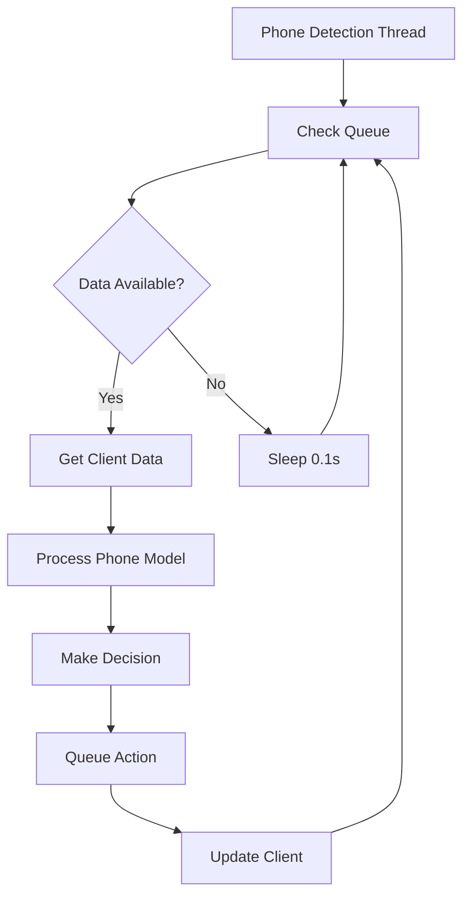

#### Face Recognition Pipeline

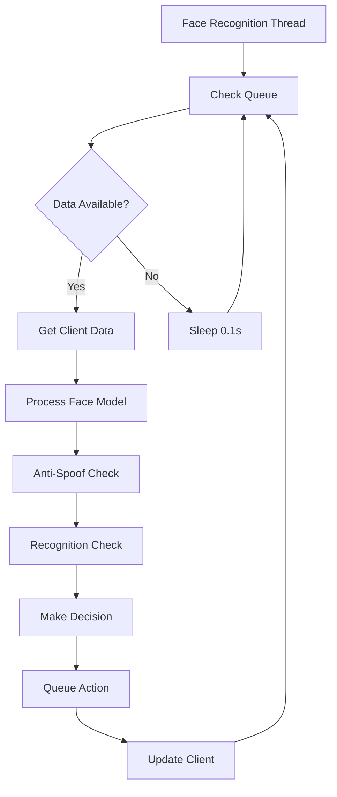

## Key Methods

### Client Management

#### `assigned_clients(client_name) -> bool`

**Purpose**: Assigns a new client to the pipeline

**Implementation**:

```python
def assigned_clients(self, client_name) -> bool:
    if self.pipeline_clients_count < self.MAX_CLIENTS:
        with self.lock_Data:
            self.pipeline_clients_count += 1
            self.pipeline_clients.append(client_name)
        return True
    else:
        return False
```

#### `unassigned_clients(client_name) -> bool`

**Purpose**: Removes a client from the pipeline

**Implementation**:

```python
def unassigned_clients(self, client_name) -> bool:
    if client_name in self.pipeline_clients:
        with self.lock_Data:
            self.pipeline_clients_count -= 1
            self.pipeline_clients.remove(client_name)
        return True
    else:
        return False
```

### Processing Methods

#### `phone_detection_pipeline(models_manager, phone_data)`

**Purpose**: Processes phone detection requests

**Flow**:

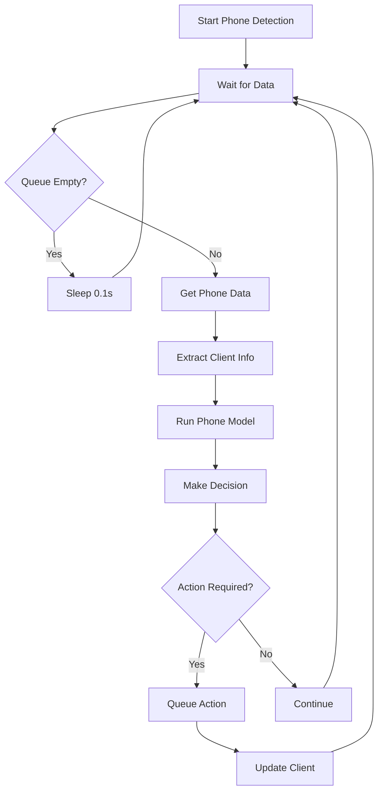

#### `recognition_anti_spoof_pipeline(models_manager, face_data)`

**Purpose**: Processes face recognition and anti-spoofing

**Flow**:

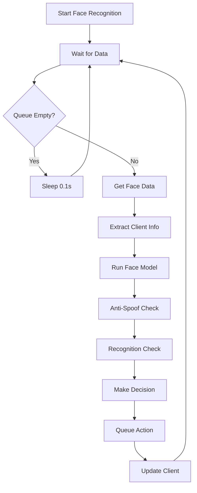

#### `pipeline(face_data, phone_data)`

**Purpose**: Main pipeline coordinator that distributes client data

**Flow**:

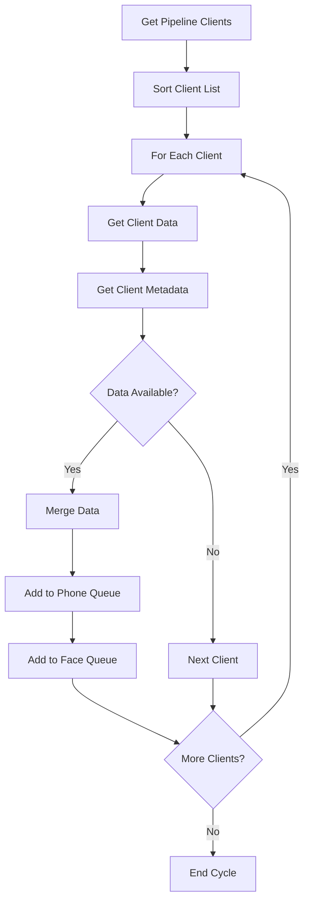

## Data Flow

### Client Data Processing

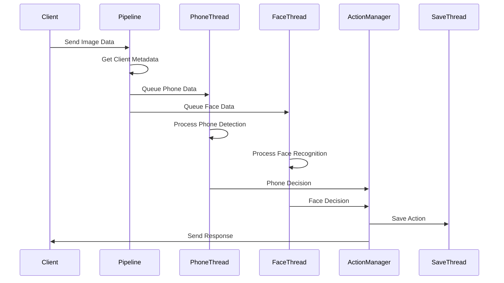

### Model Processing Flow

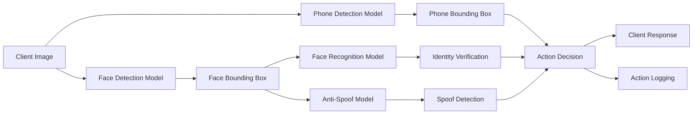

## Threading Architecture

### Thread Management

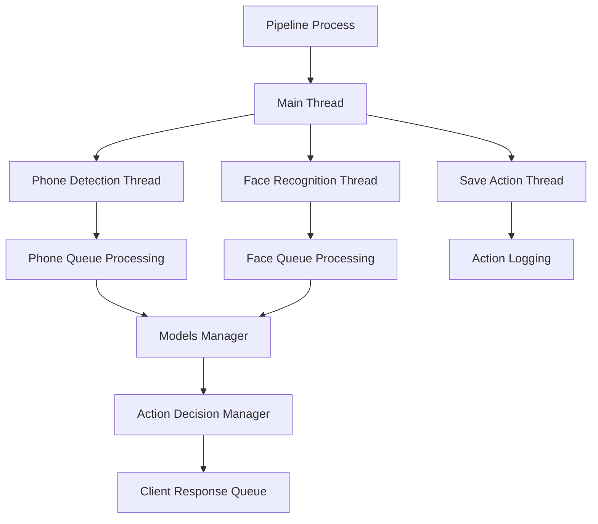

### Thread Synchronization

- **Lock_Data**: Protects client list modifications
- **Queue Management**: Thread-safe queue operations
- **Shared State**: Multiprocessing shared variables

## Error Handling

### Pipeline Errors

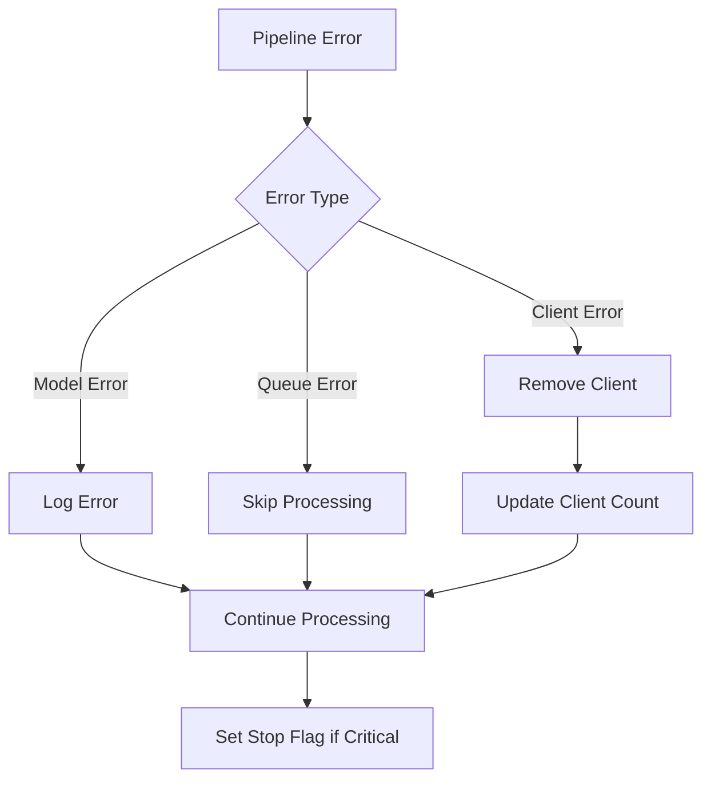

### Recovery Mechanisms

- **Graceful Degradation**: Continue processing other clients
- **Error Logging**: Comprehensive error tracking
- **State Recovery**: Automatic client state restoration

## Performance Optimization

### Queue Management

- **Queue Size**: Limited to MAX_CLIENTS to prevent memory issues
- **Non-blocking Operations**: Prevents thread deadlocks
- **Batch Processing**: Efficient data processing

### Resource Management

- **Memory Cleanup**: Automatic cleanup of client data
- **GPU Memory**: Efficient GPU resource utilization
- **Thread Pools**: Optimized thread management

## Configuration

### Pipeline Parameters

```python
pipeline = PipeLine(
    pipeline_name="pipeline_0",
    Max_clients=30,
    models_init_parameters=Models_Parameters,
    logger=logger
)
```

### Model Parameters

- **Recognition Threshold**: Face recognition confidence threshold
- **Anti-Spoof Threshold**: Spoofing detection threshold
- **Object Threshold**: Phone detection confidence threshold

## Usage Example

```python
# Initialize pipeline
pipeline = PipeLine(
    pipeline_name="pipeline_0",
    Max_clients=30,
    models_init_parameters=Models_Parameters,
    logger="pipeline_logs"
)

# Assign clients
pipeline.assigned_clients("client_1")
pipeline.assigned_clients("client_2")

# Start pipeline
pipeline.start()

# Monitor pipeline
while pipeline.is_alive():
    print(f"Active clients: {pipeline.No_Clients}")
    time.sleep(1)
```

## Dependencies

- **torch.multiprocessing**: Process management
- **threading**: Thread synchronization
- **queue**: Thread-safe queues
- **redis**: Client state management
- **ModelsManager**: AI model management
- **ActionDecisionManager**: Decision logic
- **SaveAction_Thread**: Action logging

## Memory Management

### Resource Cleanup

```python
def __del__(self):
    if hasattr(self, "action_decision_manager"):
        del self.action_decision_manager
    if hasattr(self, "pipeline_clients"):
        del self.pipeline_clients
    self.data_manager.shutdown()
```

### Memory Optimization

- **Shared Memory**: Efficient inter-process communication
- **Resource Pooling**: Reuse of expensive resources
- **Garbage Collection**: Automatic memory cleanup

## Future Enhancements

1. **Dynamic Load Balancing**: Automatic queue balancing
2. **Advanced Error Recovery**: Automatic error recovery
3. **Performance Profiling**: Detailed performance analysis
4. **Adaptive Thresholds**: Dynamic threshold adjustment
5. **Health Monitoring**: Real-time health checks
