# PipeLinesManager Module Documentation

## Overview

The `PipeLinesManager.py` module manages multiple processing pipelines for handling face recognition and object detection tasks. It provides dynamic pipeline creation, client assignment, and resource management to ensure optimal performance and scalability.

## Class Diagram

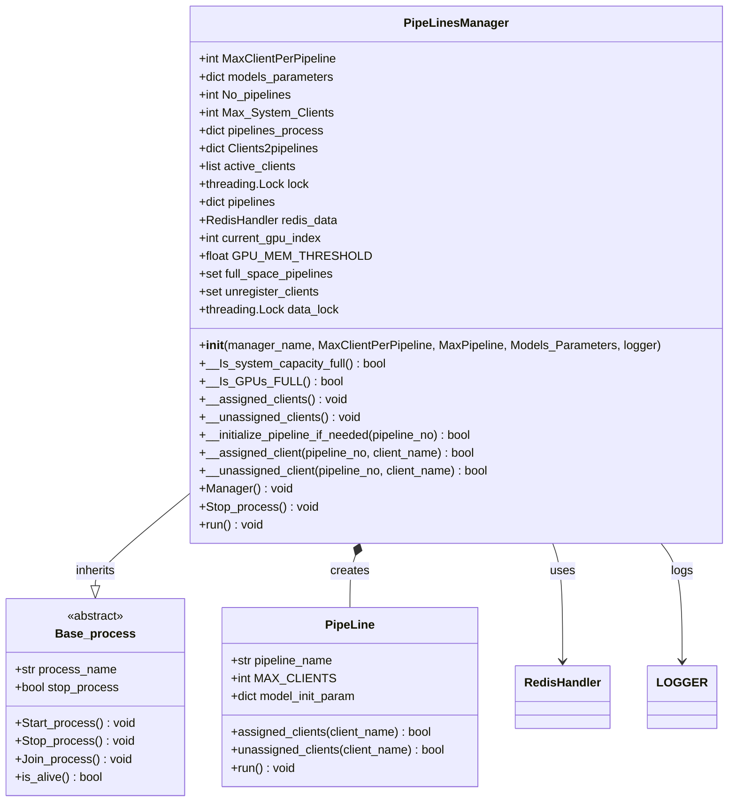

## Architecture Overview

The PipeLinesManager acts as a central coordinator for multiple processing pipelines, managing client assignment, resource allocation, and system capacity monitoring.

## Related Component Documentation

The PipeLinesManager coordinates with various system components:

- **[PipeLine](PipeLine.md)** - Individual pipeline processing logic
- **[ModelsManager](ModelsManager.md)** - AI model management for each pipeline
- **[Object Detection Task](Object_Detection_Task.md)** - Phone detection components
- **[Face Recognition Anti-Spoof Task](Face_Recognition_Anti_Spoof_Task.md)** - Face recognition components
- **[ActionDecisionManager](ActionDecisionManager.md)** - Decision logic for each pipeline
- **[Server](Server.md)** - WebSocket server coordination
- **[Save_Action_thread](Save_Action_thread.md)** - Action logging coordination

## Core Functionality

### 1. Pipeline Management

#### Pipeline Creation Flow
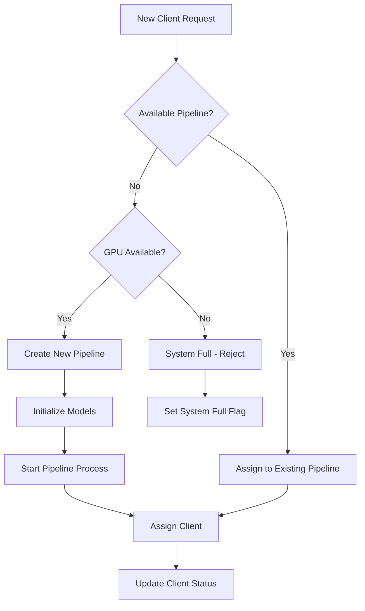

#### Pipeline Lifecycle


### 2. Client Assignment System

#### Client Assignment Flow
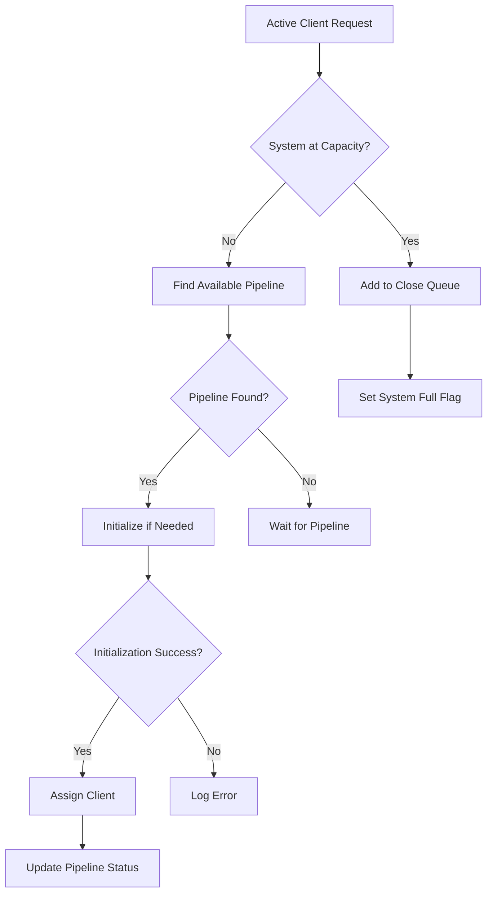

## Key Methods

### System Capacity Management

#### `__Is_system_capacity_full() -> bool`
**Purpose**: Monitors system capacity and manages client overflow

**Logic**:
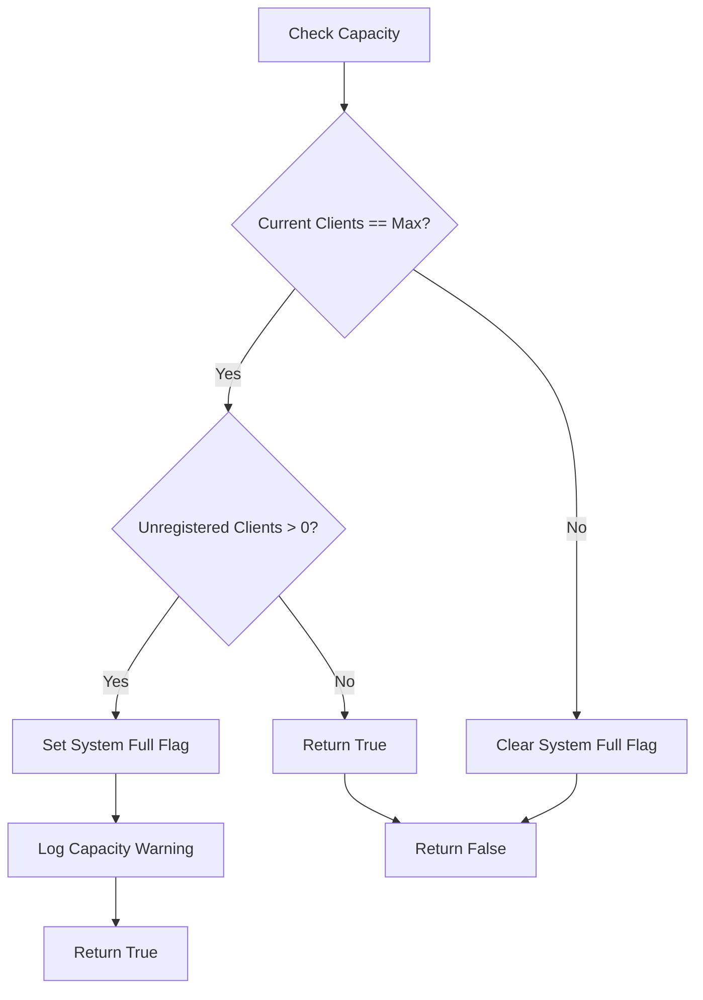

#### `__Is_GPUs_FULL() -> bool`
**Purpose**: Monitors GPU resource availability

**Logic**:
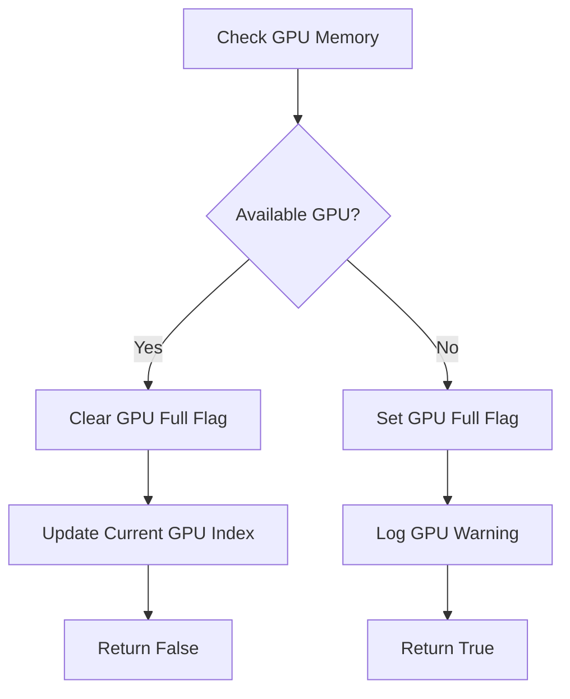

### Client Management Threads

#### `__assigned_clients()`
**Purpose**: Manages assignment of new clients to pipelines

**Flow**:
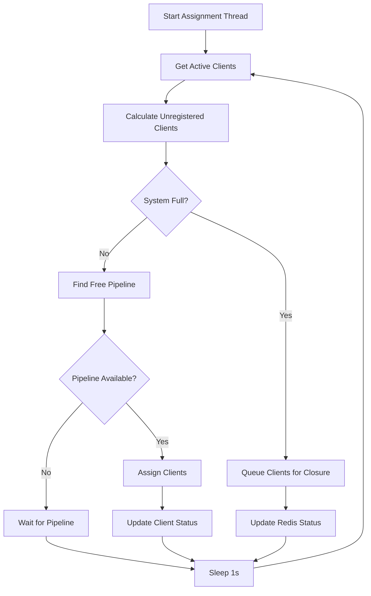

#### `__unassigned_clients()`
**Purpose**: Removes clients no longer active from pipelines

**Flow**:
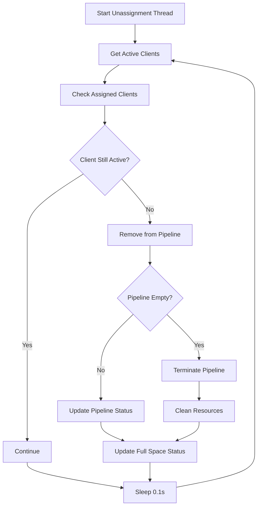

### Pipeline Operations

#### `__initialize_pipeline_if_needed(pipeline_no) -> bool`
**Purpose**: Creates and initializes a new pipeline if required

**Implementation**:
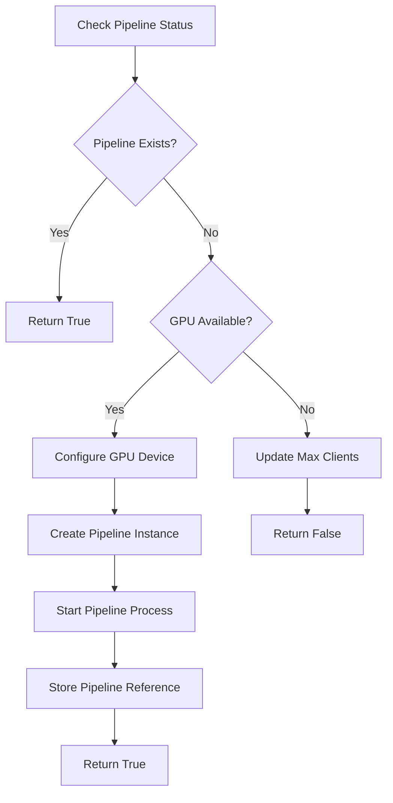

#### `__assigned_client(pipeline_no, client_name) -> bool`
**Purpose**: Assigns a specific client to a pipeline

**Logic**:
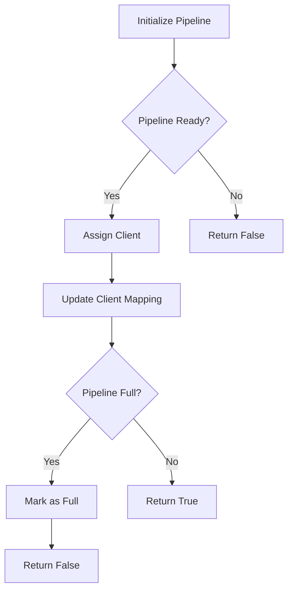

#### `__unassigned_client(pipeline_no, client_name) -> bool`
**Purpose**: Removes a client from a pipeline

**Logic**:
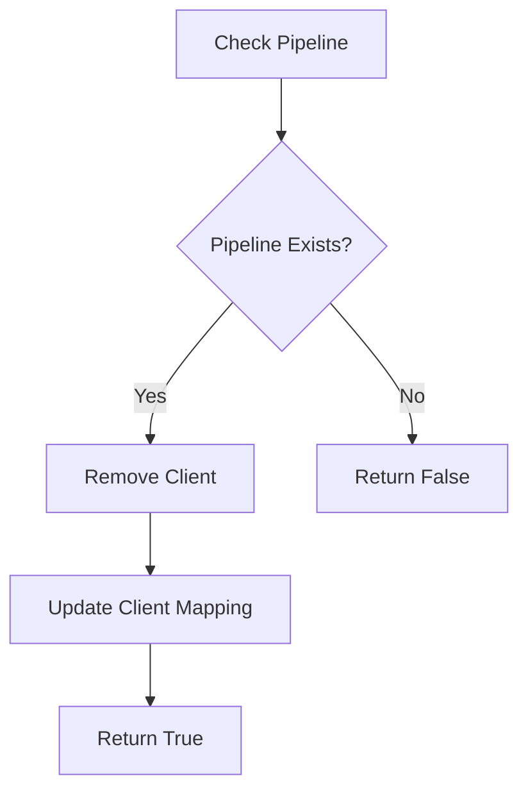

## Resource Management

### GPU Management
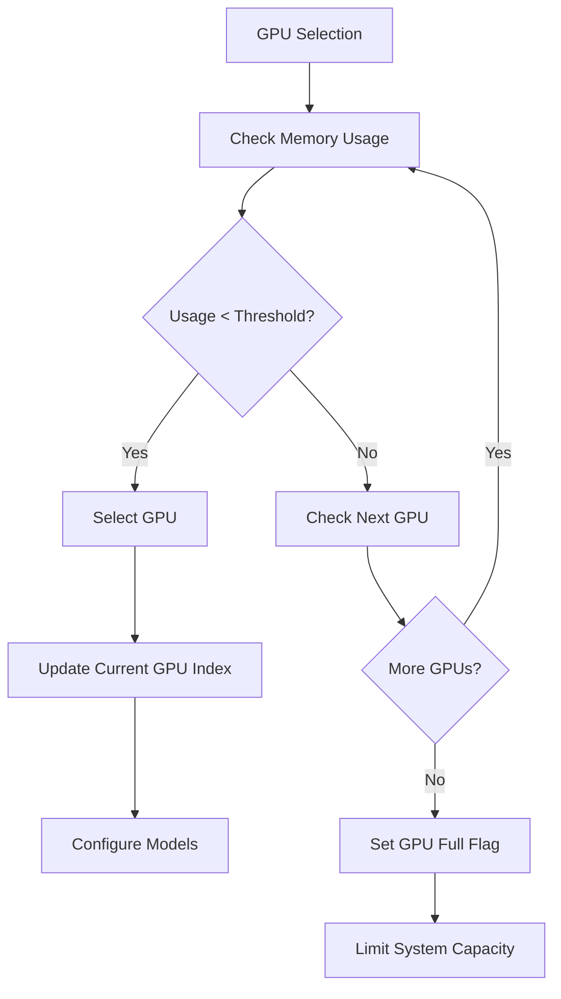

### Memory Management
- **Pipeline Cleanup**: Automatic cleanup of terminated pipelines
- **Client Mapping**: Efficient client-to-pipeline mapping
- **Resource Monitoring**: Continuous monitoring of system resources

## Configuration Parameters

### System Limits
- `MaxClientPerPipeline`: Maximum clients per pipeline (default: 30)
- `MaxPipeline`: Maximum number of pipelines (default: 5)
- `GPU_MEM_THRESHOLD`: GPU memory threshold (default: 0.8)

### Model Parameters
```python
Models_Parameters = {
    "Models_Weights_dir": "Models_Weights",
    "ObjectDetection_model_weights": "phone_detection.pt",
    "FaceDetection_model_weights": "yolov8_model.pt",
    "FaceRecognition_model_weights": None,
    "FaceSpoofChecker_model_weights": None,
    "Object_Detection_Models_device": "cuda",
    "Face_Detection_Model_device": "cuda",
    "Face_Recognition_Model_device": "GPU",
    "spoof_Models_device": "cuda",
    "Recognition_model_name": "VGG-Face",
    "Recognition_Metric": "cosine_similarity",
    "Object_class_number": 67,
    "Recognition_Threshold": 0.3,
    "Object_threshold": 65,
    "Anti_Spoof_threshold": 0.99
}
```

## Performance Metrics

### Capacity Calculations
- **Max System Clients**: `MaxPipeline × MaxClientPerPipeline`
- **Pipeline Utilization**: Clients per pipeline / MaxClientPerPipeline
- **System Utilization**: Total clients / Max System Clients

### Monitoring Points
1. **Active Clients**: Number of currently connected clients
2. **Pipeline Count**: Number of active pipelines
3. **GPU Usage**: GPU memory utilization
4. **System Capacity**: Current vs maximum capacity

## Error Handling

### Pipeline Errors
- **Initialization Failure**: GPU unavailable or model loading error
- **Process Crash**: Automatic pipeline restart
- **Resource Exhaustion**: Graceful degradation

### Client Errors
- **Assignment Failure**: Client queuing for retry
- **Timeout**: Client disconnection handling
- **Invalid State**: Client state synchronization

## Thread Safety

The PipeLinesManager uses multiple synchronization mechanisms:

### Locks
- `data_lock`: Protects pipeline data structures
- `lock`: General synchronization lock

### Thread-Safe Operations
- Client assignment and unassignment
- Pipeline creation and termination
- Resource status updates

## Usage Example

```python
# Initialize pipeline manager
pipe_lines_manager = PipeLinesManager(
    "PipeLinesManager",
    MaxClientPerPipeline=30,
    MaxPipeline=5,
    Models_Parameters=Models_Parameters,
    logger="pipelines_logs"
)

# Start pipeline manager
pipe_lines_manager.Start_process()

# Monitor pipeline manager
while pipe_lines_manager.is_alive():
    time.sleep(1)
```

## Dependencies

- **torch.multiprocessing**: Pipeline process management
- **threading**: Thread synchronization
- **redis**: Client state management
- **common_utilities**: GPU monitoring and logging
- **PipeLine**: Individual pipeline implementation

## Performance Optimization

### Strategies
1. **Lazy Loading**: Pipelines created on demand
2. **Resource Pooling**: Efficient GPU utilization
3. **Load Balancing**: Even client distribution
4. **Automatic Scaling**: Dynamic pipeline creation

### Best Practices
1. **Monitor GPU Memory**: Prevent OOM errors
2. **Client Batching**: Efficient client processing
3. **Pipeline Reuse**: Minimize initialization overhead
4. **Resource Cleanup**: Prevent memory leaks

## Future Enhancements

1. **Advanced Load Balancing**: Weighted client assignment
2. **Pipeline Prioritization**: Priority-based processing
3. **Health Monitoring**: Pipeline health checks
4. **Auto-scaling**: Dynamic capacity adjustment
5. **Metrics Dashboard**: Real-time monitoring interface
