# Save_Action_thread Module Documentation

## Overview

The `Save_Action_thread.py` module implements a threaded action logging system that handles the persistent storage of security actions and their associated evidence images. It provides asynchronous logging capabilities for actions such as face recognition failures, phone detections, and spoofing attempts.

## Class Diagram

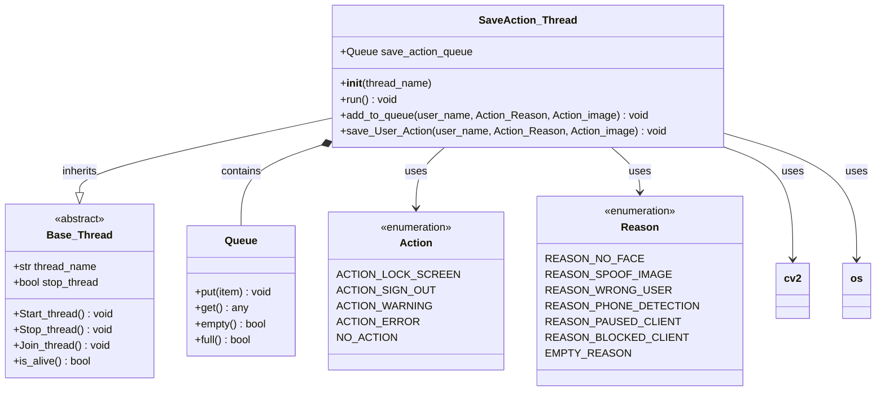

## Architecture Overview

The SaveAction_Thread implements a producer-consumer pattern where security actions are queued by detection systems and processed asynchronously by the thread for persistent storage.

## Action Logging Architecture

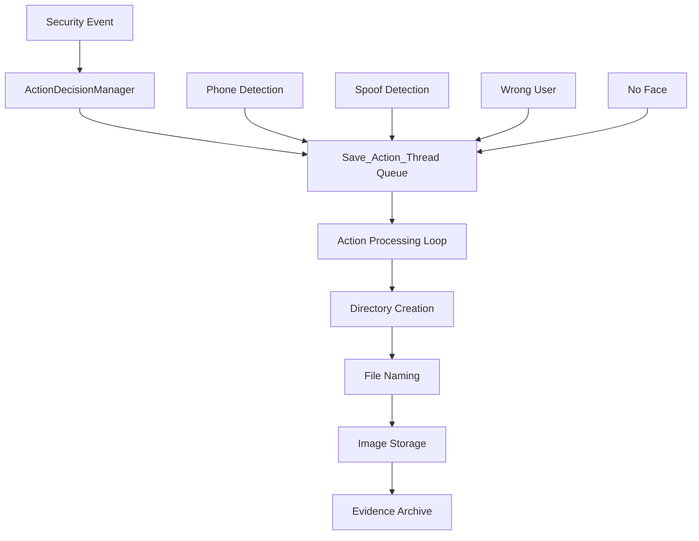

## Core Functionality

### 1. Threaded Action Processing

#### Thread Processing Flow
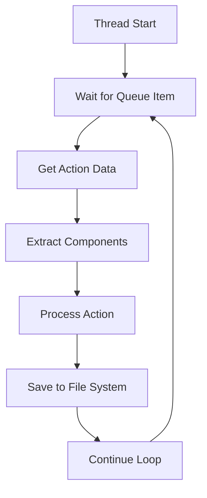

#### Queue Management
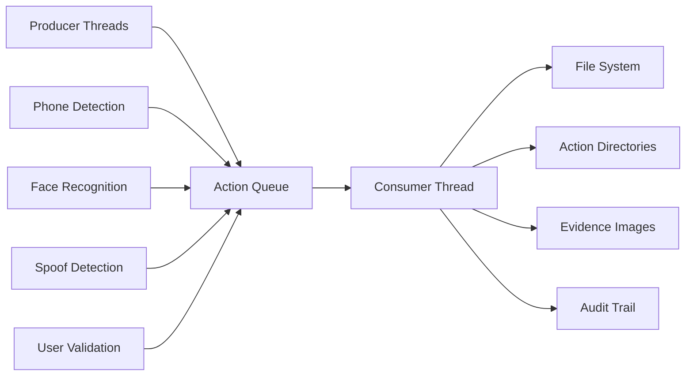

### 2. File System Organization

#### Directory Structure
```
Data/Actions/
├── Lock_screen/
│   ├── user1/
│   │   ├── 17_07_2025-12_30_Lock_screen_No_face.jpg
│   │   └── 17_07_2025-12_31_Lock_screen_Wrong_user.jpg
│   └── user2/
├── Sign_out/
│   ├── user1/
│   │   ├── 17_07_2025-12_32_Sign_out_Spoof_image.jpg
│   │   └── 17_07_2025-12_33_Sign_out_Phone_detection.jpg
│   └── user2/
└── Warning/
    └── user1/
```

#### File Naming Convention
```
{DD_MM_YYYY-HH_MM}___{Action_Type}___{Reason_Type}.jpg
```

Example: `17_07_2025-12_30___Lock_screen___No_face.jpg`

## Key Methods

### Thread Management

#### `__init__(thread_name)`
**Purpose**: Initializes the action logging thread

**Implementation**:
```python
def __init__(self, thread_name):
    super().__init__(thread_name=thread_name)
    self.save_action_queue: Queue[Tuple[str, Dict[str, int], cv2.typing.MatLike]] = Queue()
```

#### `run()`
**Purpose**: Main thread execution loop

**Implementation**:
```python
def run(self):
    while(True):
        tuple_action_data = self.save_action_queue.get()
        self.save_User_Action(
            user_name=tuple_action_data[0],
            Action_Reason=tuple_action_data[1],
            Action_image=tuple_action_data[2]
        )
```

### Queue Operations

#### `add_to_queue(user_name, Action_Reason, Action_image)`
**Purpose**: Adds action data to the processing queue

**Parameters**:
- `user_name`: Client identifier
- `Action_Reason`: Dictionary containing action and reason codes
- `Action_image`: OpenCV image with evidence

**Implementation**:
```python
def add_to_queue(self, user_name: str, Action_Reason: Dict[str, int], Action_image: cv2.typing.MatLike):
    self.save_action_queue.put((user_name, Action_Reason, Action_image))
```

### File System Operations

#### `save_User_Action(user_name, Action_Reason, Action_image)`
**Purpose**: Saves action evidence to the file system

**Process Flow**:
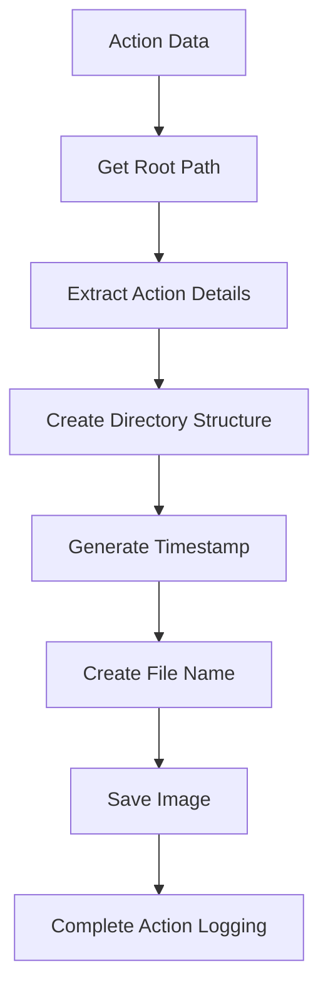

**Implementation**:
```python
def save_User_Action(self, user_name: str, Action_Reason: Dict[str, int], Action_image: cv2.typing.MatLike) -> None:
    root_path = get_root_path(__file__, "main.py")
    Action_name = Action_Reason['action']
    Reason_name = Action_Reason['reason']
    
    # Create directory structure
    action_user_dir = os.path.join(
        root_path, "Data", "Actions",
        Action(Action_name).name.replace("ACTION_", "").capitalize(),
        user_name
    )
    os.makedirs(action_user_dir, exist_ok=True)
    
    # Generate timestamp and filename
    action_time = time.localtime()
    formatted_action_time = time.strftime("%d_%m_%Y-%H_%M", action_time)
    image_name = "___".join([
        formatted_action_time,
        Action(Action_name).name.replace("ACTION_", "").capitalize(),
        Reason(Reason_name).name.replace("REASON_", "").capitalize()
    ])
    
    # Save image
    image_name_path = os.path.join(action_user_dir, image_name + ".jpg")
    cv2.imwrite(image_name_path, Action_image)
```

## Action Types and Processing

### Action Categories

#### Lock Screen Actions
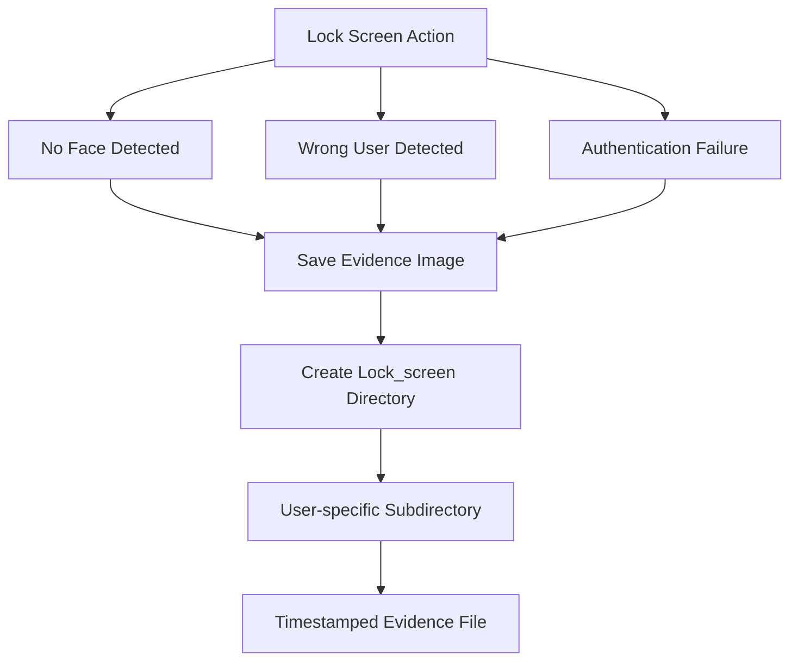

#### Sign Out Actions
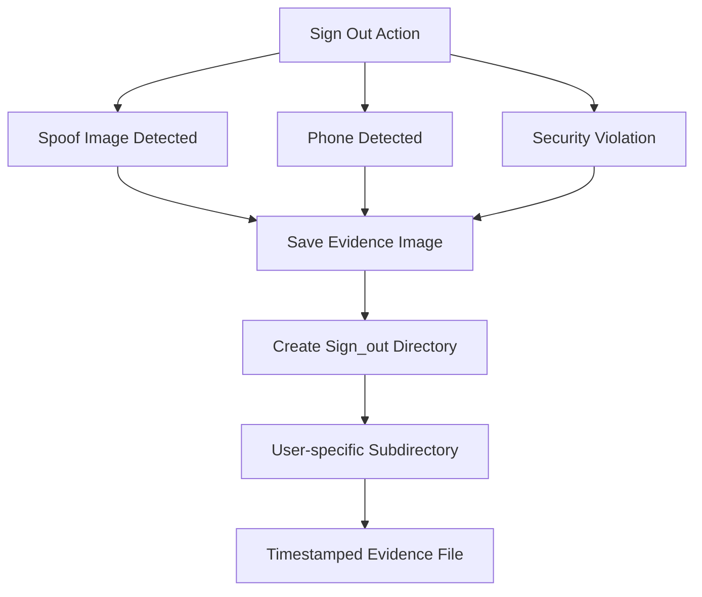

### Evidence Processing

#### Image Processing Flow
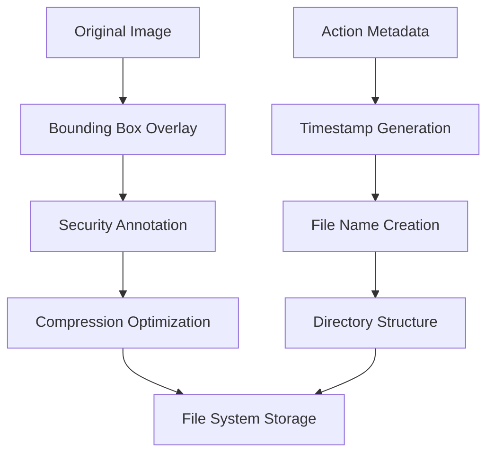

#### Bounding Box Visualization
- **Phone Detection**: Red bounding boxes around detected phones
- **Face Detection**: Blue bounding boxes for spoof faces
- **Annotation**: Clear visual indication of security violations

## File Organization

### Directory Hierarchy
```
Data/Actions/
├── {Action_Type}/          # Action category (Lock_screen, Sign_out, etc.)
│   ├── {User_Name}/        # User-specific subdirectory
│   │   ├── {Timestamp}___{Action}___{Reason}.jpg
│   │   └── {Timestamp}___{Action}___{Reason}.jpg
│   └── {User_Name}/
└── {Action_Type}/
```

### File Naming Components
1. **Timestamp**: `DD_MM_YYYY-HH_MM` format
2. **Action Type**: Cleaned action name (e.g., "Lock_screen")
3. **Reason**: Cleaned reason name (e.g., "No_face")
4. **Extension**: `.jpg` for images

## Performance Considerations

### Queue Management
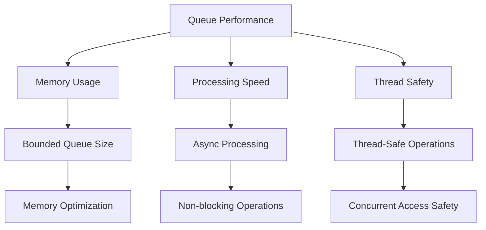

### Optimization Strategies
1. **Asynchronous Processing**: Non-blocking action logging
2. **Memory Efficiency**: Minimal memory footprint for queue items
3. **File System Optimization**: Efficient directory creation and file writing
4. **Error Handling**: Graceful error recovery for file operations

## Error Handling

### File System Errors
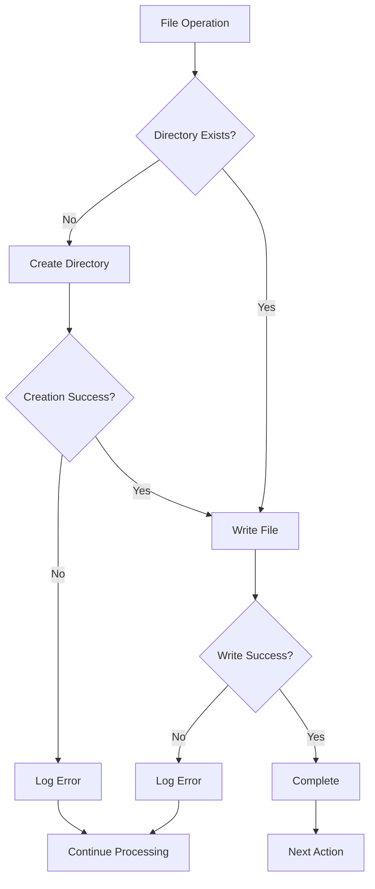

### Recovery Mechanisms
- **Directory Creation**: Automatic creation of missing directories
- **Error Logging**: Comprehensive error tracking
- **Graceful Degradation**: Continue processing despite individual failures
- **Retry Logic**: Automatic retry for transient errors

## Security and Compliance

### Evidence Integrity
- **Timestamp Accuracy**: Precise time recording for audit trails
- **Image Integrity**: Unmodified evidence images
- **Access Control**: Secure file system permissions
- **Audit Trail**: Complete action logging history

### Privacy Considerations
- **Data Minimization**: Only necessary data is stored
- **Secure Storage**: Protected file system access
- **Retention Policy**: Configurable evidence retention
- **Access Logging**: Track access to evidence files

## Configuration

### Thread Configuration
```python
save_action_thread = SaveAction_Thread("SaveAction_Thread")
save_action_thread.Start_thread()
```

### Storage Configuration
- **Root Path**: Automatically determined from application structure
- **Directory Structure**: Organized by action type and user
- **File Format**: JPEG for optimal storage efficiency
- **Naming Convention**: Standardized timestamp and metadata format

## Monitoring

### Performance Metrics
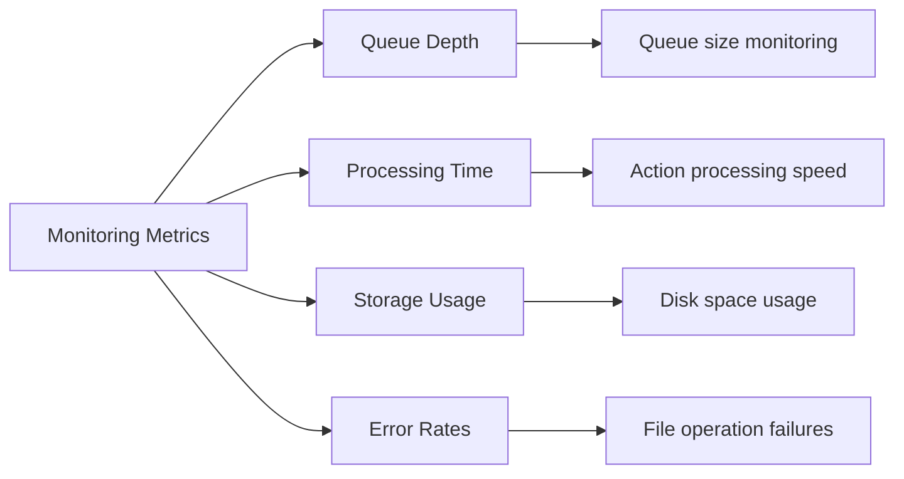

### Health Indicators
- **Queue Size**: Number of pending actions
- **Processing Rate**: Actions processed per second
- **Storage Growth**: Evidence storage consumption
- **Error Frequency**: File operation failure rate

## Usage Example

```python
# Initialize save action thread
save_action_thread = SaveAction_Thread("SaveAction_Thread")
save_action_thread.Start_thread()

# Add action to queue
action_data = {
    "action": Action.ACTION_SIGN_OUT.value,
    "reason": Reason.REASON_PHONE_DETECTION.value
}

save_action_thread.add_to_queue(
    user_name="user1",
    Action_Reason=action_data,
    Action_image=evidence_image
)

# Thread processes actions asynchronously
# Files are saved to: Data/Actions/Sign_out/user1/17_07_2025-12_30___Sign_out___Phone_detection.jpg
```

## Dependencies

- **os**: File system operations
- **time**: Timestamp generation
- **typing**: Type hints for better code documentation
- **cv2**: Image processing and file writing
- **queue**: Thread-safe queue operations
- **common_utilities**: Base thread functionality and path utilities
- **utilities.project_utilities**: Action and Reason enumerations

## Thread Safety

### Synchronization
- **Thread-Safe Queue**: Built-in thread safety for queue operations
- **Atomic Operations**: File system operations are atomic
- **Error Isolation**: Thread-level error handling
- **Resource Management**: Proper resource cleanup

## Future Enhancements

1. **Database Integration**: Store action metadata in database
2. **Compression**: Implement image compression for storage efficiency
3. **Backup System**: Automated backup of evidence files
4. **Encryption**: Encrypt sensitive evidence data
5. **Retention Policy**: Automated cleanup of old evidence
6. **Real-time Monitoring**: Live monitoring of action logging
7. **Batch Processing**: Optimize for high-volume action logging
8. **Cloud Storage**: Integration with cloud storage services
9. **Advanced Analytics**: Analysis of action patterns and trends
10. **Notification System**: Real-time alerts for critical actions
