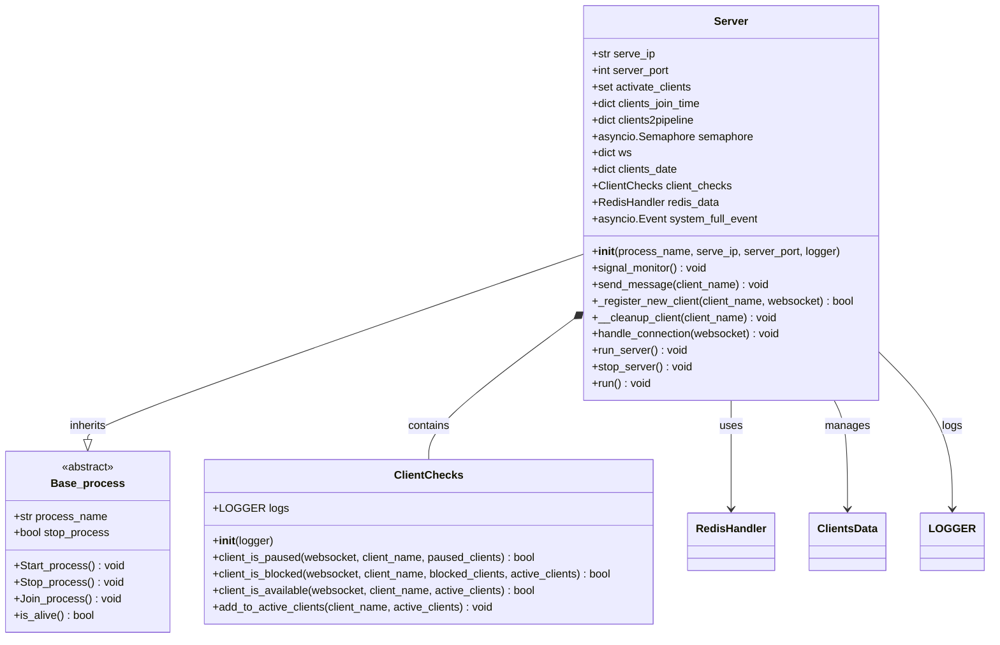
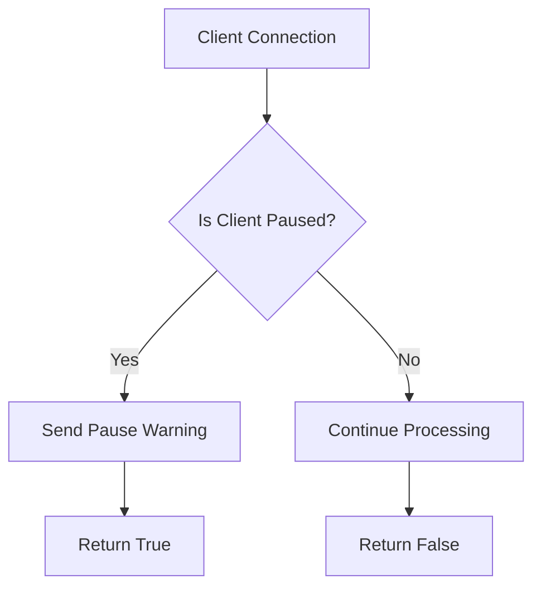
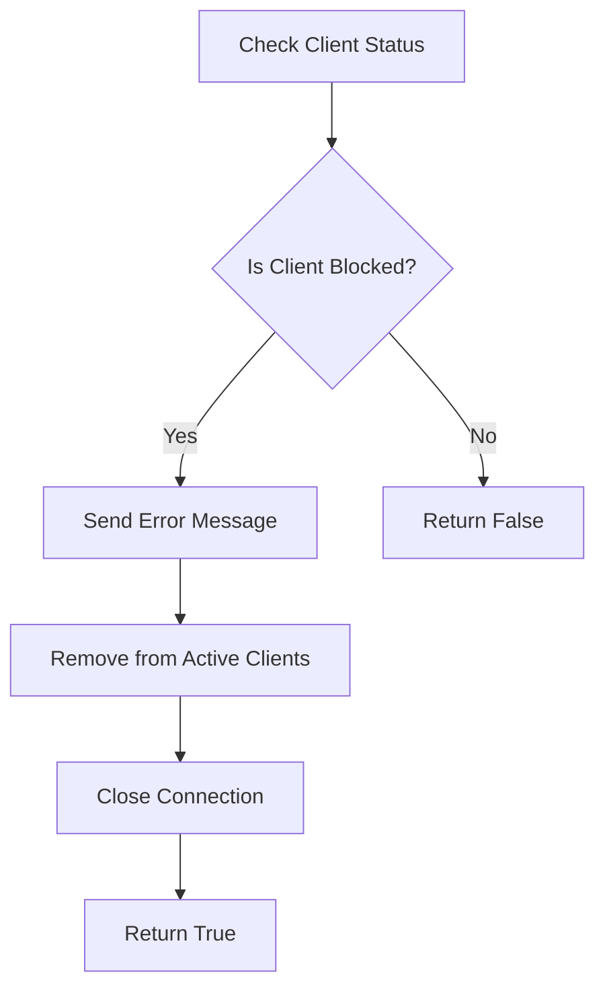
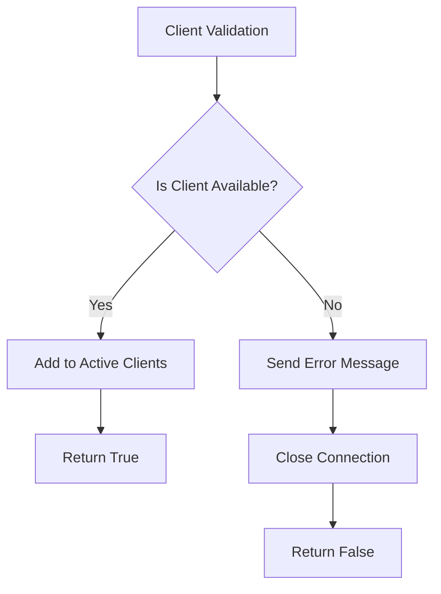
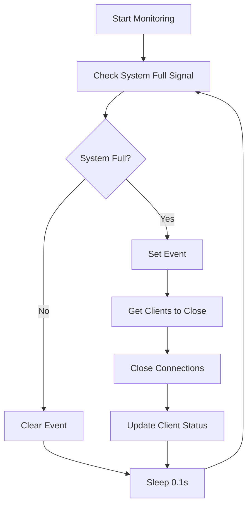
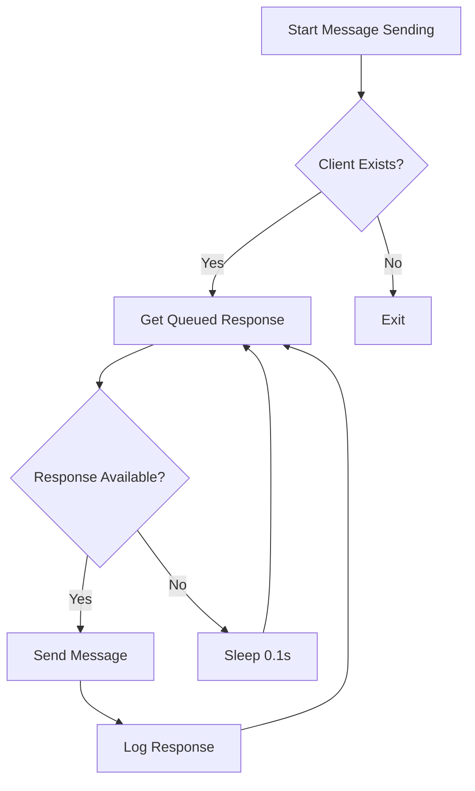
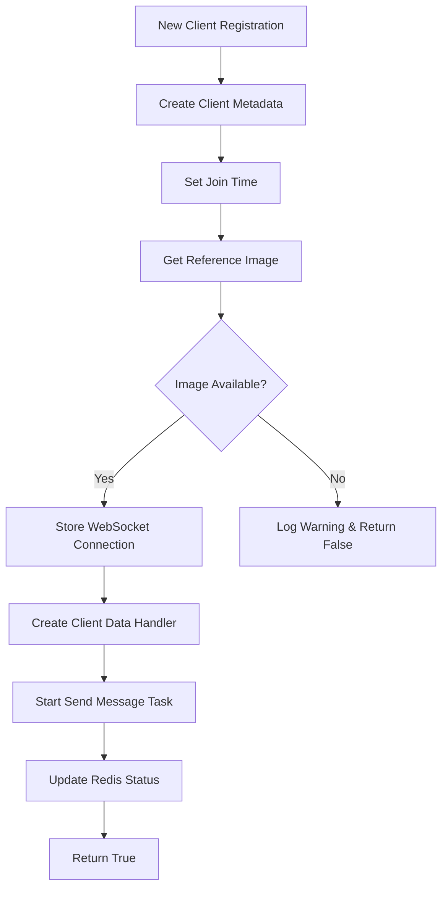
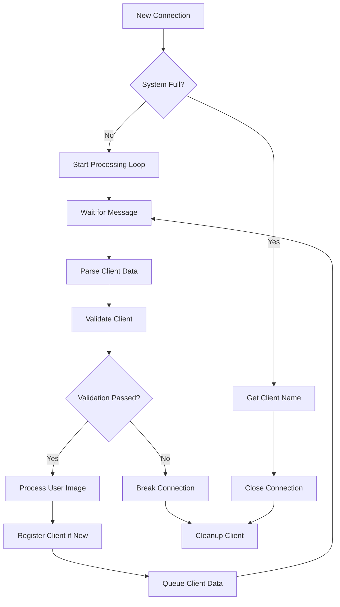
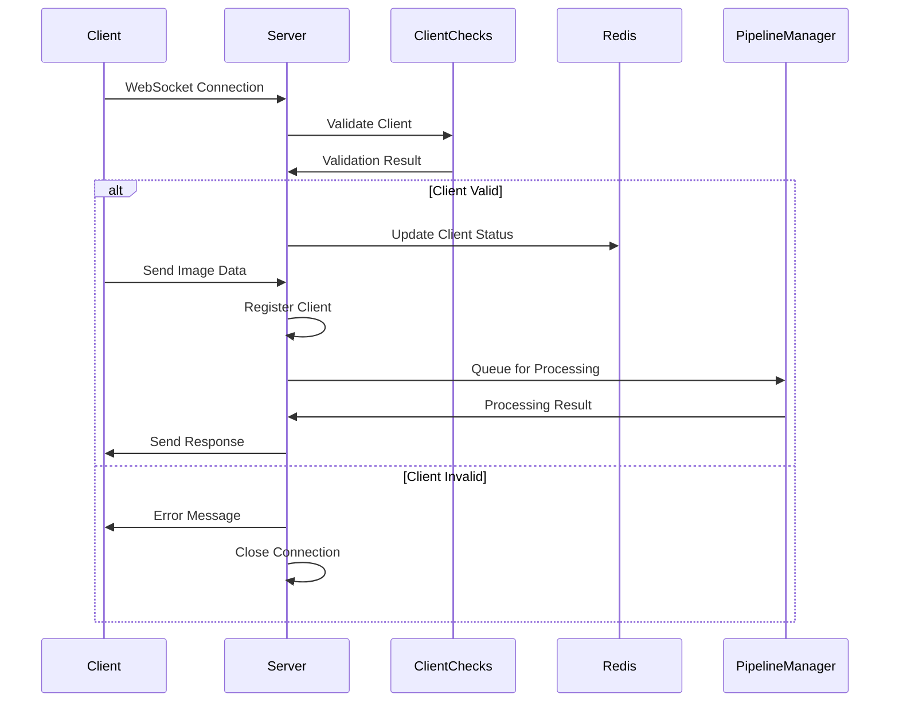

# Server Module Documentation

## Overview

The `Server.py` module implements the WebSocket server that handles client connections and manages real-time communication between clients and the face recognition system. It provides connection management, client validation, and message routing functionality.

## Class Diagram



## Architecture Overview

The Server module implements a multi-threaded WebSocket server with the following key components:

## Related Component Documentation

The Server module coordinates with various system components for complete functionality:

- **[ModelsManager](ModelsManager.md)** - AI model management and inference
- **[PipeLinesManager](PipeLinesManager.md)** - Pipeline creation and management
- **[PipeLine](PipeLine.md)** - Individual pipeline processing
- **[Object Detection Task](Object_Detection_Task.md)** - Phone detection components
- **[Face Recognition Anti-Spoof Task](Face_Recognition_Anti_Spoof_Task.md)** - Face recognition components
- **[ActionDecisionManager](ActionDecisionManager.md)** - Decision logic system
- **[Server_Manager](Server_Manager.md)** - File and data management
- **[Save_Action_thread](Save_Action_thread.md)** - Action logging system
- **[Utilities](Utilities.md)** - Project utilities and support functions

## Core Classes

### 1. ClientChecks Class

Handles client validation and status checking.

#### Methods

##### `client_is_paused(websocket, client_name, paused_clients) -> bool`

**Purpose**: Checks if a client is in paused state

**Flow**:



##### `client_is_blocked(websocket, client_name, blocked_clients, active_clients) -> bool`

**Purpose**: Validates if client is blocked and handles cleanup

**Flow**:



##### `client_is_available(websocket, client_name, active_clients) -> bool`

**Purpose**: Verifies client availability in user database

**Flow**:



### 2. Server Class

Main server implementation extending Base_process.

#### Key Attributes

- `serve_ip`: Server IP address
- `server_port`: Server port number
- `activate_clients`: Set of active client connections
- `clients_join_time`: Dictionary tracking client join timestamps
- `ws`: WebSocket connections mapping
- `clients_date`: Client data management
- `system_full_event`: Event for system capacity management

#### Core Methods

##### `signal_monitor()`

**Purpose**: Monitors system capacity and manages client connections

**Flow**:



##### `send_message(client_name)`

**Purpose**: Sends queued messages to specific client

**Flow**:



##### `_register_new_client(client_name, websocket)`

**Purpose**: Registers new client connection

**Flow**:



##### `handle_connection(websocket)`

**Purpose**: Main connection handler for WebSocket clients

**Flow**:



## Message Flow

The server handles the following message flow:



## Error Handling

The server implements comprehensive error handling:

### Connection Errors

- **ConnectionClosed**: Graceful handling of client disconnections
- **ConnectionClosedOK**: Normal connection closure
- **Timeout**: Client timeout handling with configurable limits

### Client Validation Errors

- **Blocked Client**: Immediate disconnection with error message
- **Paused Client**: Warning message with continued monitoring
- **Unavailable Client**: Error response with connection closure

### System Errors

- **System Full**: Rejection of new connections when capacity reached
- **GPU Full**: Resource management when GPU memory exhausted

## Configuration

### Environment Variables

- `MaxClientPerPipeline`: Maximum clients per processing pipeline
- `MaxPipeline`: Maximum number of processing pipelines
- `NAMESPACE`: System namespace identifier

### Redis Keys

- `SYSTEM_FULL`: System capacity status
- `GPUs_FULL`: GPU resource availability
- `Clients_status`: Client state management

## Performance Considerations

### Concurrency

- **Asynchronous Processing**: All I/O operations are asynchronous
- **Semaphore Control**: Limits concurrent operations
- **Event-driven Architecture**: Efficient resource utilization

### Memory Management

- **Client Cleanup**: Automatic cleanup of disconnected clients
- **Resource Monitoring**: GPU and system resource tracking
- **Connection Pooling**: Efficient WebSocket connection management

## Security Features

### Authentication

- **Client Validation**: Database-based client verification
- **Reference Image Check**: Validates client reference images
- **Session Management**: Secure client session handling

### Access Control

- **Blocking**: Permanent client blocking capability
- **Pausing**: Temporary client suspension
- **Rate Limiting**: Connection rate limiting through semaphore

## Usage Example

```python
# Initialize server
server = Server(
    process_name="Server",
    serve_ip="0.0.0.0",
    server_port=8000,
    logger="Server_logs"
)

# Start server process
server.Start_process()

# Monitor server
while server.is_alive():
    time.sleep(1)
```

## Dependencies

- **websockets**: WebSocket server implementation
- **asyncio**: Asynchronous I/O operations
- **redis**: Client state management
- **cv2**: Image processing
- **json**: Message serialization
- **common_utilities**: Logging and base process functionality

## Testing

The server can be tested using WebSocket clients that send properly formatted JSON messages with user images.
