# Server_Manager Module Documentation

## Overview

The `Server_Manager.py` module manages server-side operations related to client file management, status tracking, and data persistence. It handles client blocking, pausing, activation states, and maintains JSON-based data storage for server configuration and client status information.

## Class Diagram

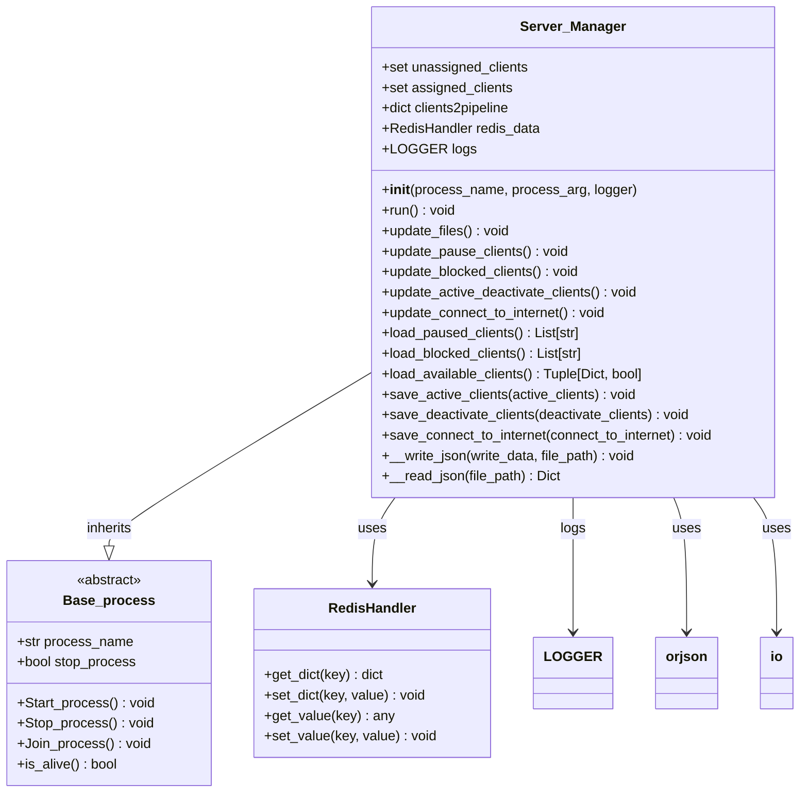

## Architecture Overview

The Server_Manager implements a file-based configuration management system with Redis integration for real-time client status tracking and updates.

## Data Flow Architecture

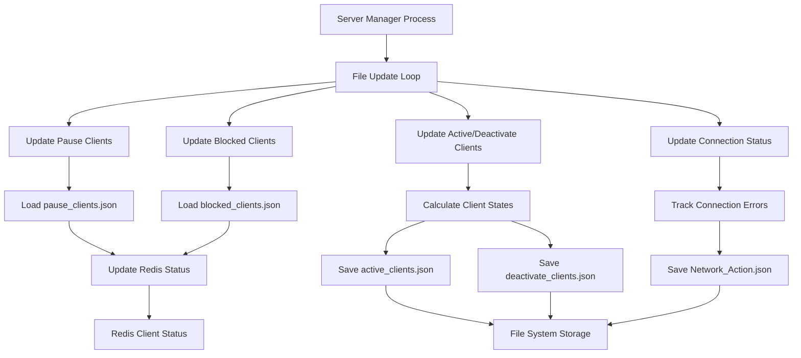

## Core Functionality

### 1. Client Status Management

#### Client State Transitions

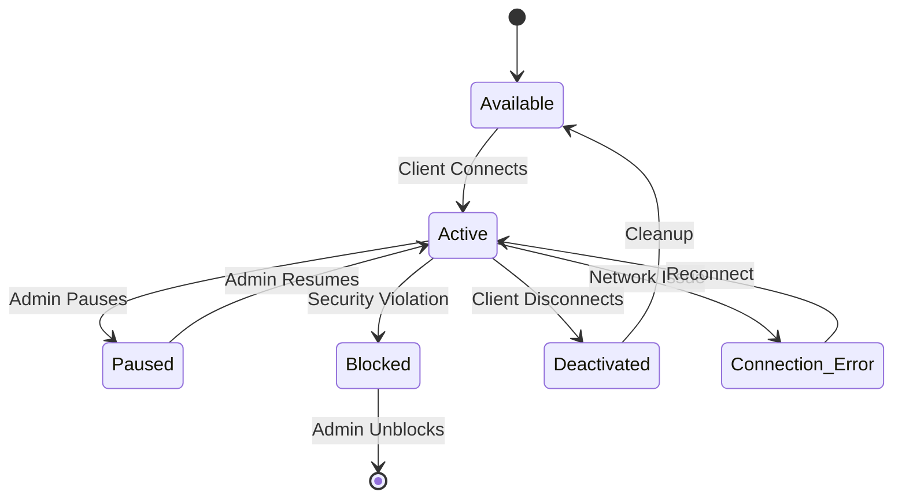

#### Status Update Flow

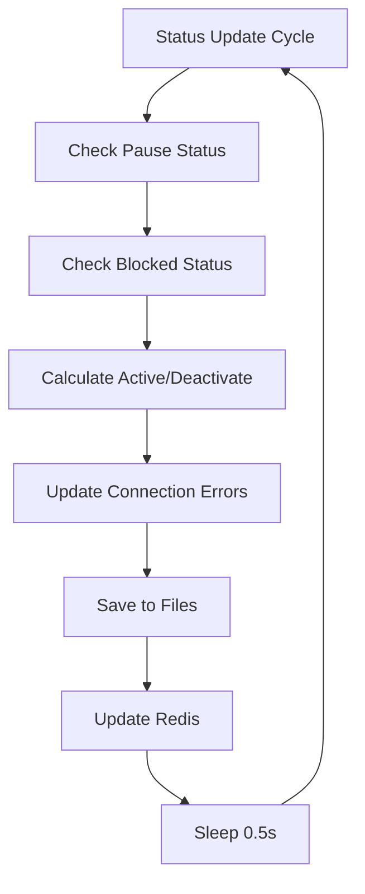

### 2. File Management System

#### File Structure

```
Data/Server_Data/
├── pause_clients.json          # Paused clients list
├── blocked_clients.json        # Blocked clients list
├── active_clients.json         # Currently active clients
├── deactivate_clients.json     # Disconnected clients
└── Network_Action.json         # Connection error clients
```

#### File Operations Flow

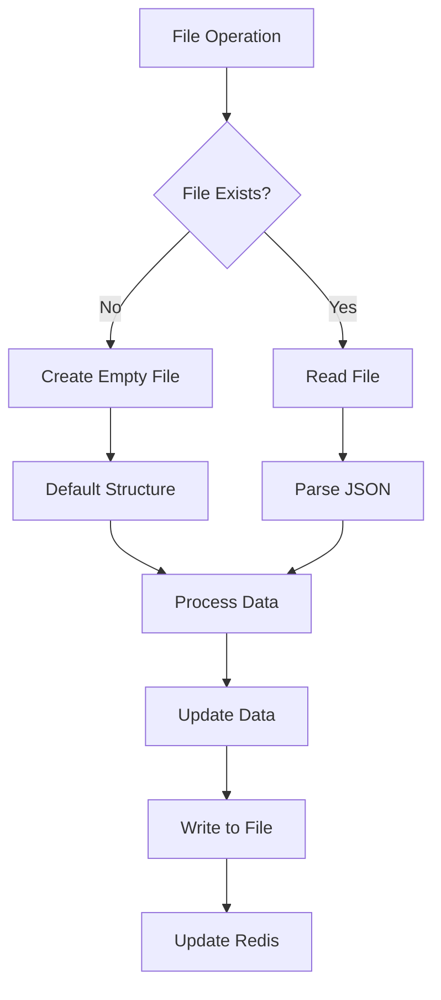

## Key Methods

### File Update Methods

#### `update_files()`

**Purpose**: Main file update loop that coordinates all status updates

**Implementation**:

```python
def update_files(self):
    try:
        while not self.stop_process:
            time.sleep(0.5)  # Reduce CPU load
            self.update_pause_clients()
            self.update_blocked_clients()
            self.update_active_deactivate_clients()
            self.update_connect_to_internet()
    except KeyboardInterrupt:
        pass
```

#### `update_pause_clients()`

**Purpose**: Updates the list of paused clients

**Flow**:

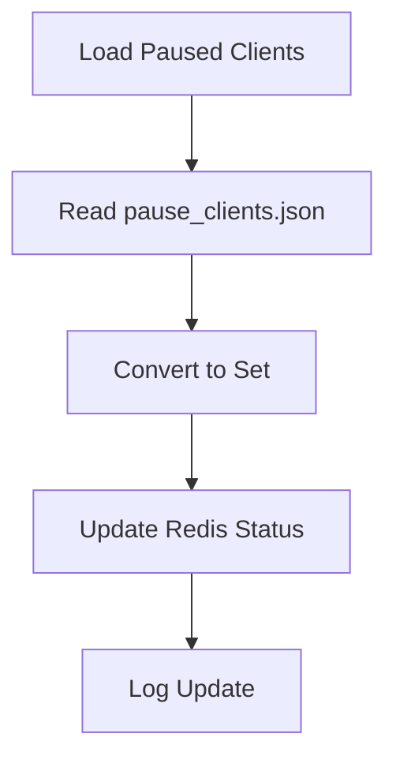

#### `update_blocked_clients()`

**Purpose**: Updates the list of blocked clients

**Flow**:

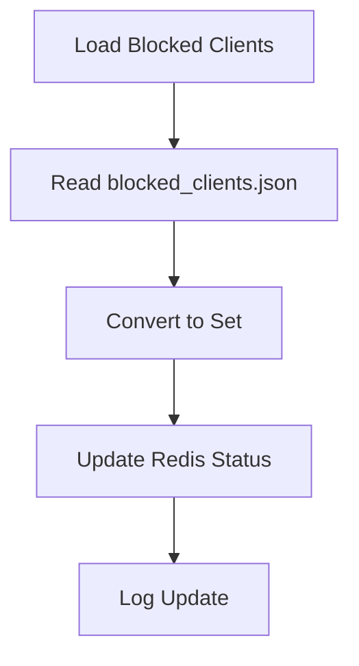

#### `update_active_deactivate_clients()`

**Purpose**: Calculates and updates active/deactivated client status

**Logic**:

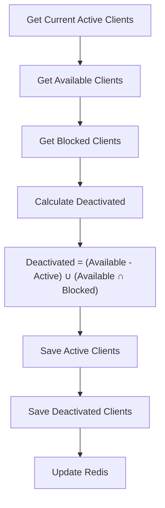

**Implementation**:

```python
def update_active_deactivate_clients(self):
    clients_status = self.redis_data.get_dict("Clients_status")
    active_clients = clients_status.get("active_clients", [])
    available_clients = list(get_available_users())
    blocked_clients = clients_status.get("blocked_clients", [])
  
    # Calculate deactivated clients
    deactivate_clients = (set(available_clients) - set(active_clients) | 
                         set(available_clients) & set(blocked_clients))
  
    # Save updates
    self.save_active_clients(active_clients)
    self.save_deactivate_clients(list(deactivate_clients))
    self.redis_data.set_dict("Clients_status", 
                           {"deactivate_clients": list(deactivate_clients)})
```

### File I/O Operations

#### `load_paused_clients() -> List[str]`

**Purpose**: Loads paused clients from JSON file

**Implementation**:

```python
def load_paused_clients(self) -> List[str]:
    Server_Data_path = getServerDataDirectoryPath()
    blocked_clients_file = os.path.join(Server_Data_path, "pause_clients.json")
    saved_pause_clients = self.__read_json(blocked_clients_file)
    return saved_pause_clients.get("clients", []) if saved_pause_clients else []
```

#### `load_blocked_clients() -> List[str]`

**Purpose**: Loads blocked clients from JSON file

**Implementation**:

```python
def load_blocked_clients(self) -> List[str]:
    Server_Data_path = getServerDataDirectoryPath()
    blocked_clients_file = os.path.join(Server_Data_path, "blocked_clients.json")
    blocked_clients = self.__read_json(blocked_clients_file)
    return blocked_clients.get("clients", []) if blocked_clients else []
```

#### `save_active_clients(active_clients)`

**Purpose**: Saves active clients to JSON file

**Implementation**:

```python
def save_active_clients(self, active_clients):
    Server_Data_path = getServerDataDirectoryPath()
    active_clients_file = os.path.join(Server_Data_path, "active_clients.json")
    self.__write_json({"clients": sorted(active_clients)}, active_clients_file)
```

### JSON Operations

#### `__write_json(write_data, file_path)`

**Purpose**: Optimized JSON writing using orjson

**Implementation**:

```python
def __write_json(self, write_data, file_path):
    with io.BufferedWriter(open(file_path, "wb")) as json_f:
        json_data = orjson.dumps(write_data, option=orjson.OPT_INDENT_2)
        json_f.write(json_data)
```

#### `__read_json(file_path) -> Dict`

**Purpose**: Optimized JSON reading with error handling

**Implementation**:

```python
def __read_json(self, file_path) -> Dict:
    if not os.path.exists(file_path):
        with open(file_path, "w") as json_f:
            json.dump({"clients": []}, json_f)
  
    with io.BufferedReader(open(file_path, "rb")) as json_f:
        read_data = json_f.read()
        return orjson.loads(read_data) if read_data else {"clients": []}
```

## Client Status Categories

### Status Definitions

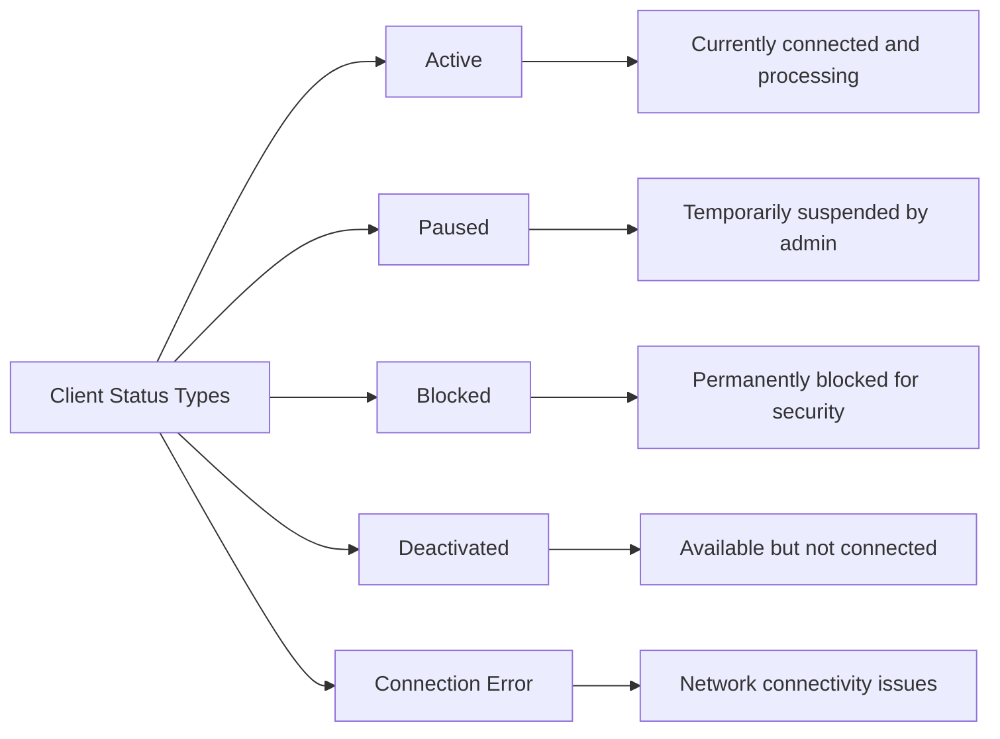

### Status Management

- **Active Clients**: Currently connected and processing
- **Paused Clients**: Temporarily suspended by administrator
- **Blocked Clients**: Permanently blocked due to security violations
- **Deactivated Clients**: Available but not currently connected
- **Connection Error Clients**: Clients with network connectivity issues

## Redis Integration

### Redis Data Structure

```python
Clients_status = {
    "active_clients": [],
    "paused_clients": [],
    "blocked_clients": [],
    "deactivate_clients": [],
    "connecting_internet_error": [],
    "clients_to_close": []
}
```

### Redis Operations

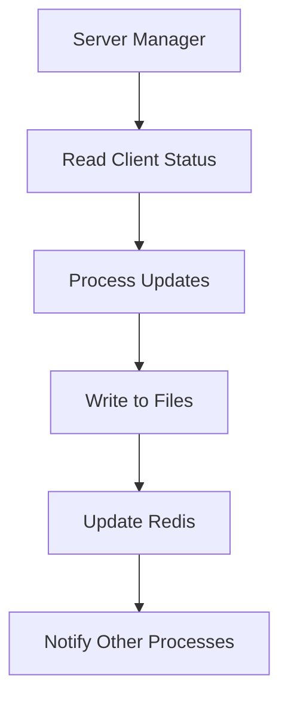

## File Format Examples

### Paused Clients (pause_clients.json)

```json
{
  "clients": [
    "user1",
    "user2",
    "user3"
  ]
}
```

### Blocked Clients (blocked_clients.json)

```json
{
  "clients": [
    "blocked_user1",
    "security_violation_user"
  ]
}
```

### Active Clients (active_clients.json)

```json
{
  "clients": [
    "active_user1",
    "active_user2",
    "active_user3"
  ]
}
```

### Network Action (Network_Action.json)

```json
{
  "clients": [
    "network_error_user1",
    "disconnected_user2"
  ]
}
```

## Error Handling

### File Operation Errors

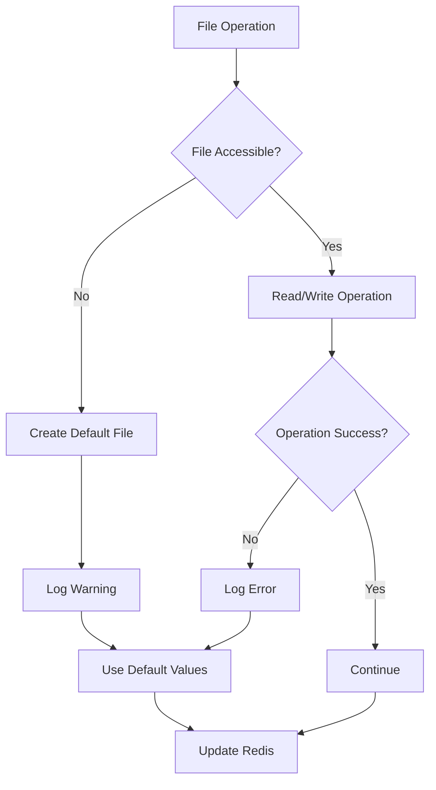

### Recovery Mechanisms

- **File Creation**: Automatic creation of missing files
- **Default Values**: Fallback to default structures
- **Error Logging**: Comprehensive error tracking
- **Graceful Degradation**: Continue operation with reduced functionality

## Performance Optimization

### Optimization Strategies

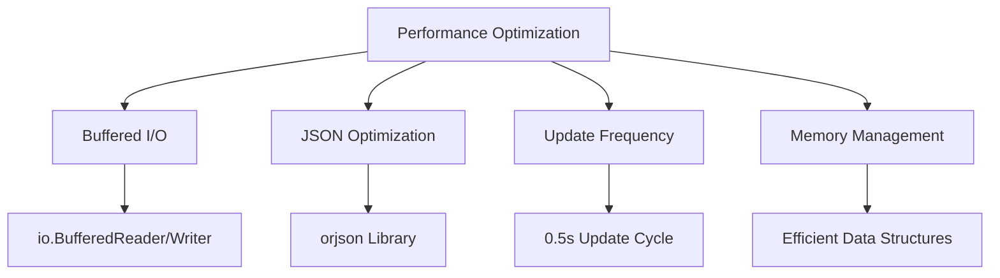

### Best Practices

1. **Buffered I/O**: Use buffered file operations for better performance
2. **JSON Optimization**: Use orjson for faster JSON processing
3. **Update Frequency**: Balance between real-time updates and performance
4. **Memory Efficiency**: Use sets for fast lookups and operations
5. **Error Handling**: Graceful error handling to prevent crashes

## Configuration

### File Paths

```python
Server_Data_path = os.path.join(APPLICATION_ROOT_PATH, "Data", "Server_Data")
```

### Update Frequency

- **File Update Cycle**: 0.5 seconds
- **Redis Update**: After each file operation
- **Status Check**: Continuous monitoring

## Usage Example

```python
# Initialize server manager
server_manager = Server_Manager(
    "Server_Files_Handler",
    logger="Server_Files_Handler_logs"
)

# Start server manager process
server_manager.Start_process()

# Monitor server manager
while server_manager.is_alive():
    time.sleep(1)
```

## Dependencies

- **os**: File system operations
- **time**: Sleep and timing operations
- **typing**: Type hints for better code documentation
- **orjson**: High-performance JSON library
- **io**: Buffered I/O operations
- **json**: Standard JSON operations (fallback)
- **cv2**: Image processing (for client validation)
- **common_utilities**: Base process and logging
- **utilities.project_utilities**: File handling utilities
- **RedisHandler**: Redis operations

## Thread Safety

### Synchronization

- **Single Process**: Server_Manager runs in its own process
- **File Locking**: OS-level file locking for concurrent access
- **Redis Operations**: Atomic Redis operations
- **Error Isolation**: Isolated error handling per operation

## Future Enhancements

1. **Database Integration**: Replace JSON files with database storage
2. **Real-time Notifications**: WebSocket-based status updates
3. **Advanced Analytics**: Client behavior analysis
4. **Backup and Recovery**: Automated backup of client data
5. **Performance Metrics**: Detailed performance monitoring
6. **Configuration Management**: Dynamic configuration updates
7. **Audit Logging**: Comprehensive audit trail for all operations
8. **High Availability**: Distributed server manager architecture
