# System Architecture Documentation

## Overview

This document provides a comprehensive view of the Face Recognition & Object Detection Server system architecture, showing how all components interact to provide secure, scalable, and efficient processing of client authentication requests.

## System Architecture Diagram

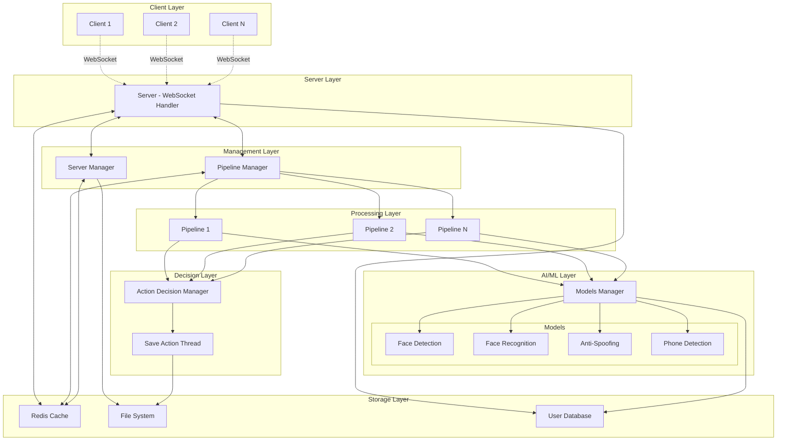

## Component Interaction Flow

### 1. Client Connection Flow

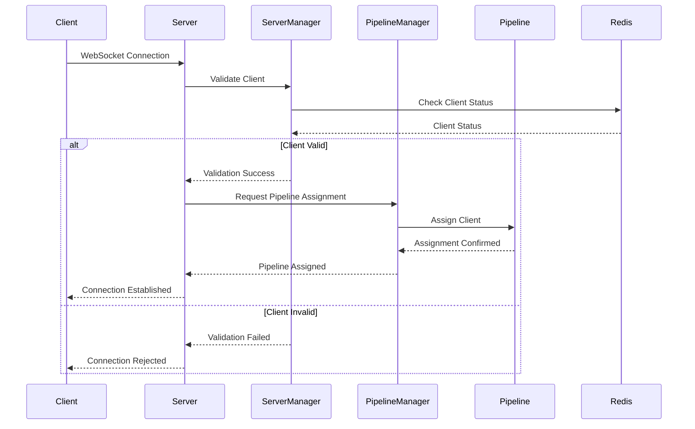

### 2. Image Processing Flow

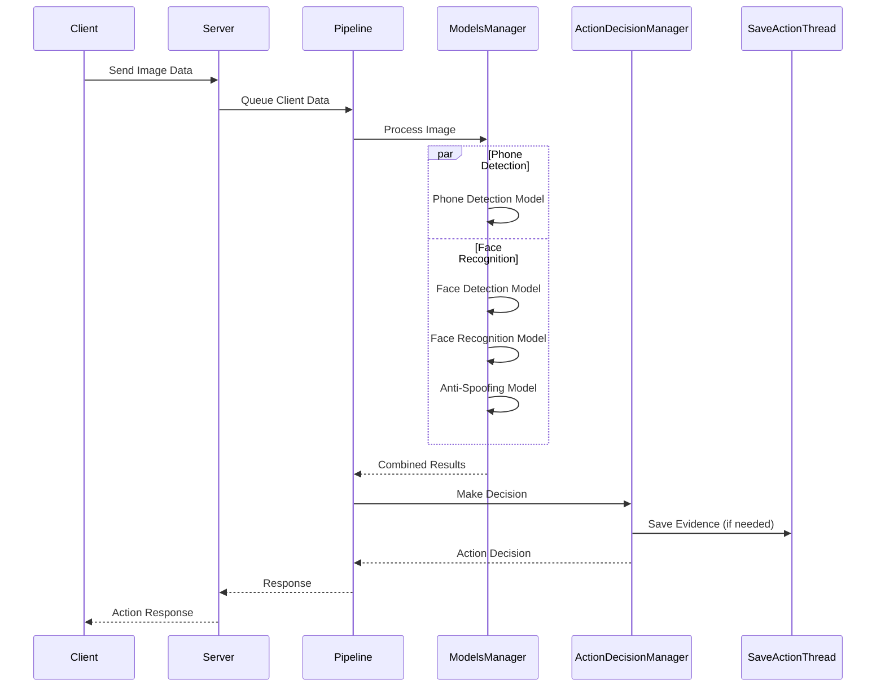

### 3. System Capacity Management

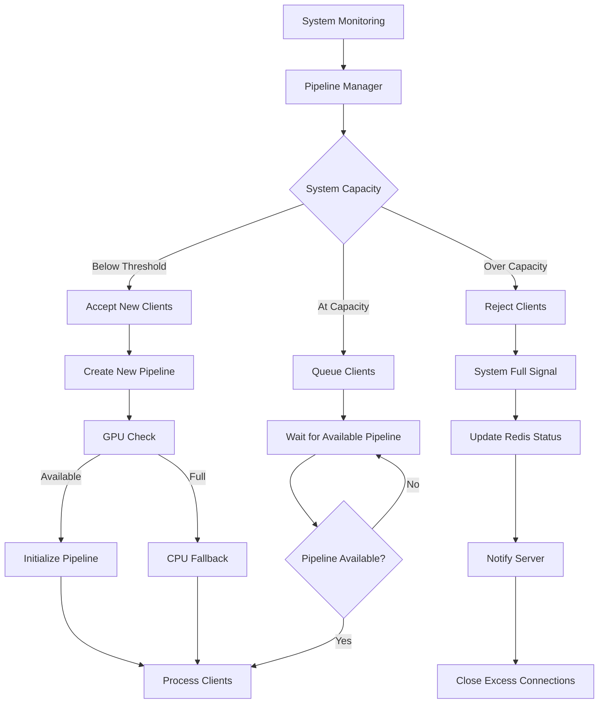

## Data Flow Architecture

### 1. Client Data Management

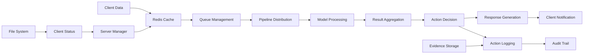

### 2. Resource Management

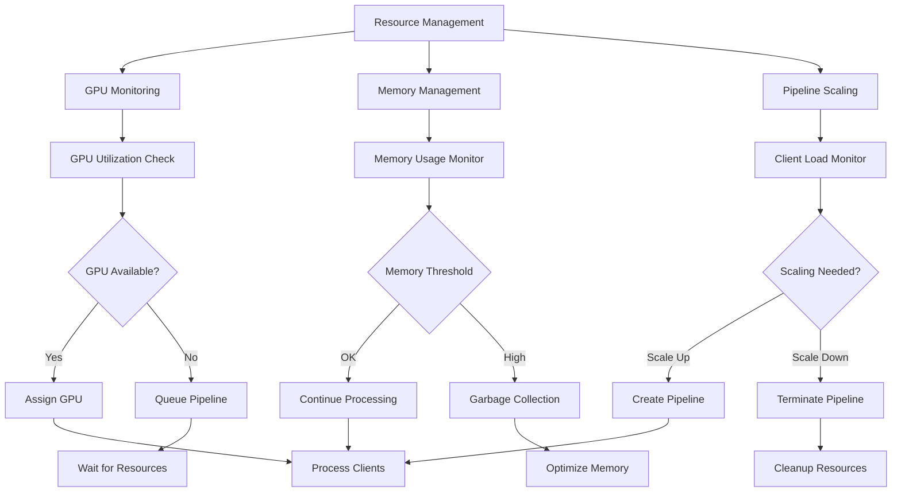

## Inter-Process Communication

### 1. Process Communication Map

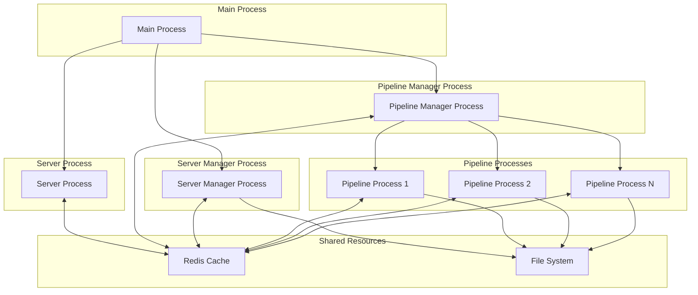

### 2. Communication Protocols

#### Redis-based Communication
- **Client Status**: Real-time client state synchronization
- **System Status**: System capacity and GPU availability
- **Pipeline Assignment**: Client-to-pipeline mapping
- **Action Queuing**: Client data queuing for processing

#### File System Communication
- **Configuration**: Client blocking/pausing configuration
- **Evidence Storage**: Security action evidence
- **Logging**: Process logging and audit trails
- **User Database**: Client authentication data

## Security Architecture

### 1. Security Layers

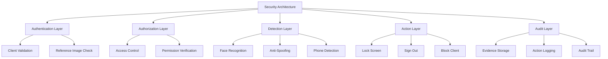

### 2. Security Decision Flow

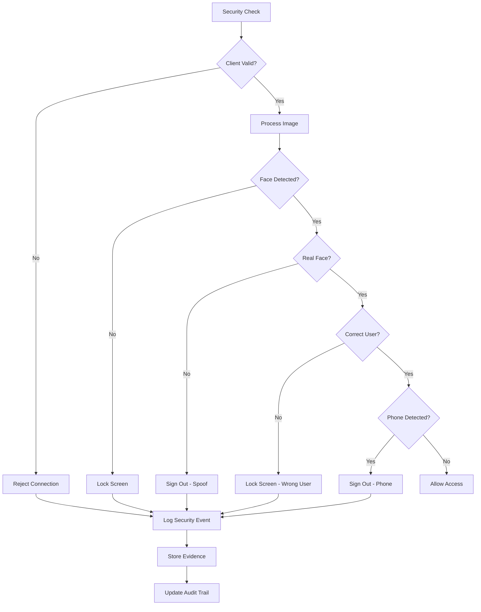

## Performance Architecture

### 1. Performance Optimization

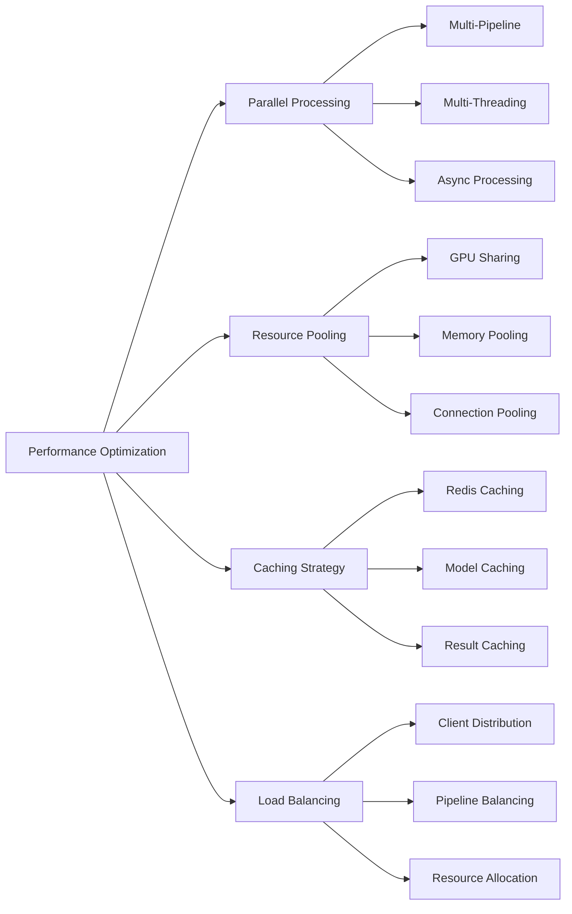

### 2. Scalability Features

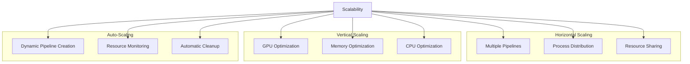

## Monitoring and Observability

### 1. System Monitoring

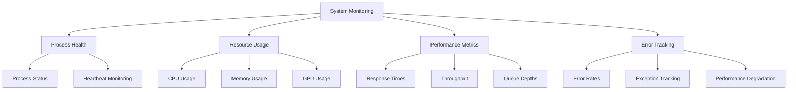

### 2. Logging Architecture

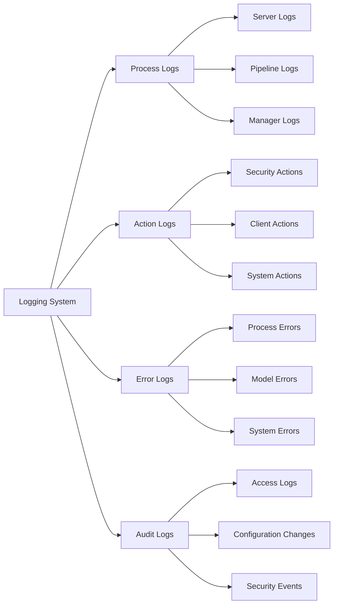

## Deployment Architecture

### 1. Containerized Deployment

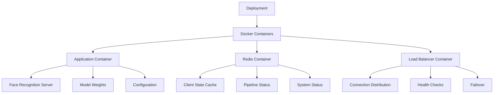

### 2. Infrastructure Requirements

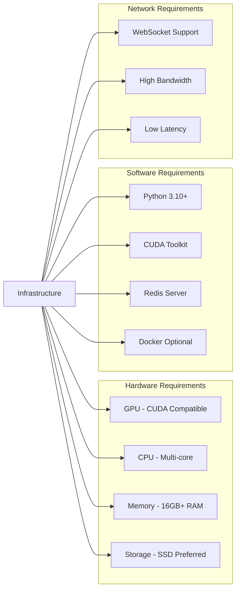

## Configuration Management

### 1. System Configuration

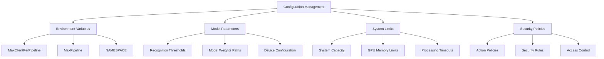

### 2. Runtime Configuration

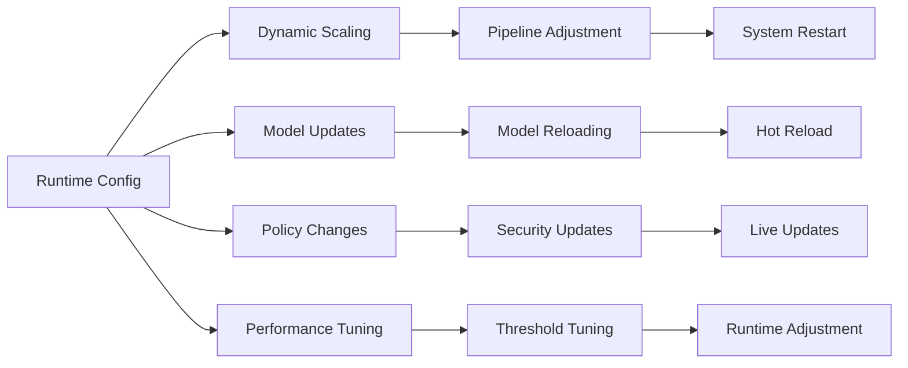

## Disaster Recovery

### 1. Backup Strategy

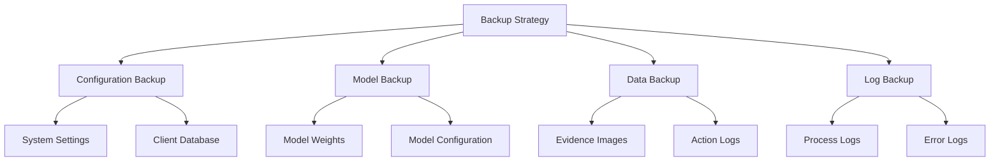

### 2. Recovery Procedures

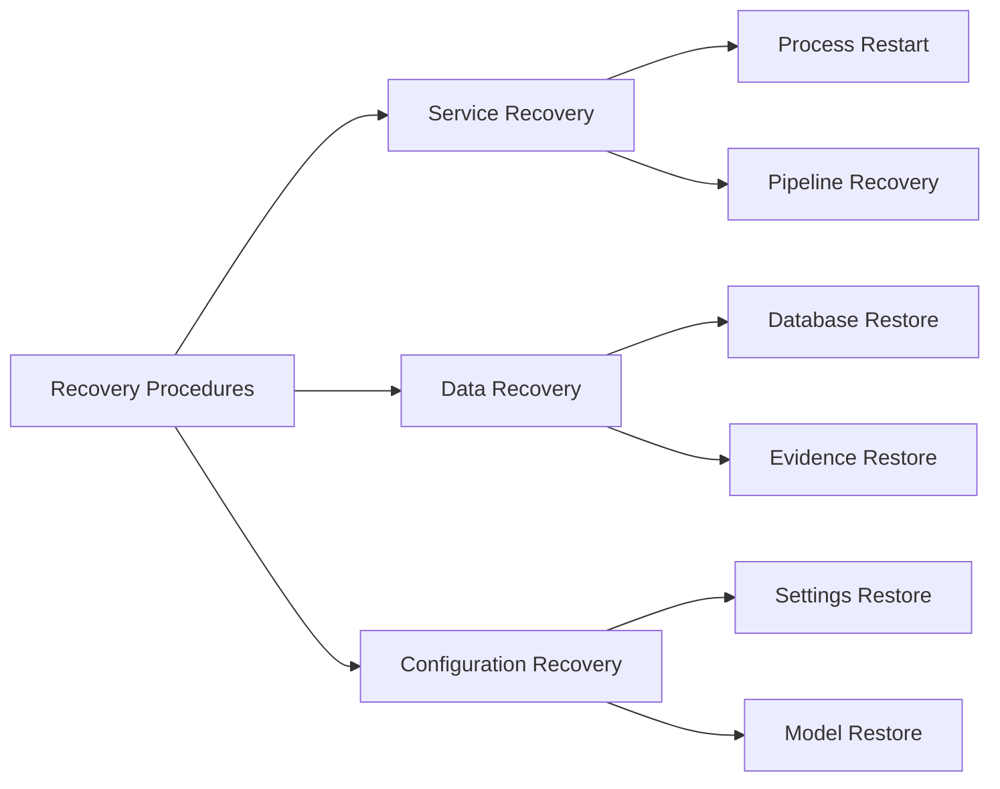

This comprehensive system architecture documentation provides a complete view of how all components work together to create a robust, scalable, and secure face recognition system. Each component has been designed with specific responsibilities and clear interaction patterns to ensure maintainability and reliability.
