# Utilities Module Documentation

## Overview

The Utilities module provides essential support functions for the Face Recognition Server, including file management, data type definitions, and project-specific utility functions. This module is organized under the `utilities/project_utilities/` directory and serves as a foundation for various system operations.

## Module Structure

```
utilities/
└── project_utilities/
    ├── __init__.py             # Module initialization and exports
    ├── files_handler.py        # File and directory management utilities
    ├── Datatypes.py           # Enumerations and data structures
    └── __pycache__/           # Python cache files
```

## Class Diagram

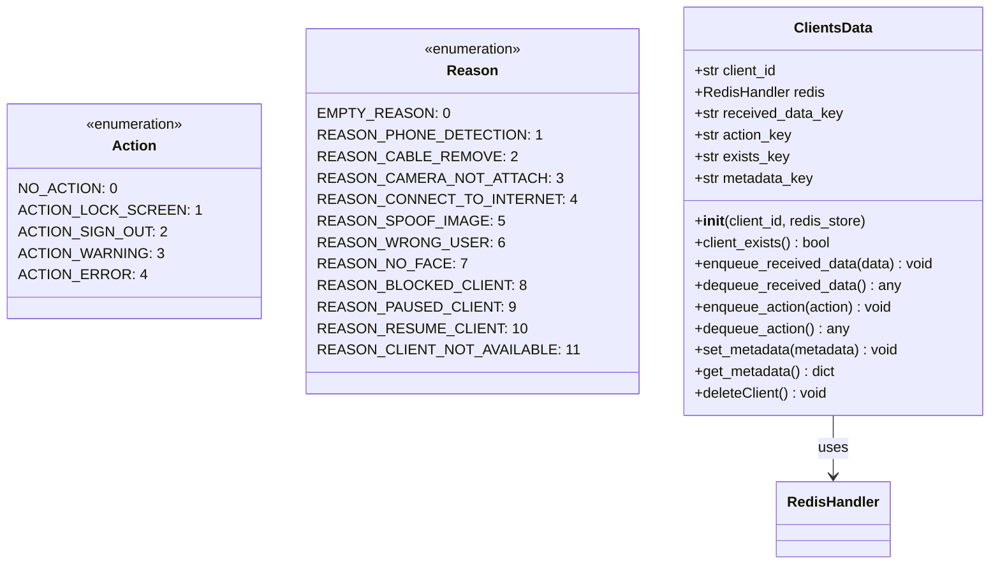

## Module Architecture

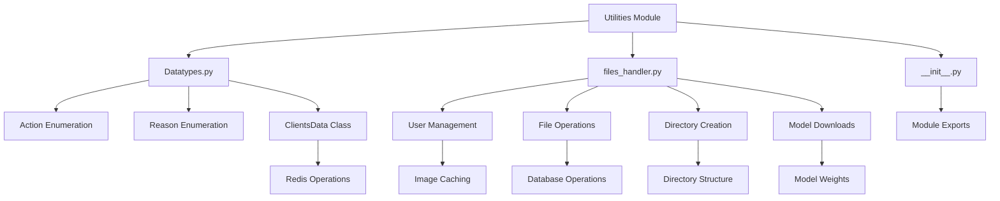

## Datatypes.py

### Purpose

Defines essential data types, enumerations, and structures used throughout the Face Recognition Server system.

### Action Enumeration

#### Definition

```python
class Action(Enum):
    NO_ACTION = 0
    ACTION_LOCK_SCREEN = 1
    ACTION_SIGN_OUT = 2
    ACTION_WARNING = 3
    ACTION_ERROR = 4
```

#### Usage

Actions represent system responses to security events:

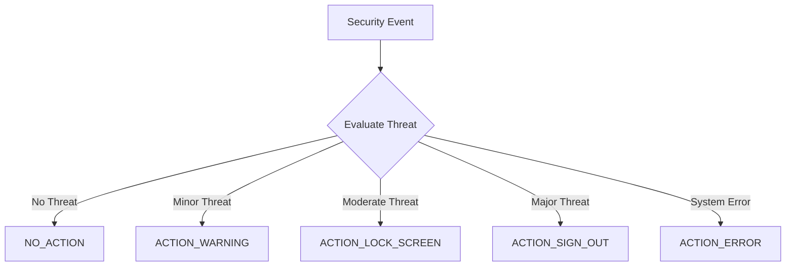

**Action Types:**

- **NO_ACTION (0)**: No action required, normal operation
- **ACTION_LOCK_SCREEN (1)**: Lock user's screen/session
- **ACTION_SIGN_OUT (2)**: Sign out user from system
- **ACTION_WARNING (3)**: Display warning message
- **ACTION_ERROR (4)**: System error occurred

### Reason Enumeration

#### Definition

```python
class Reason(Enum):
    EMPTY_REASON = 0
    REASON_PHONE_DETECTION = 1
    REASON_CABLE_REMOVE = 2
    REASON_CAMERA_NOT_ATTACH = 3
    REASON_CONNECT_TO_INTERNET = 4
    REASON_SPOOF_IMAGE = 5
    REASON_WRONG_USER = 6
    REASON_NO_FACE = 7
    REASON_BLOCKED_CLIENT = 8
    REASON_PAUSED_CLIENT = 9
    REASON_RESUME_CLIENT = 10
    REASON_CLIENT_NOT_AVAILABLE = 11
```

#### Usage

Reasons provide context for why actions are taken:

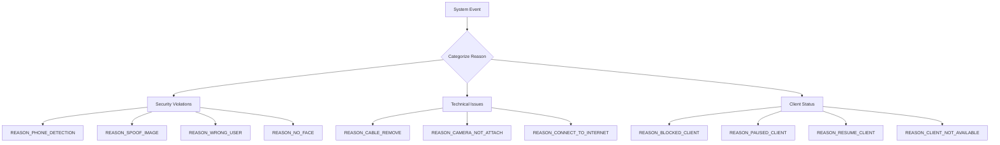

**Reason Categories:**

**Security Violations:**

- **REASON_PHONE_DETECTION (1)**: Phone detected in user's vicinity
- **REASON_SPOOF_IMAGE (5)**: Fake/spoofed image detected
- **REASON_WRONG_USER (6)**: Identity verification failed
- **REASON_NO_FACE (7)**: No face detected in image

**Technical Issues:**

- **REASON_CABLE_REMOVE (2)**: Camera cable disconnected
- **REASON_CAMERA_NOT_ATTACH (3)**: Camera not attached/available
- **REASON_CONNECT_TO_INTERNET (4)**: Internet connectivity issues

**Client Status:**

- **REASON_BLOCKED_CLIENT (8)**: Client is blocked
- **REASON_PAUSED_CLIENT (9)**: Client is paused
- **REASON_RESUME_CLIENT (10)**: Client resumed operation
- **REASON_CLIENT_NOT_AVAILABLE (11)**: Client not available

### ClientsData Class

#### Purpose

Manages client data storage and retrieval using Redis as the backend storage system.

#### Architecture

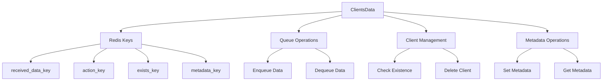

#### Key Methods

##### `__init__(client_id, redis_store)`

**Purpose**: Initialize client data management for a specific client

**Parameters**:

- `client_id` (str): Unique client identifier
- `redis_store` (RedisHandler): Redis connection handler

**Initialization Process**:

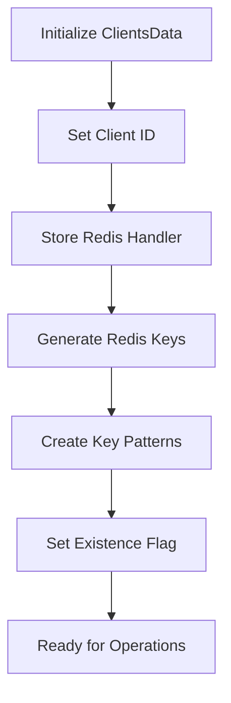

##### `client_exists() -> bool`

**Purpose**: Check if client exists in Redis

**Returns**: Boolean indicating client existence

##### `enqueue_received_data(data)` / `dequeue_received_data()`

**Purpose**: Manage received data queue for the client

**Data Flow**:

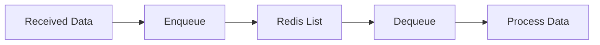

##### `enqueue_action(action)` / `dequeue_action()`

**Purpose**: Manage action queue for the client

**Action Flow**:

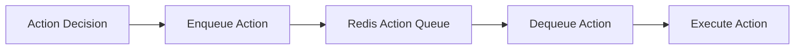

##### `set_metadata(metadata)` / `get_metadata()`

**Purpose**: Store and retrieve client metadata

**Metadata Operations**:

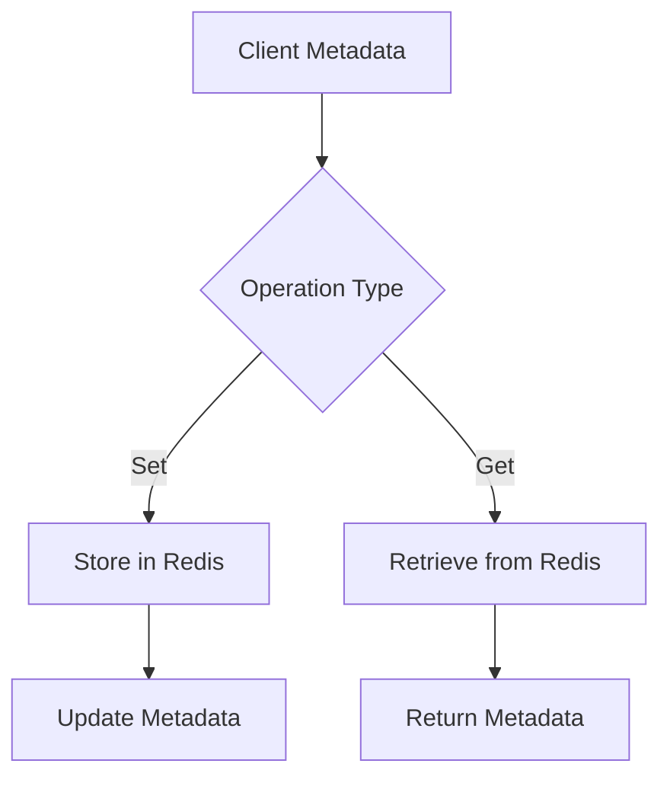

##### `deleteClient()`

**Purpose**: Clean up all client data from Redis

**Cleanup Process**:

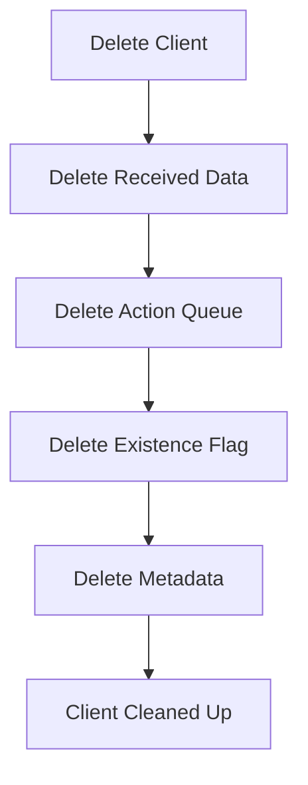

## files_handler.py

### Purpose

Provides comprehensive file and directory management utilities for the Face Recognition Server, including user database management, model weight handling, and action logging.

### Available Functions

#### User Database Management Functions

##### `get_available_users() -> Tuple[Set[str], int]`

**Purpose**: Get list of available users with caching and auto-refresh
**Returns**: Tuple of (set of user names, count)
**Features**:

- LRU caching for performance
- Auto-refresh when directory changes
- Fast directory scanning

##### `get_client_image(client_name: str) -> cv2.Mat`

**Purpose**: Retrieve client reference image with caching
**Parameters**:

- `client_name` (str): Name of the client
  **Returns**: OpenCV image matrix or None if not found
  **Features**:
- Memory caching with modification time tracking
- Lazy loading
- Error handling for missing images

#### Private Helper Functions

##### `__has_new_data() -> bool`

**Purpose**: Check if the Users_DataBase directory has been modified
**Returns**: Boolean indicating if directory was modified
**Features**:

- Tracks modification time
- Efficient change detection

##### `__read_client_image(client_name: str) -> cv2.Mat`

**Purpose**: Read client image from disk
**Parameters**:

- `client_name` (str): Name of the client
  **Returns**: OpenCV image matrix or None
  **Features**:
- Direct file system access
- Error handling for missing files

##### `__get_available_users() -> Set[str]`

**Purpose**: Ultra-fast directory scanning using low-level OS calls
**Returns**: Set of available user names
**Features**:

- LRU cached (maxsize=1)
- Optimized for large directories
- Filters out dummy users

#### Directory Management Functions

##### `create_Data_Directory() -> None`

**Purpose**: Create main data directory structure
**Creates**:

- Main Data/ directory
- Users_Database/ subdirectory
- Actions/ subdirectory
  **Features**:
- Calls other directory creation functions
- Creates complete directory structure

##### `create_Users_Database_Directory() -> None`

**Purpose**: Set up user database directory structure
**Creates**:

- Users_DataBase/ directory
- dummy/ subfolder with sample image
  **Features**:
- Creates dummy user for testing
- Generates sample image file

##### `create_server_Data_Directory() -> None`

**Purpose**: Create server data directory with namespace support
**Creates**:

- Server_Data/ directory
- Namespace subdirectory if configured
  **Features**:
- Namespace support for multi-tenant deployment
- Environment-based configuration

##### `create_Users_Actions_Directory() -> None`

**Purpose**: Create directory for storing user action logs
**Creates**:

- Actions/ directory
  **Features**:
- Prepares action logging infrastructure

##### `getServerDataDirectoryPath() -> str`

**Purpose**: Get server data directory path with namespace support
**Returns**: Full path to server data directory
**Features**:

- LRU cached (maxsize=1)
- Namespace support
- Environment variable integration

#### Action Logging Functions

##### `save_User_Action(user_name: str, Action_Reason: Dict[str, int], Action_image: cv2.typing.MatLike) -> None`

**Purpose**: Save user action with image and metadata
**Parameters**:

- `user_name` (str): Name of the user
- `Action_Reason` (Dict): Dictionary with 'action' and 'reason' keys
- `Action_image` (cv2.typing.MatLike): Image associated with the action
  **Features**:
- Organized directory structure by action type
- Timestamp-based filename generation
- Automatic directory creation

**Directory Structure Created**:

```
Actions/
├── Lock_screen/
│   └── username/
│       └── timestamp_Lock_screen_Reason.jpg
├── Sign_out/
│   └── username/
│       └── timestamp_Sign_out_Reason.jpg
└── Warning/
    └── username/
        └── timestamp_Warning_Reason.jpg
```

#### Model Management Functions

##### `create_Models_Weights_Directory() -> None`

**Purpose**: Create model weights directory and download required models
**Creates**:

- Models_Weights/ directory structure
- face_detection/ subdirectory
- phone_detection/ subdirectory
- face_recognition/.deepface/weights/ subdirectory
  **Features**:
- Automatic model downloading from Google Drive
- Skip existing models
- Progress tracking
- Error handling for download failures

**Downloaded Models**:

- **Face Detection**: yolov8_model.pt
- **Phone Detection**: phone_detection.pt
- **Face Recognition**:
  - vgg_face_weights.h5
  - 2.7_80x80_MiniFASNetV2.pth
  - 4_0_0_80x80_MiniFASNetV1SE.pth
  - yolov8n-face.pt

#### Legacy/Deprecated Functions

##### `create_User_DB(user_name: str) -> None`

**Purpose**: Create user database structure (legacy function)
**Parameters**:

- `user_name` (str): Name of the user
  **Features**:
- Creates user-specific directories
- Legacy implementation
- Not actively used in current system

### Function Categories Summary

#### **User Management** (Active Functions)

- `get_available_users()` - Get list of users with caching
- `get_client_image()` - Get client reference image
- `__has_new_data()` - Check for directory changes
- `__read_client_image()` - Read image from disk
- `__get_available_users()` - Cached directory scanning

#### **Directory Management** (Setup Functions)

- `create_Data_Directory()` - Create main structure
- `create_Users_Database_Directory()` - Setup user database
- `create_server_Data_Directory()` - Setup server data
- `create_Users_Actions_Directory()` - Setup action logging
- `getServerDataDirectoryPath()` - Get server data path

#### **Action Logging** (Logging Functions)

- `save_User_Action()` - Save user actions with images

#### **Model Management** (Setup Functions)

- `create_Models_Weights_Directory()` - Download and setup models

#### **Legacy Functions** (Deprecated)

- `create_User_DB()` - Legacy user database creation

#### User Database Management

##### `get_available_users() -> Tuple[Set[str], int]`

**Purpose**: Get list of available users with caching and auto-refresh

**Caching Strategy**:

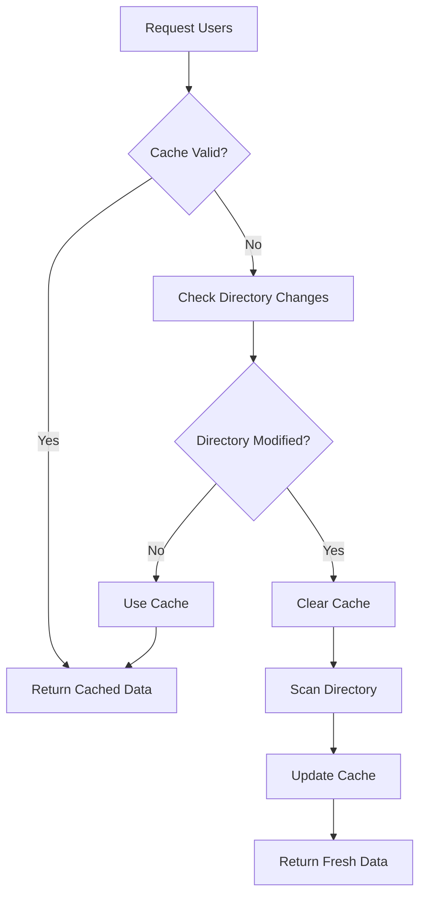

**Features**:

- **LRU Caching**: Uses `@lru_cache` for performance
- **Auto-refresh**: Detects directory changes
- **Fast Scanning**: Optimized directory traversal
- **Error Handling**: Graceful handling of missing directories

##### `get_client_image(client_name) -> cv2.Mat`

**Purpose**: Retrieve client reference image with caching

**Image Caching Flow**:

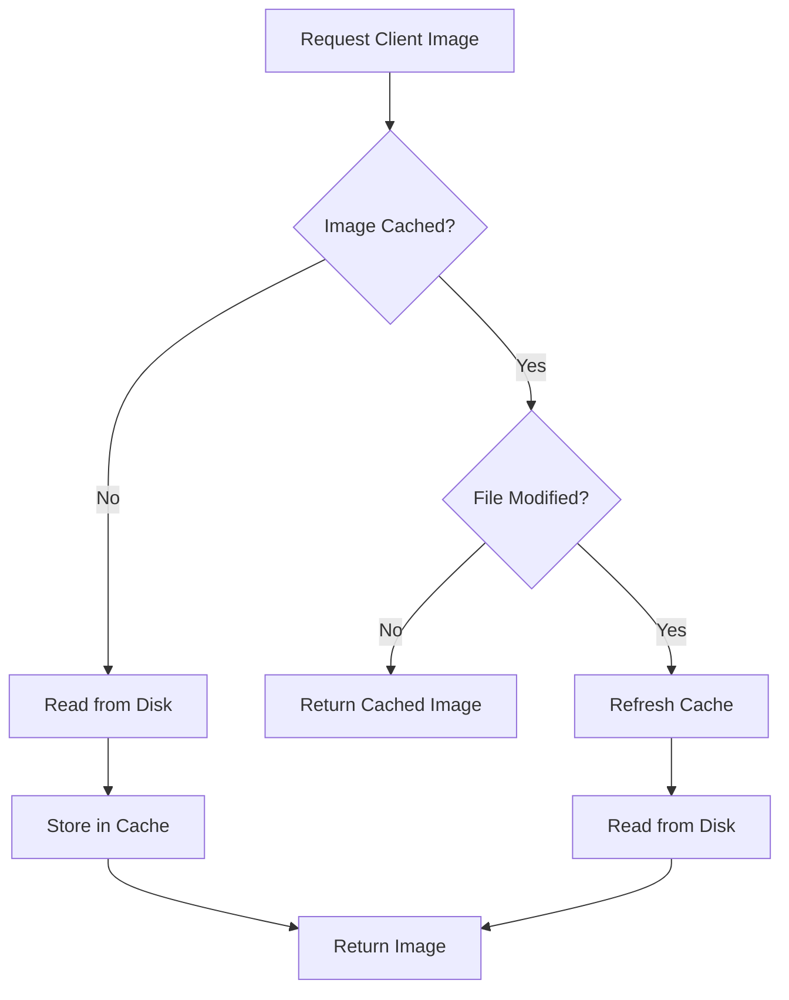

**Performance Features**:

- **Memory Caching**: In-memory image storage
- **Modification Time Tracking**: Detects file changes
- **Lazy Loading**: Load images on demand
- **Error Handling**: Returns None for missing images

#### Directory Management

##### `create_Data_Directory()`

**Purpose**: Create main data directory structure

**Directory Structure**:

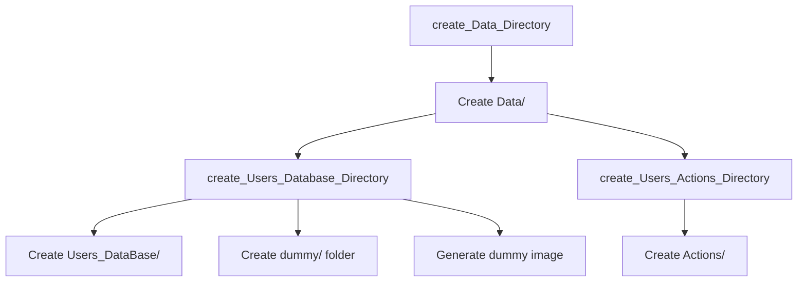

##### `create_Users_Database_Directory()`

**Purpose**: Set up user database directory structure

**Process**:

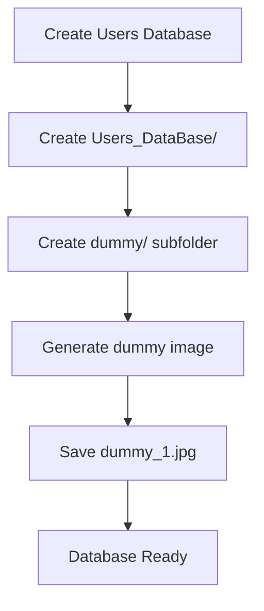

##### `create_server_Data_Directory()`

**Purpose**: Create server data directory with namespace support

**Namespace Handling**:

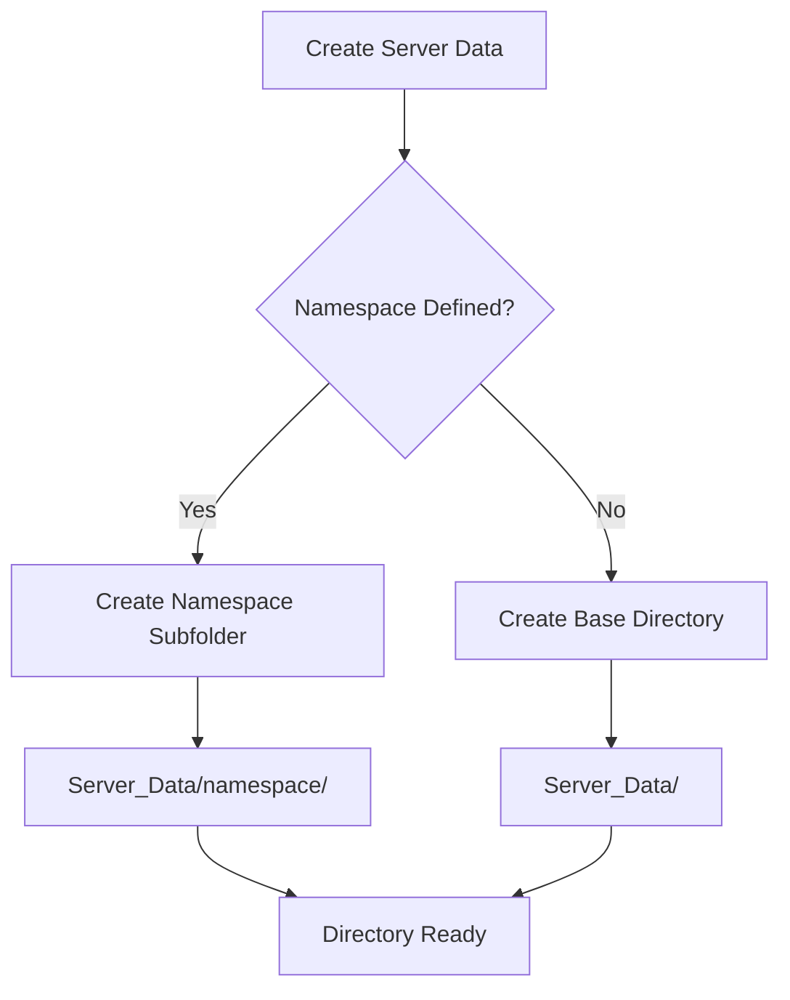

##### `create_Users_Actions_Directory()`

**Purpose**: Create directory for storing user action logs

#### Action Logging

##### `save_User_Action(user_name, Action_Reason, Action_image)`

**Purpose**: Save user action with image and metadata

**Action Logging Flow**:

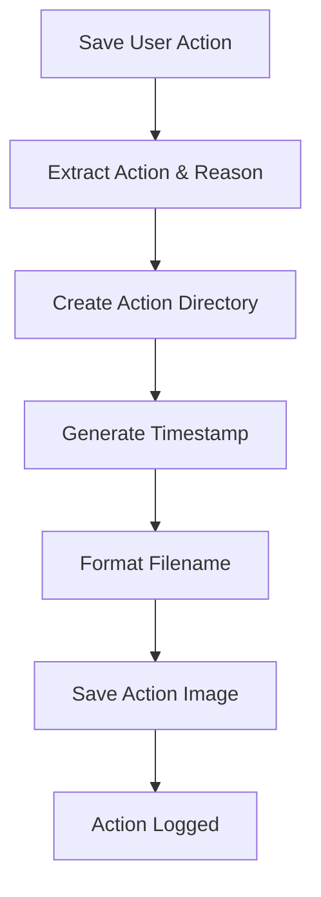

**Directory Structure**:

```
Actions/
├── Lock_screen/
│   └── username/
│       └── timestamp_Lock_screen_Phone_detection.jpg
├── Sign_out/
│   └── username/
│       └── timestamp_Sign_out_Wrong_user.jpg
└── Warning/
    └── username/
        └── timestamp_Warning_Spoof_image.jpg
```

**Filename Format**:

```
{dd_mm_yyyy-hh_mm}_{Action}_{Reason}.jpg
```

#### Model Management

##### `create_Models_Weights_Directory()`

**Purpose**: Create model weights directory and download required models

**Model Download Process**:

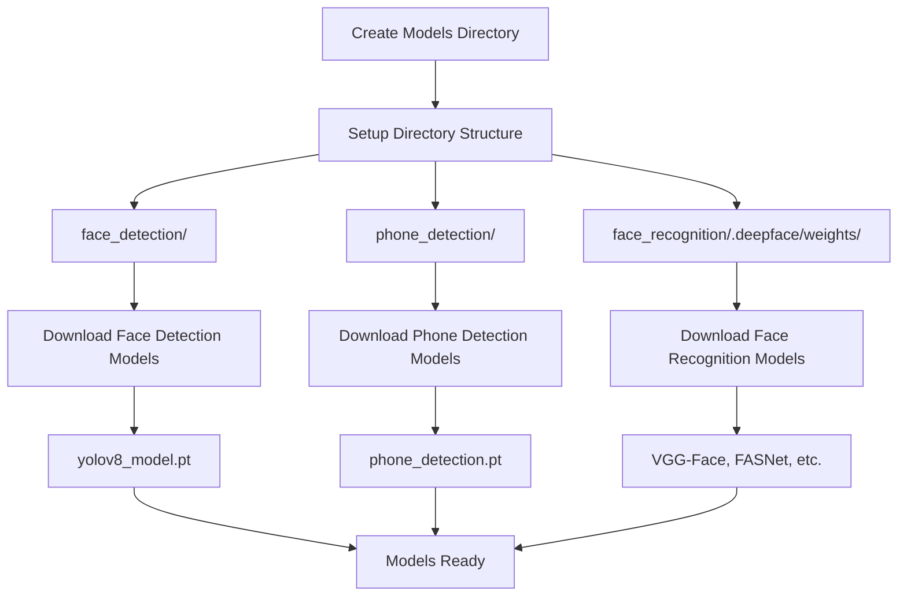

**Model Categories**:

**Face Detection Models**:

- `yolov8_model.pt` - YOLOv8 face detection model

**Phone Detection Models**:

- `phone_detection.pt` - YOLOv8 phone detection model

**Face Recognition Models**:

- `vgg_face_weights.h5` - VGG-Face recognition model
- `2.7_80x80_MiniFASNetV2.pth` - FASNet anti-spoofing model
- `4_0_0_80x80_MiniFASNetV1SE.pth` - FASNet variant
- `yolov8n-face.pt` - YOLOv8 face detection

**Model Provisioning**:

- **Local-first**: All required weights must be present in `Models_Weights`; the services validate their presence on startup.
- **Actionable feedback**: Missing models trigger explicit errors pointing to the expected paths so you can populate them manually.

### Performance Optimizations

#### Caching Strategy

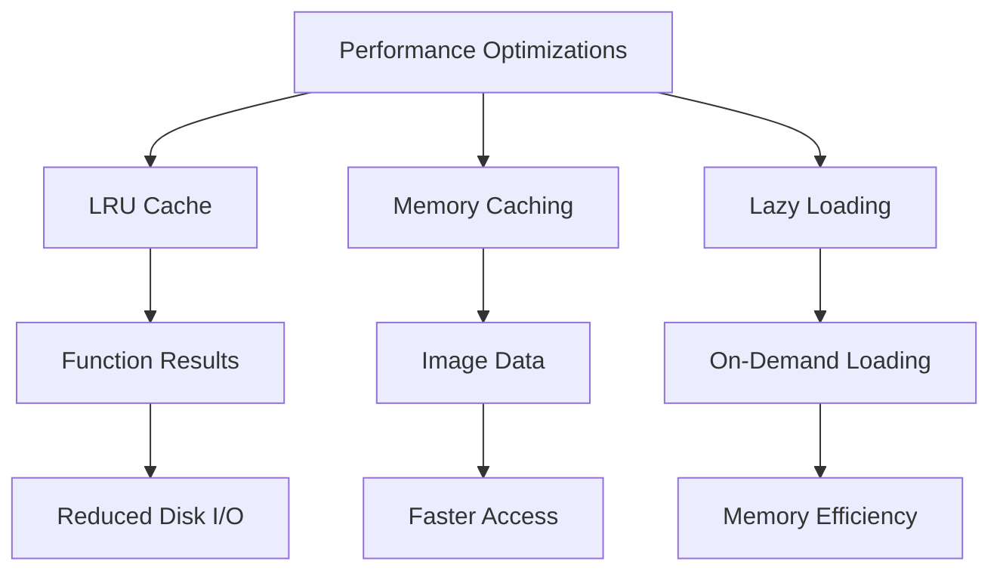

#### File System Optimizations

- **Fast Directory Scanning**: Uses `os.scandir()` for efficiency
- **Modification Time Tracking**: Avoids unnecessary file reads
- **Memory-Mapped Files**: Efficient large file handling
- **Error Resilience**: Graceful handling of file system errors

### Error Handling

#### Common Error Scenarios

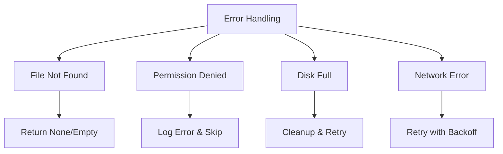

#### Error Recovery Strategies

- **Graceful Degradation**: Continue operation with reduced functionality
- **Automatic Retry**: Retry failed operations with backoff
- **Logging**: Comprehensive error logging for debugging
- **Fallback Options**: Alternative paths for critical operations

## Module Integration

### Usage Examples

#### Basic Usage

```python
from utilities.project_utilities import (
    Action, Reason, ClientsData,
    create_Data_Directory, 
    get_available_users,
    get_client_image
)

# Create directory structure
create_Data_Directory()

# Get available users
users, count = get_available_users()
print(f"Found {count} users: {users}")

# Get client image
client_image = get_client_image("john_doe")
if client_image is not None:
    print("Client image loaded successfully")

# Use enumerations
action = Action.ACTION_LOCK_SCREEN
reason = Reason.REASON_PHONE_DETECTION
print(f"Action: {action.name}, Reason: {reason.name}")
```

#### Redis Client Data Management

```python
from utilities.project_utilities import ClientsData
from common_utilities import RedisHandler

# Initialize Redis and client data
redis_handler = RedisHandler()
client_data = ClientsData("client_123", redis_handler)

# Check if client exists
if client_data.client_exists():
    print("Client exists in Redis")

# Enqueue received data
client_data.enqueue_received_data({
    "user_image": image_data,
    "timestamp": "2025-01-01 12:00:00"
})

# Dequeue and process data
received_data = client_data.dequeue_received_data()
if received_data:
    print("Processing received data")

# Set client metadata
client_data.set_metadata({
    "username": "john_doe",
    "status": "active",
    "last_seen": "2025-01-01 12:00:00"
})

# Clean up when done
client_data.deleteClient()
```

#### Action Logging

```python
from utilities.project_utilities import save_User_Action, Action, Reason
import cv2

# Load action image
action_image = cv2.imread("user_violation.jpg")

# Define action and reason
action_reason = {
    "action": Action.ACTION_LOCK_SCREEN.value,
    "reason": Reason.REASON_PHONE_DETECTION.value
}

# Save user action
save_User_Action(
    user_name="john_doe",
    Action_Reason=action_reason,
    Action_image=action_image
)
```

### Integration with Main System

#### Server Integration

```python
# Used in Server.py
from utilities.project_utilities import ClientsData

class Server:
    def __init__(self):
        self.redis_handler = RedisHandler()
  
    def handle_client(self, client_id, websocket):
        client_data = ClientsData(client_id, self.redis_handler)
        # Use client_data for managing client state
```

#### Pipeline Integration

```python
# Used in PipeLine.py
from utilities.project_utilities import get_client_image, Action, Reason

def process_client_data(client_name):
    # Get reference image
    ref_image = get_client_image(client_name)
  
    # Process and determine action
    action = Action.ACTION_WARNING
    reason = Reason.REASON_SPOOF_IMAGE
  
    return {"action": action.value, "reason": reason.value}
```

#### Action Decision Integration

```python
# Used in ActionDecisionManager.py
from utilities.project_utilities import Action, Reason, save_User_Action

def make_decision(client_name, detection_results):
    if detection_results["phone_detected"]:
        action = Action.ACTION_LOCK_SCREEN
        reason = Reason.REASON_PHONE_DETECTION
    
        # Save action with image
        save_User_Action(
            user_name=client_name,
            Action_Reason={"action": action.value, "reason": reason.value},
            Action_image=detection_results["image"]
        )
  
    return action, reason
```

## Dependencies

### Core Dependencies

- **opencv-python**: Image processing and file I/O
- **numpy**: Numerical operations for image data
- **shutil**: Local file management and safe copying of weight files
- **functools**: LRU cache implementation
- **enum**: Enumeration support
- **os**: File system operations
- **time**: Timestamp generation
- **re**: Regular expression operations

### Project Dependencies

- **common_utilities**: Project-specific utilities
- **RedisHandler**: Redis database operations

## Performance Characteristics

### File Operations

- **Directory Scanning**: 10-100ms for typical user databases
- **Image Loading**: 5-20ms per image (cached)
- **Cache Hit Ratio**: 90%+ for frequent operations
- **Memory Usage**: ~100MB for typical image cache

### Redis Operations

- **Data Enqueue/Dequeue**: <1ms per operation
- **Client Existence Check**: <1ms
- **Metadata Operations**: 1-5ms
- **Cleanup Operations**: 5-10ms per client

## Best Practices

### File Management

1. **Use Caching**: Leverage built-in caching for frequently accessed data
2. **Check Existence**: Always verify file existence before operations
3. **Handle Errors**: Implement proper error handling for file operations
4. **Clean Up**: Properly clean up resources and temporary files

### Redis Usage

1. **Connection Management**: Reuse Redis connections
2. **Key Naming**: Use consistent key naming conventions
3. **Data Cleanup**: Clean up client data when no longer needed
4. **Error Handling**: Handle Redis connection failures gracefully

### Performance Tips

1. **Batch Operations**: Group multiple operations when possible
2. **Memory Management**: Monitor and limit memory usage
3. **Cache Invalidation**: Implement proper cache invalidation strategies
4. **Resource Monitoring**: Monitor disk space and Redis memory usage
